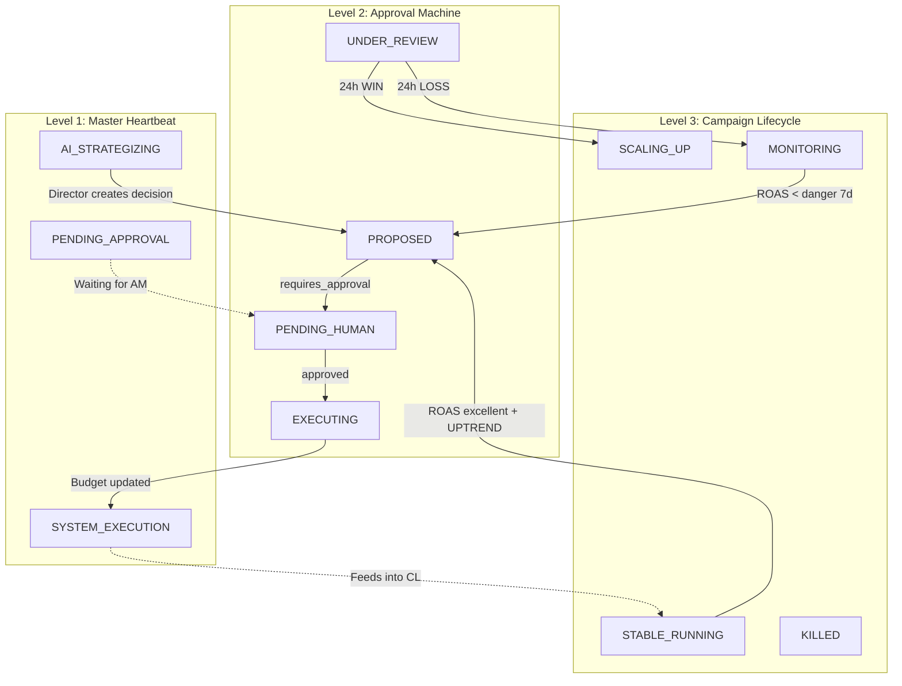

# 05 — Máy Trạng Thái Hệ Thống (System State Machines)

> **Project**: FAOS v6 — Agentic Workflow & Human-in-the-Loop  
> **Version**: 1.1 | **Date**: 2026-03-01  
> **Author**: System Architect  
> **Status**: v1.1 — Fixed 4 gaps (Senior Architect Review)  
> **Vai trò**: Tài liệu "Nhạc trưởng" (Orchestrator) — kiểm soát vòng đời vận hành toàn hệ thống

---

## Ngữ Cảnh Dự Án — Context Anchoring

Trước khi đọc các state machine bên dưới, xác nhận các nguyên tắc bất di bất dịch:

> [!CAUTION]
> **Nguyên tắc #1**: AI KHÔNG ĐƯỢC hành động nếu hệ thống chưa sẵn sàng. Data rác = phân tích rác = quyết định sai = mất tiền thật.

> [!IMPORTANT]
> **Nguyên tắc #2**: Mọi quyết định quan trọng PHẢI đi qua Human-in-the-Loop. AI đề xuất → Con người quyết định → Hệ thống thực thi.

> [!NOTE]
> **Nguyên tắc #3**: Campaign có vòng đời riêng. AI KHÔNG được nhảy qua các giai đoạn — mỗi campaign phải trải qua learning phase trước khi bị đánh giá.

| Thuộc tính | Giá trị |
|:--|:--|
| Mô hình kinh doanh | E-commerce Cross-border, COD, fashion, EU/US/AU |
| Kiến trúc | 3 Trụ Cột: Data Pipeline + AI Analyst + AI Director |
| Memory Layer | FalkorDB (Graph) + SimpleMem (Episodic) via MCP |
| LLM | GPT-4o primary, Gemini Flash fallback, rule-based last resort |
| Approval | Telegram (primary) + Discord (secondary), Interactive Buttons |

---

## Mục Lục

1. [Cấp Độ 1: FAOS Master Heartbeat](#cấp-độ-1-faos-master-heartbeat)
2. [Cấp Độ 2: Interactive Approval Machine](#cấp-độ-2-interactive-approval-machine)
3. [Cấp Độ 3: Campaign Lifecycle Machine](#cấp-độ-3-campaign-lifecycle-machine)
4. [Cross-Machine Interactions](#cross-machine-interactions)

---

## Cấp Độ 1: FAOS Master Heartbeat

> Điều khiển nhịp vận hành hàng ngày — đồng bộ hóa Data Pipeline, AI Agents, Approval và Learning theo đúng trình tự. **Không bước nào được skip.**

### State Diagram

```mermaid
stateDiagram-v2
    direction TB

    [*] --> SYSTEM_IDLE

    state "😴 SYSTEM_IDLE" as SYSTEM_IDLE {
        note right of SYSTEM_IDLE
            Hệ thống chờ trigger.
            Cron: 08:00 daily (Asia/Ho_Chi_Minh)
            Hoặc: Manual trigger từ CLI/Dashboard
            Hoặc: Intraday alert trigger (mỗi 2h)
        end note
    }

    state "🔄 DATA_SYNCING" as DATA_SYNCING {
        note right of DATA_SYNCING
            ETL Micro-batch chạy:
            - Shopify/Sapo → BigQuery (orders)
            - Meta Ads API → BigQuery (ad spend)
            - n8n pipelines (15-min cycle)
        end note
    }

    state "🔍 DATA_VALIDATION" as DATA_VALIDATION {
        note right of DATA_VALIDATION
            Kiểm tra chất lượng data:
            - Orders > 0 cho ngày hôm qua?
            - Ads data matched? (attribution > 90%)
            - API tokens valid?
            - BQ views queryable?
            - Momentum views return data?
        end note
    }

    state "🧠 AI_ANALYZING" as AI_ANALYZING {
        note right of AI_ANALYZING
            Pillar 2: Executive AI Analyst
            Forced Workflow Steps 1-4:
            SOP → History → Data → LLM Reasoning
            Output: 3-Axis Report + Predictions
        end note
    }

    state "📣 AI_STRATEGIZING" as AI_STRATEGIZING {
        note right of AI_STRATEGIZING
            Pillar 3: AI Marketing Director
            Forced Workflow Steps 1-5:
            Personality → Context → Patterns → LLM → Decisions
            Output: ActionList (scale/kill/pause)
        end note
    }

    state "⏳ PENDING_APPROVAL" as PENDING_APPROVAL {
        note right of PENDING_APPROVAL
            Lệnh nguy hiểm → Telegram + Discord
            Interactive Buttons: Duyệt / Bỏ qua / Rollback
            Timeout: 4h (standard) / 12h (kill primary)
            Safe actions → auto-executed, skip state này
        end note
    }

    state "⚡ SYSTEM_EXECUTION" as SYSTEM_EXECUTION {
        note right of SYSTEM_EXECUTION
            Thực thi lệnh đã được duyệt:
            - Meta API: update budget, pause adset
            - BQ: log approval_logs
            - FalkorDB: create Decision node
            - SimpleMem: save execution context
        end note
    }

    state "📝 KNOWLEDGE_SAVING" as KNOWLEDGE_SAVING {
        note right of KNOWLEDGE_SAVING
            Lưu kiến thức từ cả 2 agents:
            - Predictions → BQ ai_prediction_log
            - Lessons → FalkorDB Lesson nodes
            - Decisions → SimpleMem episodes
            - Run metrics → BQ agent_run_log
        end note
    }

    state "🪞 DAILY_REFLECTION" as DAILY_REFLECTION {
        note right of DAILY_REFLECTION
            18:00 daily — AI tự soi gương:
            - Compare T-1 predictions vs T-0 actuals
            - Calculate accuracy per metric
            - Generate lessons learned
            - Update confidence scores
        end note
    }

    state "🚨 EMERGENCY_HALT" as EMERGENCY_HALT {
        note right of EMERGENCY_HALT
            DỪNG KHẨN CẤP — data không đáng tin.
            AI KHÔNG ĐƯỢC phân tích.
            Gửi alert ngay cho Owner + Dev team.
            Chờ manual intervention.
        end note
    }

    state "🌙 CAPI_PUSH" as CAPI_PUSH {
        note right of CAPI_PUSH
            21:00 daily — Pillar 1:
            Push success orders → Meta CAPI
            Dedup bằng order_id
            Nuôi Meta AI attribution
        end note
    }

    state "🔥 INTRADAY_EMERGENCY" as INTRADAY_EMERGENCY {
        note right of INTRADAY_EMERGENCY
            Mỗi 2h check giữa ngày:
            - Camp đốt > $X mà 0 orders?
            - Spend pace > 200% daily budget?
            - Tồn kho = 0 mà camp vẫn chạy?
            Tự động PAUSE, không chờ 8h sáng.
        end note
    }

    %% ═══ MAIN FLOW ═══
    SYSTEM_IDLE --> DATA_SYNCING : ⏰ Cron trigger 07:45\nor 📱 Manual trigger

    DATA_SYNCING --> DATA_VALIDATION : ✅ Sync complete

    DATA_VALIDATION --> AI_ANALYZING : ✅ All checks pass
    DATA_VALIDATION --> EMERGENCY_HALT : ❌ Validation failed

    AI_ANALYZING --> AI_STRATEGIZING : ✅ Analysis + predictions saved
    AI_ANALYZING --> KNOWLEDGE_SAVING : ⚠️ LLM failed → rule-based fallback used\n(skip strategizing)

    AI_STRATEGIZING --> PENDING_APPROVAL : 🔴 Dangerous actions detected
    AI_STRATEGIZING --> SYSTEM_EXECUTION : 🟢 Only safe auto-exec actions
    AI_STRATEGIZING --> KNOWLEDGE_SAVING : ⚪ No actions needed today

    PENDING_APPROVAL --> SYSTEM_EXECUTION : ✅ Human approved
    PENDING_APPROVAL --> KNOWLEDGE_SAVING : ❌ Human rejected\nor ⏰ Timeout expired

    SYSTEM_EXECUTION --> KNOWLEDGE_SAVING : ✅ Execution complete\n(success or partial)

    KNOWLEDGE_SAVING --> SYSTEM_IDLE : ✅ All knowledge saved\n⏰ Wait for reflection trigger

    SYSTEM_IDLE --> DAILY_REFLECTION : ⏰ Cron trigger 18:00

    DAILY_REFLECTION --> SYSTEM_IDLE : ✅ Reflection complete\n→ lessons saved to FalkorDB

    SYSTEM_IDLE --> CAPI_PUSH : ⏰ Cron trigger 21:00

    CAPI_PUSH --> SYSTEM_IDLE : ✅ CAPI push complete

    %% ═══ INTRADAY EMERGENCY (mỗi 2h) ═══
    SYSTEM_IDLE --> INTRADAY_EMERGENCY : ⏰ Cron mỗi 2h\n(10:00, 12:00, 14:00, 16:00)

    INTRADAY_EMERGENCY --> SYSTEM_EXECUTION : 🔴 Phát hiện camp đốt tiền\n→ AUTO-PAUSE ngay
    INTRADAY_EMERGENCY --> SYSTEM_IDLE : ✅ Không có anomaly

    %% ═══ EMERGENCY RECOVERY ═══
    EMERGENCY_HALT --> DATA_SYNCING : 🔧 Issue fixed\n+ manual restart
    EMERGENCY_HALT --> SYSTEM_IDLE : 👤 Admin: skip today
```

### Transition Rules — Master Heartbeat

#### T1: `SYSTEM_IDLE` → `DATA_SYNCING`

- **Trigger**: Cron job `07:45 Asia/Ho_Chi_Minh` hoặc manual CLI command
- **Guard**: None — luôn cho phép start
- **Action**: Log `agent_run_log` (run_id, started_at)
- **SSE**: Emit `system.heartbeat.start`

#### T2: `DATA_SYNCING` → `DATA_VALIDATION`

- **Trigger**: Tất cả ETL pipelines complete (Shopify sync + Meta Ads sync)
- **Guard**: Shopify sync status = SUCCESS, Meta Ads sync status = SUCCESS
- **Timeout**: 15 phút — nếu sync chưa xong → retry 1 lần → nếu vẫn fail → `EMERGENCY_HALT`
- **Action**: Timestamp sync completion

#### T3: `DATA_VALIDATION` → `AI_ANALYZING` ✅

- **Trigger**: Tất cả validation checks pass
- **Guards** (ALL phải TRUE):

| Check | Query | Pass Criteria |
|:--|:--|:--|
| Orders exist | `SELECT COUNT(*) FROM vw_fact_orders WHERE order_date = CURRENT_DATE()-1` | `> 0` |
| Ads data exist | `SELECT COUNT(*) FROM fb_ads_data WHERE date = CURRENT_DATE()-1` | `> 0` |
| Attribution rate | `SELECT ads_matched_by_ad + ads_matched_by_adset / total_ads FROM mart_performance_master` | `> 85%` |
| Momentum views | `SELECT COUNT(*) FROM vw_daily_momentum WHERE report_date = CURRENT_DATE()-1` | `> 0` |
| API token valid | Test call to Meta Marketing API: `GET /v21.0/me` | HTTP 200 |
| FalkorDB alive | Health check `GET http://localhost:8200/health` (Graphiti MCP) | HTTP 200 |
| SimpleMem alive | Health check `GET http://localhost:8100/health` | HTTP 200 |

#### T4: `DATA_VALIDATION` → `EMERGENCY_HALT` ❌

- **Trigger**: Bất kỳ validation check nào fail
- **Action**:
  - Log failure reason vào BQ `agent_run_log` (status=`ERROR`)
  - Gửi **Telegram alert** đến Owner: "🚨 FAOS EMERGENCY: {check_name} failed. AI bị chặn. Kiểm tra ngay!"
  - Gửi **Discord alert** đến #faos-alerts channel
  - SSE emit `system.emergency_halt` → Live Feed hiển thị đỏ
- **Behavioral constraint**: **KHÔNG CHO PHÉP** bất kỳ AI Agent nào chạy. Hardcoded gate trong `ForcedWorkflow.run()`:
  ```python
  if not await validate_data_gates():
      raise EmergencyHaltError("Data validation failed. AI blocked.")
  ```

#### T5: `EMERGENCY_HALT` → `DATA_SYNCING` 🔧

- **Trigger**: Admin fix issue + manual restart command
- **Guard**: Admin phải xác nhận bằng CLI command: `python -m faos_brain.runner --resume-from-halt`
- **Action**: Re-run sync, then re-validate
- **SSE**: Emit `system.recovery.start`

#### T6: `AI_ANALYZING` → `AI_STRATEGIZING`

- **Trigger**: Analyst completes all 7 steps (bao gồm reflection)
- **Guard**: `analyst_output.status == SUCCESS` (hoặc `PARTIAL` nếu LLM fallback)
- **Action**: Pass analyst output (predictions, recommendations) cho Director
- **Data flow**: Analyst predictions feed vào Director context

#### T7: `AI_STRATEGIZING` → `PENDING_APPROVAL`

- **Trigger**: Director finds ≥ 1 decision with `requires_approval == True`
- **Guard**: `len(dangerous_decisions) > 0`
- **Action**: Gửi Telegram + Discord messages với Interactive Buttons
- **Parallel**: Safe decisions đã auto-execute trước khi vào state này

#### T8: `PENDING_APPROVAL` → `SYSTEM_EXECUTION`

- **Trigger**: Human bấm `✅ Duyệt Lệnh` trên Telegram/Discord
- **Guard**: Decision chưa expired (`now < expires_at`)
- **Action**: Load decision from pending queue → Execute
- **Cross-machine**: Triggers [Approval Machine](#cấp-độ-2-interactive-approval-machine) `PENDING_HUMAN` → `APPROVED`

#### T9: `SYSTEM_IDLE` → `DAILY_REFLECTION`

- **Trigger**: Cron `18:00 Asia/Ho_Chi_Minh`
- **Guard**: Analyst đã chạy sáng nay (check `agent_run_log` for today)
- **Action**: Compare T-1 predictions vs T-0 actuals
- **Output**: Accuracy scores + new Lessons → FalkorDB

#### T10: `SYSTEM_IDLE` → `CAPI_PUSH`

- **Trigger**: Cron `21:00 Asia/Ho_Chi_Minh`
- **Guard**: Meta API token valid, capi_push_log không có entry cho ngày hôm nay
- **Action**: Query success orders from BQ → hash user_data → POST to Meta CAPI
- **Dedup**: order_id as event_id

#### T11: `SYSTEM_IDLE` → `INTRADAY_EMERGENCY` 🔥 **(NEW — v1.1)**

- **Trigger**: Cron mỗi 2 giờ (`10:00, 12:00, 14:00, 16:00 Asia/Ho_Chi_Minh`)
- **Purpose**: Phát hiện campaign đốt tiền giữa ngày — KHÔNG chờ đến 8h sáng hôm sau
- **Checks** (ANY triggers action):

| Check | Query | Trigger Criteria | Action |
|:--|:--|:--|:--|
| Burn detection | `SELECT campaign_id, spend_today, orders_today FROM fb_ads_data WHERE date = TODAY` | `spend_today > $50 AND orders_today = 0` | AUTO-PAUSE campaign |
| Spend pace | `SELECT campaign_id, spend_today / daily_budget FROM active_campaigns` | `spend_pace > 200% (đốt gấp đôi budget)` | AUTO-PAUSE + alert Owner |
| Stock-out | `SELECT product_code, stock_qty FROM inventory WHERE stock_qty = 0` JOIN campaigns | `Campaign quảng cáo SP hết hàng` | AUTO-PAUSE campaign |
| ROAS cliff | `SELECT campaign_id FROM today_performance WHERE roas < 0.5 AND spend > $30` | `ROAS < 0.5 với spend đáng kể` | Alert Owner + đề xuất pause |

- **Action khi trigger**:
  1. AUTO-PAUSE campaign ngay lập tức (không cần approval — đây là **emergency stop**)
  2. Ghi `approval_logs` (status = `EMERGENCY_PAUSED`, approved_by = `SYSTEM_INTRADAY`)
  3. Gửi Telegram alert: "🔥 KHẨN CẤP: Camp {name} bị pause tự động. Lý do: {reason}. [▶️ Resume] [✅ OK]"
  4. Nút [▶️ Resume] cho phép Owner bật lại nếu pause sai
  5. Log vào FalkorDB: Event node + CAUSED_BY edge

- **Behavioral note**: Intraday emergency check là **lightweight** — chỉ query BQ, không gọi LLM. Chạy trong < 10s.

---

### Daily Timeline Visualization

```
07:45  08:00           08:15          08:30    ~09:00  10:00  12:00  14:00  16:00  18:00    21:00
  │      │               │              │        │      │      │      │      │      │        │
  ▼      ▼               ▼              ▼        ▼      ▼      ▼      ▼      ▼      ▼        ▼
 SYNC → VALIDATE → ANALYZE → STRATEGIZE → APPROVE → IDLE → [INTRADAY CHECKS mỗi 2h] → REFLECT → CAPI
         │ fail?       (P2)      (P3)       │wait│       🔥 Burn? → AUTO-PAUSE        │         │
         └→ EMERGENCY                       ▼    │       📦 Stock=0? → AUTO-PAUSE     ▼         ▼
              HALT                      EXECUTE  │                                 LESSONS   PUSH
                                           │     │                                 SAVED    EVENTS
                                           ▼     │                                    │         │
                                       SAVE → IDLE ◀──────────────────────────────────┘────────┘
```

---

## Cấp Độ 2: Interactive Approval Machine

> Vòng đời của MỘT quyết định (Decision) — từ lúc AI đề xuất đến lúc thực thi hoặc rollback. Mỗi decision là instance riêng của máy trạng thái này.

### State Diagram

```mermaid
stateDiagram-v2
    direction TB

    [*] --> PROPOSED

    state "💡 PROPOSED" as PROPOSED {
        note right of PROPOSED
            AI Director tạo decision.
            Kiểm tra: requires_approval?
            Snapshot pre-action state.
        end note
    }

    state "🟢 AUTO_EXECUTED" as AUTO_EXECUTED {
        note right of AUTO_EXECUTED
            Safe action → thực thi ngay:
            - Budget change ≤ auto_limit
            - Scale ≤ 20%
            - Giảm budget (bất kỳ)
            - Pause adset phụ
            ⚠️ NHƯNG: tổng auto-exec/ngày
            KHÔNG vượt daily_auto_ceiling.
        end note
    }

    state "📱 PENDING_HUMAN" as PENDING_HUMAN {
        note right of PENDING_HUMAN
            Gửi message tới Telegram + Discord
            với Interactive Buttons:
            [✅ Duyệt] [❌ Bỏ qua] [↩️ Rollback]
            Timer bắt đầu đếm ngược.
        end note
    }

    state "✅ APPROVED" as APPROVED {
        note right of APPROVED
            Human bấm [✅ Duyệt Lệnh].
            Đã xác nhận thực thi.
        end note
    }

    state "❌ REJECTED" as REJECTED {
        note right of REJECTED
            Human bấm [❌ Bỏ Qua].
            Lệnh bị từ chối.
            AI ghi nhận rejection vào memory.
        end note
    }

    state "⏰ EXPIRED" as EXPIRED {
        note right of EXPIRED
            Không ai phản hồi trong timeout.
            Standard: 4h | Kill primary: 12h
            AI ghi nhận timeout vào memory.
        end note
    }

    state "⚡ EXECUTING" as EXECUTING {
        note right of EXECUTING
            Gọi Meta Marketing API:
            - Update budget / Pause / Kill
            Ghi response vào approval_logs.
        end note
    }

    state "✅ EXECUTION_SUCCESS" as EXECUTION_SUCCESS {
        note right of EXECUTION_SUCCESS
            Meta API trả về 200.
            Budget/status đã thay đổi.
            Rollback window: 24h.
        end note
    }

    state "❌ EXECUTION_FAILED" as EXECUTION_FAILED {
        note right of EXECUTION_FAILED
            Meta API lỗi (rate limit, token expire...).
            Retry 2 lần, sau đó báo lỗi.
        end note
    }

    state "↩️ ROLLBACK_REQUESTED" as ROLLBACK_REQUESTED {
        note right of ROLLBACK_REQUESTED
            Human bấm [↩️ Rollback]
            SAU KHI lệnh đã được duyệt + thực thi.
            Window: 24h kể từ execution.
        end note
    }

    state "🔄 RESTORED" as RESTORED {
        note right of RESTORED
            Load snapshot pre-action state.
            Gọi Meta API khôi phục.
            Ghi ROLLED_BACK vào approval_logs.
        end note
    }

    state "📊 UNDER_REVIEW" as UNDER_REVIEW {
        note right of UNDER_REVIEW
            24h sau execution — AI tự review:
            Compare metric trước vs sau action.
            Xác định WIN / LOSS / NEUTRAL.
        end note
    }

    state "📚 REVIEWED" as REVIEWED {
        note right of REVIEWED
            Terminal state. Verdict recorded:
            WIN / LOSS / NEUTRAL.
            Lesson saved to FalkorDB.
        end note
    }

    %% ═══ MAIN FLOW ═══
    PROPOSED --> AUTO_EXECUTED : Guard: can_auto_execute() == True
    PROPOSED --> PENDING_HUMAN : Guard: can_auto_execute() == False

    %% Human actions
    PENDING_HUMAN --> APPROVED : 👤 Bấm [✅ Duyệt]
    PENDING_HUMAN --> REJECTED : 👤 Bấm [❌ Bỏ Qua]
    PENDING_HUMAN --> EXPIRED : ⏰ Timeout (4h/12h)

    %% Execution
    APPROVED --> EXECUTING : Trigger: immediately after approval
    AUTO_EXECUTED --> EXECUTING : Trigger: immediately

    EXECUTING --> EXECUTION_SUCCESS : Meta API 200 OK
    EXECUTING --> EXECUTION_FAILED : Meta API error\n(after 2 retries)

    %% Post-execution
    EXECUTION_SUCCESS --> ROLLBACK_REQUESTED : 👤 Bấm [↩️ Rollback]\nwithin 24h window
    EXECUTION_SUCCESS --> UNDER_REVIEW : ⏰ 24h elapsed\nno rollback requested

    ROLLBACK_REQUESTED --> RESTORED : Meta API restored\nto pre-action state

    %% Terminal
    UNDER_REVIEW --> REVIEWED : Verdict: WIN/LOSS/NEUTRAL
    RESTORED --> REVIEWED : Verdict: ROLLED_BACK
    REJECTED --> REVIEWED : 24h later: was AI right?
    EXPIRED --> REVIEWED : 24h later: AI evaluates missed opportunity
    EXECUTION_FAILED --> REVIEWED : Verdict: FAILED

    REVIEWED --> [*]
```

### Transition Rules — Approval Machine

#### T1: `PROPOSED` → Fork

```python
def route_decision(decision, personality, daily_tracker):
    """Determine if decision needs human approval.
    
    v1.1: Added daily_auto_ceiling check — prevents AI from
    auto-spending unlimited budget via many small decisions.
    """
    # ═══ HARD BLOCKS — always need approval ═══
    if decision.action in ('kill_campaign', 'new_campaign', 'update_rule'):
        return 'PENDING_HUMAN'

    if decision.action == 'scale_budget':
        if decision.change_pct > 30:
            return 'PENDING_HUMAN'  # High risk
        if decision.budget_change_cents > personality.auto_budget_limit:
            return 'PENDING_HUMAN'  # Over per-decision limit
        if decision.change_pct > 20 and personality.risk_level < 0.5:
            return 'PENDING_HUMAN'  # Conservative personality

    # ═══ DAILY AUTO-EXEC CEILING (v1.1 FIX) ═══
    # Ngăn AI "lách" bằng cách ra 20 lệnh nhỏ $50 = $1000/ngày
    projected_total = daily_tracker.total_auto_spent_today + decision.budget_change_cents
    if projected_total > personality.daily_auto_ceiling:
        return 'PENDING_HUMAN'  # Daily ceiling breached

    return 'AUTO_EXECUTED'
```

> [!WARNING]
> **v1.1 FIX — Daily Auto-Exec Ceiling**: Ngoài `auto_budget_limit` (trần mỗi lệnh), thêm `daily_auto_ceiling` (trần TỔNG tất cả lệnh auto-exec trong 1 ngày). Mặc định: `$200/ngày = 20000 cents`. Config trong PersonalityConfig.

| Config | Mô tả | Default | Ví dụ |
|:--|:--|:--|:--|
| `auto_budget_limit` | Trần MỖI LỆNH auto-exec | $50 (5000¢) | Tăng $30 → auto. Tăng $80 → hỏi |
| `daily_auto_ceiling` | Trần TỔNG auto-exec/ngày | $200 (20000¢) | 4 lệnh $50 = $200 → hết quota. Lệnh thứ 5 → hỏi |

```python
# Daily tracker — reset mỗi 00:00
class DailyAutoTracker:
    def __init__(self):
        self.total_auto_spent_today = 0  # cents
        self.auto_decisions_today = 0
        self.reset_date = date.today()
    
    def record(self, amount_cents: int):
        if date.today() != self.reset_date:
            self.total_auto_spent_today = 0
            self.auto_decisions_today = 0
            self.reset_date = date.today()
        self.total_auto_spent_today += amount_cents
        self.auto_decisions_today += 1
    
    def remaining_auto_budget(self, ceiling: int) -> int:
        return max(0, ceiling - self.total_auto_spent_today)
```

#### T2: `PENDING_HUMAN` — Concurrent Channel Handling

- Gửi **đồng thời** Telegram + Discord
- **First-come-first-served**: Ai bấm trước → thắng
- Lock mechanism:
  ```python
  async def handle_button_click(decision_id, action, user, channel):
      # Atomic check-and-lock
      locked = await redis.set(f"decision:{decision_id}:lock", channel, nx=True, ex=3600)
      if not locked:
          return f"Đã được xử lý trên {await redis.get(f'decision:{decision_id}:lock')}"
      # Process action...
  ```
- Kênh còn lại: Update message → "Đã được {user} xử lý trên {channel}"

#### T3: `PENDING_HUMAN` → `EXPIRED`

- **Timer**: Standard 4h, kill primary 12h
- **Action**:
  - Edit Telegram/Discord message: thêm "⏰ HẾT HẠN — không ai phản hồi"
  - Remove interactive buttons
  - BQ `approval_logs`: status = `EXPIRED`
  - AI ghi nhận vào SimpleMem: "Owner không phản hồi lệnh {action} cho {campaign}"
- **Intelligence**: Nếu 3 lệnh liên tiếp expired → AI gửi alert đặc biệt: "⚠️ 3 lệnh liên tiếp HẾT HẠN. Owner có cần tắt notification?"

#### T4: `EXECUTION_SUCCESS` → `ROLLBACK_REQUESTED`

- **Guard**: `now - executed_at < 24 hours`
- **Trigger**: Human bấm `↩️ Rollback` (nút vẫn active sau khi Duyệt, trong 24h)
- **Pre-condition**: `rollback_state` tồn tại trong SimpleMem (snapshot pre-action)

#### T5: `ROLLBACK_REQUESTED` → `RESTORED`

- **Action sequence**:
  1. Load `rollback_state` từ SimpleMem
  2. Gọi Meta API khôi phục (VD: budget $100 → rollback $80)
  3. Verify: query Meta API confirm state đã khôi phục
  4. BQ `approval_logs`: status = `ROLLED_BACK`, rolled_back_by = {user}
  5. FalkorDB: Create `ROLLED_BACK` edge giữa 2 Decision nodes
  6. Reply message: "↩️ Đã rollback {campaign} về {previous_state}"
- **Fail safe**: Nếu Meta API rollback fail → alert Owner kèm manual instructions

#### T6: `UNDER_REVIEW` → `REVIEWED`

- **Trigger**: Cron 24h sau execution (hoặc trong DAILY_REFLECTION cycle 18:00)
- **Evaluation logic**:
  ```python
  def evaluate_outcome(decision, metrics_before, metrics_after):
      if decision.action == 'scale_budget':
          roas_delta = metrics_after.roas - metrics_before.roas
          if roas_delta >= 0:
              return 'WIN'    # ROAS maintained or improved
          elif roas_delta > -0.3:
              return 'NEUTRAL'  # Minor dip, acceptable
          else:
              return 'LOSS'   # Significant ROAS drop

      elif decision.action == 'kill_campaign':
          # If killed, check: was budget saved worth it?
          # Compare: saved spend vs. potential revenue if kept running
          return 'WIN'  # Killing is usually WIN (cost saving)
  ```
- **Lesson creation**: WIN → "Scale thành công", LOSS → "Scale gây drop ROAS, nguyên nhân {x}"

---

### Approval State Timeline

```
T+0s        T+1s              T+~5min         T+4h           T+24h         T+48h
 │            │                  │               │               │              │
 ▼            ▼                  ▼               ▼               ▼              ▼
PROPOSED → PENDING_HUMAN → APPROVED → EXECUTING → EXEC_SUCCESS → UNDER_REVIEW → REVIEWED
                │               │                    │               │
                │               │               Rollback window     │
                │               │               (Nút ↩️ active)     │
                ├→ REJECTED ────│────────────────────────────────→ REVIEWED
                └→ EXPIRED ─────┘────────────────────────────────→ REVIEWED
```

---

## Cấp Độ 3: Campaign Lifecycle Machine

> Kiểm soát vòng đời quảng cáo — đảm bảo AI KHÔNG được đánh giá campaign quá sớm hoặc "nhảy cóc" giai đoạn. Mỗi campaign trong hệ thống là instance riêng của state machine này.

### State Diagram

```mermaid
stateDiagram-v2
    direction TB

    [*] --> NEW_LAUNCH

    state "🆕 NEW_LAUNCH" as NEW_LAUNCH {
        note right of NEW_LAUNCH
            Campaign vừa được tạo trên Meta.
            Day 0. Chưa có data.
            AI CHỈ ĐƯỢC monitor impressions.
        end note
    }

    state "📚 LEARNING_PHASE" as LEARNING_PHASE {
        note right of LEARNING_PHASE
            Meta AI đang học targeting.
            Thoát khi ĐỦ CẢ 2 điều kiện:
            1. Tối thiểu 7 ngày (time-based)
            2. Tối thiểu ~50 conversions (data-based)
            CẤM đánh giá ROAS. CẤM kill/scale.
            Chỉ monitor: spending? impressions?
        end note
    }

    state "📦 STOCK_OUT_PAUSED" as STOCK_OUT_PAUSED {
        note right of STOCK_OUT_PAUSED
            Sản phẩm HẾT HÀNG.
            Campaign tự động PAUSE.
            Khi nhập hàng lại → resume.
            v1.1: Emergency trigger mới.
        end note
    }

    state "📊 EVALUATING" as EVALUATING {
        note right of EVALUATING
            Day 7-14. Đủ data để đánh giá.
            So sánh ROAS vs target.
            Check momentum (MA3 vs MA7).
            Phân loại BCG stage.
        end note
    }

    state "🐄 STABLE_RUNNING" as STABLE_RUNNING {
        note right of STABLE_RUNNING
            Campaign healthy.
            ROAS ≥ target, momentum STABLE/UP.
            BCG: Cash Cow hoặc Star.
            DO NOT TOUCH unless strong signal.
        end note
    }

    state "🚀 SCALING_UP" as SCALING_UP {
        note right of SCALING_UP
            Đang được scale budget.
            Max +20%/day (safe zone).
            Monitor CPM spikes closely.
            Auto-revert nếu CPM spike > 40%.
        end note
    }

    state "⚠️ MONITORING" as MONITORING {
        note right of MONITORING
            Signal cảnh báo xuất hiện:
            - ROAS giảm nhưng chưa danger
            - CPM tăng bất thường
            - Conversion rate drop
            Cần 2-3 ngày thêm data.
        end note
    }

    state "😰 AD_FATIGUE" as AD_FATIGUE {
        note right of AD_FATIGUE
            Bão hòa quảng cáo:
            - CPM tăng >40% so với baseline
            - CTR giảm >30%
            - Frequency >3.0
            Cần creative refresh hoặc pause.
        end note
    }

    state "⏸️ PAUSED" as PAUSED {
        note right of PAUSED
            Campaign bị tạm dừng.
            Lý do: fatigue, budget realloc,
            seasonal pause, manual hold.
            Có thể resume nếu conditions met.
        end note
    }

    state "💀 KILLED" as KILLED {
        note right of KILLED
            Campaign bị tắt vĩnh viễn.
            ROAS < danger quá 7 ngày.
            Terminal state — KHÔNG THỂ TRỞ LẠI.
            Products có thể relaunch trong
            campaign MỚI.
        end note
    }

    %% ═══ PROGRESSION PATH ═══
    NEW_LAUNCH --> LEARNING_PHASE : ✅ Campaign active\nMeta bắt đầu deliver

    LEARNING_PHASE --> EVALUATING : ✅ Day ≥ 7 AND\n≥ 50 conversions\n(dual exit condition)

    LEARNING_PHASE --> PAUSED : 🔴 0 impressions after 48h\n(Setup error → pause + fix)

    LEARNING_PHASE --> KILLED : ❌ $0 revenue + $100 spend\nafter 7 days (rare, extreme)

    %% ═══ EVALUATION OUTCOMES ═══
    EVALUATING --> STABLE_RUNNING : ✅ ROAS ≥ target\nfor 3+ consecutive days

    EVALUATING --> MONITORING : ⚠️ ROAS between\nwarning and target

    EVALUATING --> AD_FATIGUE : 📉 CPM spike >40%\nAND CTR drop >30%

    EVALUATING --> KILLED : 🔴 ROAS < danger\nfor 7+ consecutive days\nAND momentum DOWNTREND

    %% ═══ STABLE LIFECYCLE ═══
    STABLE_RUNNING --> SCALING_UP : 🚀 ROAS ≥ excellent\nAND UPTREND momentum\nAND stable ≥ 3 days\n(requires approval if >30%)

    STABLE_RUNNING --> MONITORING : ⚠️ ROAS drops below target\nOR momentum → DOWNTREND

    STABLE_RUNNING --> AD_FATIGUE : 📉 CPM spike + CTR drop\n(creative exhaustion)

    %% ═══ SCALING OUTCOMES ═══
    SCALING_UP --> STABLE_RUNNING : ✅ Scale absorbed\nROAS maintained

    SCALING_UP --> MONITORING : ⚠️ CPM spike after scale\nROAS dipping

    SCALING_UP --> AD_FATIGUE : 🔴 CPM doubled after scale\n(too aggressive)

    %% ═══ MONITORING OUTCOMES ═══
    MONITORING --> STABLE_RUNNING : ✅ Recovery confirmed\nROAS back above target\nfor 2+ days

    MONITORING --> AD_FATIGUE : 📉 Continued decline\n3+ days deteriorating

    MONITORING --> EVALUATING : 🔄 Mixed signals\nre-evaluate from scratch

    %% ═══ FATIGUE OUTCOMES ═══
    AD_FATIGUE --> PAUSED : ⏸️ Pause for creative refresh\n(manual or AI recommendation)

    AD_FATIGUE --> KILLED : 🔴 No improvement after\ncreative refresh attempt

    %% ═══ PAUSED OUTCOMES ═══
    PAUSED --> LEARNING_PHASE : ▶️ Resume with new creative\n(restart learning from Day 0)

    PAUSED --> KILLED : 🔴 Paused >30 days\nwithout restart plan

    %% ═══ STOCK-OUT (v1.1) ═══
    STABLE_RUNNING --> STOCK_OUT_PAUSED : 📦 Tồn kho = 0\nAUTO-PAUSE ngay
    SCALING_UP --> STOCK_OUT_PAUSED : 📦 Tồn kho = 0\nAUTO-PAUSE ngay
    MONITORING --> STOCK_OUT_PAUSED : 📦 Tồn kho = 0\nAUTO-PAUSE ngay
    LEARNING_PHASE --> STOCK_OUT_PAUSED : 📦 Tồn kho = 0\nAUTO-PAUSE ngay
    STOCK_OUT_PAUSED --> LEARNING_PHASE : 📦 Nhập hàng lại\nstock > threshold\n(restart learning)

    %% ═══ TERMINAL ═══
    KILLED --> [*]
```

### Transition Rules — Campaign Lifecycle

#### T1: `NEW_LAUNCH` → `LEARNING_PHASE`

- **Trigger**: Meta API confirms campaign status = `ACTIVE`, first impression delivered
- **Guard**: Campaign has valid ad creative, budget set
- **AI restriction**: **CẤM tuyệt đối** — AI không được:
  - Đánh giá ROAS (data chưa có ý nghĩa thống kê)
  - Đề xuất scale hoặc kill
  - So sánh với campaign khác
- **AI allowed**: Monitor impressions, spend pace, setup errors

#### T2: `LEARNING_PHASE` → `EVALUATING` **(v1.1 UPDATED)**

> [!IMPORTANT]
> **v1.1 FIX**: Meta's learning phase tính bằng **~50 conversions (purchase events)**, không chỉ 7 ngày. Campaign chi $500/ngày có thể learn trong 3 ngày, campaign chi $20/ngày có thể cần 14 ngày. Dùng **dual exit condition**.

- **Trigger**: **CẢ HAI** điều kiện phải TRUE:
  1. `days_active >= 7` (time-based minimum — tối thiểu 7 ngày bất kể conversions)
  2. `total_conversions >= 50` (data-based — Meta cần ~50 conversions để tối ưu)
- **Fallback**: Nếu ngày 14 mà vẫn chưa đủ 50 conversions → chuyển sang EVALUATING anyway (avoid infinite learning)
- **Guard**: `total_orders > 0` AND `total_spend > $20`
- **Data**: FalkorDB update Campaign node: `lifecycle_stage = 'EVALUATING'`
- **If guard fails at day 14**: → `KILLED` (14 ngày mà 0 orders = campaign chết)

```python
def should_exit_learning(campaign) -> bool:
    """Dual exit condition for learning phase.
    
    Meta's Advantage+ needs ~50 conversions to optimize.
    But we also set a minimum 7 days regardless.
    Hard cap at 14 days to prevent infinite learning.
    """
    if campaign.days_active < 7:
        return False  # Always wait minimum 7 days
    
    if campaign.total_conversions >= 50:
        return True   # Meta has enough data to optimize
    
    if campaign.days_active >= 14:
        return True   # Hard cap — evaluate anyway
    
    return False  # Between 7-14 days, not enough conversions yet
```

| Scenario | Budget | Conversions/day | Days to exit | Thoát bằng |
|:--|:--|:--|:--|:--|
| High budget | $500/day | ~15/day | 7 days (50 conv ở day 3, nhưng chờ min 7d) | Time |
| Medium budget | $100/day | ~5/day | 10 days (50 conv ở day 10) | Conversions |
| Low budget | $20/day | ~1/day | 14 days (hard cap, chỉ 14 conv) | Hard cap |

#### T3: `EVALUATING` → `STABLE_RUNNING`

- **Guard** (ALL phải TRUE):
  - `roas_ma7 >= target_roas` (từ PersonalityConfig)
  - `roas_momentum IN ('UPTREND', 'STABLE')`
  - 3 ngày liên tiếp ROAS ≥ target
- **BCG Stage**: `Cash Cow` hoặc `Star`
- **Action**: Mark campaign as `STABLE_RUNNING` trong FalkorDB

#### T4: `STABLE_RUNNING` → `SCALING_UP`

- **Guard** (ALL phải TRUE):
  - `roas_ma7 >= excellent_threshold` (VD: 3.0)
  - `roas_momentum == 'UPTREND'`
  - Stable ≥ 3 consecutive days above excellent
  - FalkorDB lessons check: no recent "Scale → CPM spike" for this campaign
- **Max rate**: +20%/day (auto-execute), +21-30% (approval), >30% (**forbidden** single-day)
- **Approval**: Cross-references [Approval Machine](#cấp-độ-2-interactive-approval-machine)

#### T5: `SCALING_UP` → `MONITORING` (CPM Spike Guard)

- **Trigger**: After scale, CPM increases >20% within 24h
- **Auto-action**: If CPM spike >40% → auto-revert budget to pre-scale level
- **Lesson**: AI saves `"Scale {X}% on {campaign} → CPM spike {Y}%"`

#### T6: `* → AD_FATIGUE` (from any active state)

- **Guard** (ANY is TRUE):
  - CPM increased >40% vs. 7-day baseline AND CTR dropped >30%
  - Ad frequency >3.0 (same audience seeing ad too many times)
  - CPC doubled vs. baseline
- **Action**: AI proposes: "Pause for creative refresh" → Approval Machine

#### T7: `EVALUATING` → `KILLED`

- **Guard** (ALL phải TRUE):
  - `roas_ma7 < danger_threshold` (VD: 1.3)
  - `roas_momentum == 'DOWNTREND'`
  - `days_below_danger >= 7` (7 ngày liên tiếp)
- **Approval**: Kill primary campaign → MUST go through Approval Machine
- **Action**: Campaign status → `PAUSED` on Meta (soft kill, can reference later)
- **Terminal**: Campaign node trong FalkorDB: `killed_at`, `kill_reason`

#### T8: `PAUSED` → `LEARNING_PHASE` (Resume)

- **Guard**: New creative uploaded OR market conditions changed
- **Important**: Reset counter — resume = restart learning from Day 0 + 0 conversions
- **Approval**: Resume requires human approval (re-committing budget)

#### T9: `*` → `STOCK_OUT_PAUSED` **(NEW — v1.1)**

> [!CAUTION]
> **v1.1 FIX — Stock-Out Emergency**: Quảng cáo sản phẩm hết hàng = đốt tiền vô nghĩa. Đơn hàng vào → không ship được → refund → ROAS thực = 0.

- **Trigger**: Intraday check phát hiện `stock_qty = 0` cho product đang quảng cáo
- **From states**: `LEARNING_PHASE`, `STABLE_RUNNING`, `SCALING_UP`, `MONITORING`
- **Guard**: `product.stock_qty == 0` (từ inventory sync hoặc BQ `product_inventory`)
- **Action**:
  1. AUTO-PAUSE campaign trên Meta ngay lập tức (emergency, không cần approval)
  2. Ghi `approval_logs`: status = `STOCK_OUT_PAUSED`, entity = campaign, reason = "Stock=0"
  3. FalkorDB: Update Campaign node `lifecycle_stage = 'STOCK_OUT_PAUSED'`
  4. Telegram alert: "📦 Camp {name} PAUSED — SP {product} hết hàng! [▶️ Resume khi nhập hàng]"
  5. AI ghi lesson: "Product {X} ran out of stock while campaign active"
- **Resume**: Khi `stock_qty > stock_resume_threshold` (mặc định: 20 units)
  - Resume → restart từ `LEARNING_PHASE` (Meta cần re-learn)
  - Cần human approval để resume

```python
async def check_stock_out(campaigns, inventory):
    """Intraday stock-out check — runs every 2h."""
    for camp in campaigns:
        product = camp.promoted_product
        stock = await inventory.get_stock(product.code)
        
        if stock.quantity == 0 and camp.lifecycle_stage not in ('KILLED', 'PAUSED', 'STOCK_OUT_PAUSED'):
            # EMERGENCY PAUSE — no approval needed
            await meta.pause_campaign(camp.id)
            await log_approval(
                decision_id=f"stockout_{camp.id}_{date.today()}",
                action='emergency_pause',
                reason=f"Stock-out: {product.code} = 0 units",
                status='STOCK_OUT_PAUSED',
                approved_by='SYSTEM_STOCK_CHECK'
            )
            await telegram.alert(
                f"📦 HẾTHÀNG: Camp {camp.name} bị PAUSE. "
                f"SP {product.code} = 0 tồn kho."
            )
```

| Config | Mô tả | Default |
|:--|:--|:--|
| `stock_resume_threshold` | Tồn kho tối thiểu để resume | 20 units |
| `stock_check_interval` | Tần suất check tồn kho | 2 giờ |
| `stock_source` | Nguồn dữ liệu tồn kho | BQ `product_inventory` hoặc Shopify API |

### Forbidden Transitions — Hard Guards

> [!CAUTION]
> Các transition sau **TUYỆT ĐỐI KHÔNG ĐƯỢC PHÉP**. Code phải enforce bằng exception.

| From | To | Tại sao cấm |
|:--|:--|:--|
| `KILLED` | Bất kỳ state nào | Dead is dead. Muốn quảng cáo lại → tạo campaign MỚI |
| `LEARNING_PHASE` | `SCALING_UP` | Chưa đủ 50 conversions → không được scale |
| `LEARNING_PHASE` | `STABLE_RUNNING` | Phải qua `EVALUATING` trước |
| `NEW_LAUNCH` | `SCALING_UP` | Nhảy cóc — phải qua 2 giai đoạn trung gian |
| `NEW_LAUNCH` | `KILLED` | Chỉ trong trường hợp extreme (14 ngày $0 revenue) |
| `MONITORING` | `SCALING_UP` | Phải recovery về `STABLE_RUNNING` trước rồi mới scale |
| `AD_FATIGUE` | `SCALING_UP` | Fatigue → cần refresh, không scale thêm |
| `STOCK_OUT_PAUSED` | `STABLE_RUNNING` | Phải re-learn sau khi resume từ stock-out |
| `STOCK_OUT_PAUSED` | `SCALING_UP` | Không thể scale sản phẩm vừa hết hàng |

```python
# Enforcement code
FORBIDDEN_TRANSITIONS = {
    'KILLED': {'*'},  # Cannot transition to anything
    'LEARNING_PHASE': {'SCALING_UP', 'STABLE_RUNNING'},
    'NEW_LAUNCH': {'SCALING_UP', 'STABLE_RUNNING', 'AD_FATIGUE'},
    'MONITORING': {'SCALING_UP'},
    'AD_FATIGUE': {'SCALING_UP'},
    'STOCK_OUT_PAUSED': {'STABLE_RUNNING', 'SCALING_UP'},  # Must re-learn
}

def validate_transition(current_state, target_state):
    blocked = FORBIDDEN_TRANSITIONS.get(current_state, set())
    if '*' in blocked or target_state in blocked:
        raise ForbiddenTransitionError(
            f"Cannot transition from {current_state} → {target_state}. "
            f"This is a hard guard — campaign must follow lifecycle sequence."
        )
```

---

## Cross-Machine Interactions

### Cách 3 State Machines Liên Kết



### Interaction Examples

#### Ví dụ 1: Scale Campaign Thành Công

```
Master Heartbeat        Approval Machine         Campaign Lifecycle
────────────────        ──────────────────        ────────────────────
AI_STRATEGIZING    →    PROPOSED                  STABLE_RUNNING
                   →    PENDING_HUMAN             (ROAS 3.5, UPTREND)
PENDING_APPROVAL        (TG: "Scale +20%?")
                   →    APPROVED (owner bấm ✅)
SYSTEM_EXECUTION   →    EXECUTING
                   →    EXECUTION_SUCCESS         → SCALING_UP
KNOWLEDGE_SAVING        (24h chờ review...)
SYSTEM_IDLE             UNDER_REVIEW
                   →    REVIEWED (WIN: ROAS vẫn 3.5)  → STABLE_RUNNING ✅
```

#### Ví dụ 2: Scale Gây CPM Spike → Rollback

```
Master Heartbeat        Approval Machine         Campaign Lifecycle
────────────────        ──────────────────        ────────────────────
AI_STRATEGIZING    →    PROPOSED                  STABLE_RUNNING
PENDING_APPROVAL   →    PENDING_HUMAN
                   →    APPROVED
SYSTEM_EXECUTION   →    EXECUTING → SUCCESS       → SCALING_UP
KNOWLEDGE_SAVING        (2h sau: CPM +45%!)
                        Owner thấy CPM alert
                   →    ROLLBACK_REQUESTED
                   →    RESTORED (budget về cũ)    → MONITORING ⚠️
                   →    REVIEWED (ROLLED_BACK)
                        Lesson: "Scale +20% on D04
                        → CPM spike 45%"
```

#### Ví dụ 3: Emergency Halt Blocks Everything

```
Master Heartbeat        Approval Machine         Campaign Lifecycle
────────────────        ──────────────────        ────────────────────
DATA_SYNCING       ✅
DATA_VALIDATION    ❌   (Meta token expired!)
EMERGENCY_HALT     🚨
                        ❌ ALL BLOCKED            ❌ ALL FROZEN
                        No new decisions          No state changes
                        Pending decisions paused  Campaigns untouched

                        (Admin fixes token)
DATA_SYNCING       ✅   (Manual restart)
DATA_VALIDATION    ✅
AI_ANALYZING       →    (Resume normal flow)      (Resume normal flow)
```

---

## Appendix: State Persistence

### Lưu State Ở Đâu?

| Machine | State Storage | Why |
|:--|:--|:--|
| Master Heartbeat | `agent_run_log` (BQ) + Redis key `faos:heartbeat:state` | Need fast read + durable log |
| Approval Machine | `approval_logs` (BQ) + SimpleMem (pending queue) | Each decision = 1 row |
| Campaign Lifecycle | FalkorDB `Campaign.lifecycle_stage` | Part of Knowledge Graph |

### Crash Recovery

| Scenario | Recovery |
|:--|:--|
| Server crash during `AI_ANALYZING` | Check `agent_run_log` last run status → resume from last completed step |
| Server crash during `EXECUTING` | Check `approval_logs` — if no `meta_api_response` → retry |
| FalkorDB crash | Campaign lifecycle frozen → use cached lifecycle from SimpleMem |
| All systems crash | Heartbeat restarts from `SYSTEM_IDLE` → full re-sync next cron |
