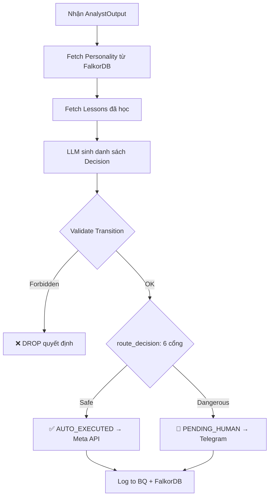
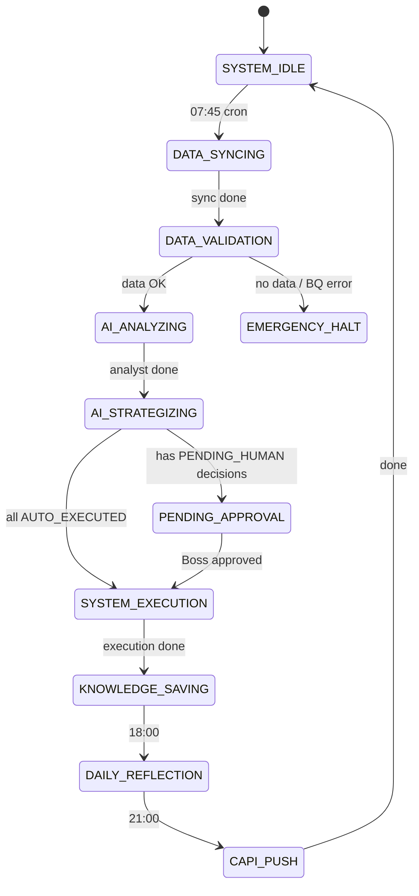

# AGENT_WORKFLOWS.md — Sổ tay Quy trình AI (Agent Workflow Handbook)

> **Version:** 1.0 — Frozen 2026-03-02  
> **Audience:** Boss / Dev / Stakeholders

---

## Table of Contents

1. [Tổng Quan Hệ Thống 2 Agent](#1-tổng-quan-hệ-thống-2-agent)
2. [Lịch Trình Hàng Ngày](#2-lịch-trình-hàng-ngày)
3. [Executive Analyst — Quy Trình 7 Bước](#3-executive-analyst--quy-trình-7-bước)
4. [COD Business Logic — Bộ Quy Tắc Doanh Thu](#4-cod-business-logic--bộ-quy-tắc-doanh-thu)
5. [Marketing Director — Quy Trình Ra Quyết Định](#5-marketing-director--quy-trình-ra-quyết-định)
6. [6 Cổng Kiểm Duyệt (Routing Gates)](#6-6-cổng-kiểm-duyệt-routing-gates)
7. [Bản Đồ State Machine](#7-bản-đồ-state-machine)
8. [Delegation Matrix — Phân Quyền Multi-Project](#8-delegation-matrix--phân-quyền-multi-project)

---

## 1. Tổng Quan Hệ Thống 2 Agent

Hệ thống FAOS v6 vận hành trên 2 "nhân viên AI" hoạt động nối tiếp nhau:

| # | Agent | Vai trò | File |
|:--|:------|:--------|:-----|
| 1 | **Executive Analyst** (Pillar 2) | Phân tích 3 trục, dự báo, tự học | `faos_brain/analyst.py` |
| 2 | **Marketing Director** (Pillar 3) | Ra quyết định, phân luồng, thực thi Meta API | `faos_brain/marketing_director.py` |

**Luồng chính:**

```
BigQuery (data) → Analyst (phân tích) → Director (quyết định) → Meta API (thực thi)
       ↑                   ↓                      ↓
   FalkorDB ←──── Lessons + Predictions ←──── Decision logs
```

Cả 2 agent đều chạy qua `ForcedWorkflow` — một orchestrator cứng bắt buộc tuân thủ thứ tự bước, không cho phép bỏ qua.

---

## 2. Lịch Trình Hàng Ngày

| Giờ (VN) | Trigger | Hành Động | Agent | File |
|:---------:|:--------|:----------|:------|:-----|
| **07:45** | Cron | Đồng bộ dữ liệu POS → BigQuery | ETL | External sync |
| **08:00** | Cron | **Chạy phân tích + ra quyết định đầy đủ** | Analyst → Director | `runner.py --project stramark` |
| **18:00** | Cron | **Reflection**: So sánh dự báo T-1 vs thực tế T-0 | Analyst (Step 7) | `runner.py --reflection-only` |
| **21:00** | Cron | **CAPI Push**: Đẩy conversion data lên Meta | CAPI workflow | `workflows/capi_push.py` |

### Chế Độ Chạy

```bash
# Chạy thử (không gọi Meta API, không gửi report)
python -m faos_brain.runner --project stramark --dry-run

# Chạy thật (gọi Meta API + gửi Discord/Telegram)
python -m faos_brain.runner --project stramark --live

# Chỉ Analyst (không Director)
python -m faos_brain.runner --project stramark --analyst-only --dry-run

# Chỉ Reflection (18:00)
python -m faos_brain.runner --project stramark --reflection-only
```

---

## 3. Executive Analyst — Quy Trình 7 Bước

> **File**: `faos_brain/analyst.py` — class `ExecutiveAnalyst`  
> **System Prompt**: `faos_brain/prompts/analyst_system.md`

Analyst PHẢI chạy đúng 7 bước theo thứ tự. Không được bỏ bước.

### Bảng Tổng Quan

| Bước | Tên | Nguồn dữ liệu | Fail → ? |
|:----:|:----|:---------------|:---------|
| 1 | Lấy SOPs & Personality | FalkorDB | Fallback → defaults |
| 2 | Lấy dữ liệu T-1 (lịch sử) | BigQuery | Fallback → empty (lần chạy đầu) |
| 3 | Lấy dữ liệu T-0 (hôm nay) | BigQuery | **⛔ ABORT** — không có data = không phân tích |
| 4 | LLM Reasoning (phân tích 3 trục) | Gemini / GPT | Fallback → rule-based |
| 5 | Gửi báo cáo | Discord / Telegram | Log error, tiếp tục |
| 6 | Lưu Knowledge | BQ + FalkorDB | Log error, tiếp tục |
| 7 | Daily Reflection | BQ (so sánh T-1 vs T-0) | Bỏ qua nếu lần đầu |

### Step 3: DATA GATE (Cổng Dữ Liệu)

Đây là bước **quan trọng nhất**. Nếu BigQuery không có data:

```
Step 3 ABORT → Toàn bộ workflow DỪNG → agent_run_log ghi status = "ERROR"
```

Analyst query 3 trục dữ liệu:

| View | Mô Tả |
|:-----|:-------|
| `vw_daily_momentum` | ROAS, orders, revenue, MA3/MA7 cấp project |
| `vw_marketer_momentum` | Hiệu quả từng marketer (ROAS, CPA, momentum) |
| `vw_product_lifecycle` | Phân loại BCG (Star/Cash Cow/Question Mark/Dog) |

### Step 4: Phân tích 3 Trục

| Trục | Tên | Output |
|:-----|:----|:-------|
| 🏆 Axis 1 | **Bảng Phong Thần Marketer** | Leaderboard xếp hạng marketer theo efficiency_score |
| 🐄 Axis 2 | **Vòng Đời Sản Phẩm** (BCG) | Phân loại ⭐Star / 🐄Cash Cow / ❓Question Mark / 🐕Dog |
| 🌍 Axis 3 | **Bản Đồ Thị Trường Chéo** | So sánh ROAS, CPM, momentum giữa các thị trường |

### Step 7: Daily Reflection

So sánh dự báo T-1 với thực tế T-0:

```
Accuracy = |1 - |predicted - actual| / actual| × 100
Direction correct = predicted ↑ AND actual ↑ (hoặc cả hai ↓)
```

Kết quả ghi ngược vào `ai_prediction_log` (cột `actual_value`, `accuracy_pct`, `direction_correct`).

---

## 4. COD Business Logic — Bộ Quy Tắc Doanh Thu

> **Đây là đặc thù nghiệp vụ quan trọng nhất** — bán hàng COD (Cash On Delivery)  
> **File**: `faos_brain/prompts/analyst_system.md` (section "COD BUSINESS LOGIC")

### 4.1 Hai Luồng Doanh Thu

| Metric | Ý Nghĩa | Khi Nào Dùng |
|:-------|:--------|:-------------|
| `provisional_revenue` | Tổng đơn POS chốt trong ngày (chưa giao xong) | Monitoring nhanh intraday |
| `provisional_roas` | = provisional_revenue / spend | Tín hiệu sớm — **KHÔNG DÙNG ĐỂ SCALE** |
| `confirmed_revenue` | Đơn đã DELIVERED/SUCCESS (trừ hoàn/hủy) | **Quyết định dài hạn** |
| `confirmed_roas` | = confirmed_revenue / spend | **ROAS THẬT** |
| `confirmed_roas_ma7` | Moving Average 7 ngày confirmed_roas | **DÙNG CHO SCALING — metric duy nhất** |

### 4.2 Tín Hiệu Sớm (Early Signal Metrics)

| Metric | Ngưỡng Cảnh Báo | Hành Động |
|:-------|:----------------|:----------|
| `cost_per_lead` (CPL) | CPL hôm nay > CPL_MA7 × 2 | 🔴 **PAUSE ngay** (không cần chờ doanh thu) |
| `cost_per_mess` (CPMess) | CPMess hôm nay > CPMess_MA7 × 2 | ⚠️ Cảnh báo + giảm budget 20% |
| `total_leads` | Giảm > 50% so với MA7 | Kiểm tra targeting |
| `total_messages` | Giảm > 50% so với MA7 | Kiểm tra creative |

### 4.3 Quy Tắc Tối Ưu Theo Thời Gian

#### 🔴 Ngắn hạn (Intraday / 1-3 ngày)

| Điều kiện | Hành động |
|:----------|:----------|
| CPL hôm nay > CPL_MA7 × 2 | PAUSE ngay |
| provisional_roas < 1.0 liên tục 2 ngày | PAUSE |
| Leads = 0 nhưng spend > 0, 2 ngày liên tiếp | PAUSE |

#### 🟢 Dài hạn (MA7 — cho quyết định SCALE)

| Điều kiện | Hành động |
|:----------|:----------|
| confirmed_roas_ma7 < target_roas | 🚫 **CẤM SCALE** — bất kể provisional_roas cao đến đâu |
| confirmed_roas_ma7 ≥ roas_excellent (3.0) + UPTREND + success_rate ≥ 70% | ✅ ĐỦ ĐIỀU KIỆN SCALE |
| provisional_roas >> confirmed_roas (gap > 50%) | ⚠️ **CẢNH BÁO ĐƠN ẢO** (Phantom Revenue) |

### 4.4 Bảng Tham Chiếu Nhanh

```
CPL hôm nay > CPL_MA7 × 2         → 🔴 PAUSE ngay
provisional_roas < 1.0 (2 ngày)   → 🔴 PAUSE
confirmed_roas_ma7 < target        → 🟡 CẤM SCALE (dù provisional đẹp)
confirmed_roas_ma7 ≥ excellent     → 🟢 ĐỦ ĐIỀU KIỆN SCALE
  + momentum UPTREND
  + success_rate ≥ 70%
provisional_roas >> confirmed_roas → ⚠️ CẢNH BÁO ĐƠN ẢO
```

### 4.5 Hard Rules (Không Được Vi Phạm)

1. **NEVER** kill campaign < 7 ngày tuổi
2. **NEVER** scale nếu `confirmed_roas_ma7` < target — dù `provisional_roas` tốt
3. **NEVER** thay đổi Cash Cow product — đó là "thế cân bằng mong manh"
4. **ALWAYS** check MA7 trend trước khi đánh giá 1 ngày duy nhất
5. **CẤM** dùng `provisional_roas` để justify SCALE — chỉ dùng `confirmed_roas_ma7`
6. Nếu `provisional_roas` >> `confirmed_roas` (gap > 50%) → phải ghi "⚠️ Rủi ro đơn ảo"

---

## 5. Marketing Director — Quy Trình Ra Quyết Định

> **File**: `faos_brain/marketing_director.py` — class `MarketingDirector`  
> **System Prompt**: `faos_brain/prompts/director_system.md`

### 5.1 Workflow Tổng Quan



### 5.2 HARD_BLOCK_ACTIONS — Hành Động Luôn Cần Người Duyệt

```python
HARD_BLOCK_ACTIONS = frozenset({
    "kill_campaign",     # Tắt chiến dịch
    "new_campaign",      # Tạo chiến dịch mới
    "update_rule",       # Thay đổi rule hệ thống
})
```

Bất kể budget bao nhiêu, bất kể personality settings → 3 hành động này **LUÔN** phải chờ Boss duyệt.

### 5.3 Campaign Lifecycle Rules

| Giai Đoạn | Ngày | Đặc Điểm | AI Được Làm Gì |
|:----------|:----:|:---------|:----------------|
| 🆕 NEW_LAUNCH | 0-7 | Learning Phase — Meta AI đang học | ĐỂ YÊN. Chỉ monitor. |
| 📊 EVALUATING | 7-14 | Đánh giá — so sánh ROAS vs target | Đánh giá, cảnh báo nếu ROAS < danger 3 ngày |
| 🚀 SCALING_UP | 7+ | Scale — ROAS ≥ target, stable ≥ 3 ngày | +20%/ngày (auto), >30% cần Boss |
| 🐄 STABLE_RUNNING | 14+ | Cash Cow — chạy ổn định | KHÔNG ĐỤNG VÀO |
| 💀 KILLED | - | Đã tắt — terminal state | Không thể chuyển sang trạng thái khác |
| ⏸️ PAUSED | - | Tạm dừng (CPL cao, v.v.) | Có thể RESUME |

---

## 6. 6 Cổng Kiểm Duyệt (Routing Gates)

> **Function**: `marketing_director.py → route_decision()`  
> Mỗi quyết định phải đi qua 6 cổng kiểm tra tuần tự. Nếu BẤT KỲ cổng nào fail → `PENDING_HUMAN`.

### Gate 1: 🔒 AI Delegation Matrix Guard

```
Nếu Ad Account thuộc về managed_by = HUMAN
    → raise ForbiddenTransitionError (AI KHÔNG ĐƯỢC đụng vào)
```

Đây là cổng đầu tiên, chặn cứng. Mỗi Ad Account được gán là `AI` hoặc `HUMAN` trong FalkorDB (node `AdAccountConfig`). Account đánh dấu `HUMAN` sẽ bị chặn tuyệt đối — AI không thể bypass bằng bất kỳ cách nào.

### Gate 2: 🚫 Hard Block Actions

```
Nếu action ∈ {kill_campaign, new_campaign, update_rule}
    → PENDING_HUMAN (luôn luôn, không ngoại lệ)
```

### Gate 3: 📊 Scale > 30% Check

```
Nếu action = scale_budget AND change_pct > 30%
    → PENDING_HUMAN ("High CPM spike risk")
```

### Gate 4: 💰 Per-Decision Budget Limit

```
Nếu budget_change_cents > auto_budget_limit (PersonalityConfig)
    → PENDING_HUMAN ("Exceeds auto_budget_limit")
```

Ví dụ: `auto_budget_limit = 5000` (= $50/lần). Nếu scale $60 → phải hỏi Boss.

### Gate 5: 🎚️ Conservative + Scale 20-30%

```
Nếu action = scale_budget AND change_pct > 20% AND risk_level < 0.5
    → PENDING_HUMAN ("Conservative personality")
```

Đây là cổng "personality-aware" — nếu Boss set risk_level thấp (thận trọng), thì scale 20-30% cũng phải hỏi.

### Gate 6: 📈 Daily Auto-Exec Ceiling

```
Nếu tổng auto-exec budget hôm nay + lần này > daily_auto_ceiling
    → PENDING_HUMAN ("Daily ceiling exceeded")
```

Track bởi `DailyAutoTracker`. Reset tự động lúc 00:00. Ngăn AI "lách" bằng nhiều lệnh nhỏ liên tiếp.

### Tóm Tắt Bảng

| # | Gate | Trigger | Kết Quả |
|:-:|:-----|:--------|:--------|
| 1 | Delegation Matrix | Account = HUMAN | `ForbiddenTransitionError` (chặn cứng) |
| 2 | Hard Block Actions | kill / new / update_rule | PENDING_HUMAN |
| 3 | Scale > 30% | change_pct > 30 | PENDING_HUMAN |
| 4 | Budget Limit | cents > auto_budget_limit | PENDING_HUMAN |
| 5 | Conservative + 20-30% | scale 20-30% + risk < 0.5 | PENDING_HUMAN |
| 6 | Daily Ceiling | sum_today > daily_auto_ceiling | PENDING_HUMAN |
| ✅ | All pass | Tất cả OK | **AUTO_EXECUTED** |

---

## 7. Bản Đồ State Machine

### Level 1: Master Heartbeat (Orchestration)



### Level 2: Decision Lifecycle

```
PROPOSED → AUTO_EXECUTED → EXECUTION_SUCCESS/FAILED
PROPOSED → PENDING_HUMAN → APPROVED → EXECUTING → EXECUTION_SUCCESS
                         → REJECTED
                         → EXPIRED (timeout)
EXECUTION_SUCCESS → UNDER_REVIEW (T+24h) → REVIEWED (WIN/LOSS/NEUTRAL)
```

### Level 3: Forbidden Campaign Transitions

| From State | Cannot Go To | Reason |
|:-----------|:-------------|:-------|
| KILLED | * (anywhere) | Terminal state — không chuyển được nữa |
| LEARNING_PHASE | SCALING_UP, STABLE_RUNNING | Chưa qua 7 ngày learn |
| NEW_LAUNCH | SCALING_UP, STABLE_RUNNING, AD_FATIGUE | Campaign mới, kiên nhẫn |
| MONITORING | SCALING_UP | Đang monitor, chưa đủ data |
| AD_FATIGUE | SCALING_UP | Creative mệt, scale sẽ tệ hơn |
| STOCK_OUT_PAUSED | STABLE_RUNNING, SCALING_UP | Hết hàng, chưa có hàng lại |

---

## 8. Delegation Matrix — Phân Quyền Multi-Project

> **File**: `faos_brain/models/delegation.py`

Mỗi project (stramark, auus1, zen8) có nhiều Ad Account trên Meta. Mỗi account được gán quyền:

| managed_by | AI Được Làm Gì | Ví Dụ |
|:-----------|:----------------|:------|
| `AI` | Auto-execute budget changes (trong giới hạn 6 cổng) | Account chạy Advantage+ |
| `HUMAN` | **CHẶN CỨNG** — AI không đụng vào bất kỳ thao tác nào | Account chạy manual, do marketer quản lý |

Config lưu trong FalkorDB node `AdAccountConfig`:

```cypher
CREATE (a:AdAccountConfig {
    project_id: "stramark",
    account_id: "act_123456789",
    account_name: "Stramark Romania ASC",
    managed_by: "AI"
})
```

Khi AI cố thao tác trên account HUMAN → `ForbiddenTransitionError` → quyết định bị **DROP hoàn toàn** (không phải PENDING, mà là bị từ chối luôn).

Fallback khi FalkorDB không kết nối được: mặc định TẤT CẢ accounts = HUMAN (an toàn nhất).

---

*Last updated: 2026-03-02 | FAOS v6 Documentation Freeze*
