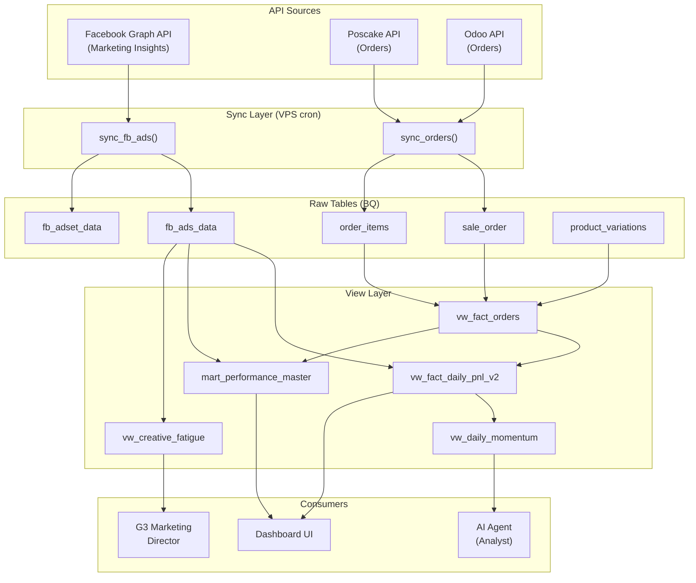

# Database Architecture — FAOS v6

> **Last updated:** 2026-03-07 | **Scope:** All datasets (STRAMARK, AUUS1, TALPHA, T1, zen8, trendify, HNLE)

---

## 1. Data Flow Overview



---

## 2. Dataset Schema per Project

| Column | STRAMARK | AUUS1 | TALPHA | T1 |
|--------|:--------:|:-----:|:------:|:--:|
| **Currency** | RON | VND | VND | VND |
| **POS** | Poscake | Poscake | Odoo | Pancake |
| **Ad accounts** | 2 | 1 | 7 | 1 |
| **Views count** | 38 | 32 | 0 | 8 |
| **fb_ads columns** | 20 | 20 | 24 | 15 |
| `revenue_L4_...` | `cod_collected` | `collected` | N/A | N/A |
| `product_variations.imported_price` | ✅ | ❌ | N/A | N/A |

> [!IMPORTANT]
> **Mỗi project có schema khác nhau.** Không copy SQL giữa projects mà không check column names.

---

## 3. Sync Patterns

### 3.1 Ads Sync: Date-Range Delete + Append ✅
```
1. Fetch insights từ FB API (days_back=1 cho daily, days_back=35 cho backfill)
2. DELETE FROM fb_ads_data WHERE date >= since AND date <= until
3. INSERT new rows (APPEND)
```

| Property | Value |
|----------|-------|
| Scope | Chỉ xóa date range được sync |
| Old data | ✅ Preserved (ngoài date range) |
| TKQC die | ✅ Data cũ còn (không bị xóa) |
| TKQC mới | ✅ Data mới thêm vào (append) |
| Sync fail | ⚠️ Date range bị xóa, cần re-sync |

### 3.2 Order Sync: Full Reload (WRITE_TRUNCATE)
```
1. Fetch ALL orders từ POS API
2. WRITE_TRUNCATE → xóa toàn bộ → insert mới
```

| Property | Value |
|----------|-------|
| Scope | Full table |
| Safety | ⚠️ Phụ thuộc API trả đầy đủ |
| Guard | ✅ `len(new) < existing * 0.5 → ABORT` |

### 3.3 BQ Column Naming Convention
```
leads            → FLOAT64
messaging_conversations_started → INT64 (NOT 'messages')
add_to_cart      → INT64
cpm/ctr/cpc      → FLOAT64
frequency        → FLOAT64
```

> [!CAUTION]
> Sync scripts MUST sử dụng `messaging_conversations_started` (NOT `messages`) để match BQ schema.
> `leads` phải cast sang `float()` trước khi upload.

---

## 4. View Layer Architecture

### 4.1 `vw_fact_daily_pnl_v2` — Daily P&L Summary
- **Input:** `fb_ads_data` (trực tiếp) + `vw_fact_orders`
- **Join:** `FULL OUTER JOIN` trên `report_date` (KHÔNG join marketer)
- **FX:** `cost_exchange_rates` (USD → local currency)
- **Consumers:** Dashboard CEO, P&L tab, `vw_daily_momentum`

> [!WARNING]
> **KHÔNG đọc từ `mart_performance_master`.** View này đã được tách khỏi mart để tránh bug marketer attribution.

### 4.2 `mart_performance_master` — Marketer-Level Performance
- **Input:** `fb_ads_data` → marketer resolution + `vw_fact_orders`
- **Join:** `LEFT JOIN ads_agg ON marketer_id + report_date`
- **Consumers:** Dashboard Marketing tab
- ⚠️ **Limitation:** Spend = 0 cho ngày chưa có marketer attribution

### 4.3 `vw_daily_momentum` — AI Agent Data Source
- **Input:** `vw_fact_daily_pnl_v2`
- **Consumers:** `analyst.py` (daily analysis)

### 4.4 `vw_creative_fatigue` — Ad Creative Health
- **Input:** `fb_ads_data` trực tiếp
- **Consumers:** `marketing_director.py` (KILL/SCALE decisions)

---

## 5. Data Retention Policy

### 5.1 When Ad Accounts Die
| Scenario | What happens |
|----------|-------------|
| TKQC bị disable | Data cũ **PRESERVED** — sync chỉ delete date range, không delete by account |
| TKQC mới thay thế | Data mới **APPENDED** — cũ + mới cùng tồn tại |
| Sync chạy cho TKQC die | API trả 0 rows → DELETE 0 rows → **data không bị ảnh hưởng** |
| Backfill sau khi TKQC die | ⚠️ DELETE date range → INSERT 0 (vì API trả rỗng) → **date range bị mất** |

### 5.2 Safe Backfill Protocol
```bash
# ĐÚNG: Backfill chỉ date range cần
python sync_script.py --ads --days 7

# SAI: Backfill quá rộng (sẽ xóa data cũ ngoài phạm vi API)
python sync_script.py --ads --days 180
```

> [!CAUTION]
> **Backfill days PHẢI <= phạm vi API trả data.** Facebook API giới hạn 37 tháng. Nếu backfill 180 ngày nhưng TKQC mới chỉ 30 ngày → 150 ngày data cũ bị xóa.

### 5.3 BigQuery Time Travel
BQ tự động giữ snapshot 7 ngày. Nếu data bị xóa nhầm:
```sql
SELECT * FROM `dataset.fb_ads_data`
FOR SYSTEM_TIME AS OF TIMESTAMP_SUB(CURRENT_TIMESTAMP(), INTERVAL 1 DAY)
```

---

## 6. Adding New Projects

### Checklist
1. **Create dataset** trong BQ: `{PROJECT}_Dataset`
2. **Create raw tables:** `fb_ads_data`, `sale_order`, `order_items`, `product_variations`
3. **Create views:** Clone từ STRAMARK, **SỬA column names** theo project
4. **Create sync script:** Copy structure, sử dụng `date-range delete` pattern
5. **Config:** Add ad accounts vào `config/ad_accounts.json`
6. **Cron:** Add schedule vào VPS crontab
7. **FX rates:** Insert vào `cost_exchange_rates`

> [!IMPORTANT]
> **Column names khác nhau giữa projects** (ví dụ: `revenue_L4_cod_collected` vs `revenue_L4_collected`). LUÔN check `vw_fact_orders` schema trước khi clone views.

---

## 7. Known Limitations

| # | Limitation | Impact | Workaround |
|---|-----------|--------|------------|
| 1 | `mart_performance_master` join by marketer | Spend = 0 khi attribution fail | `vw_fact_daily_pnl_v2` bypass mart |
| 2 | Order `WRITE_TRUNCATE` mỗi sync | Risk nếu API fail | Safety guard: abort if <50% |
| 3 | Delete before Insert (non-atomic) | Data gap nếu insert fail | BQ time-travel 7 ngày |
| 4 | `autodetect=True` schema | Type mismatch risk | Nên dùng explicit SchemaField |
