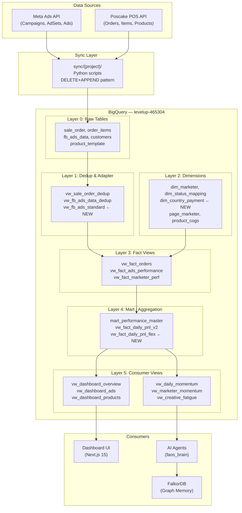
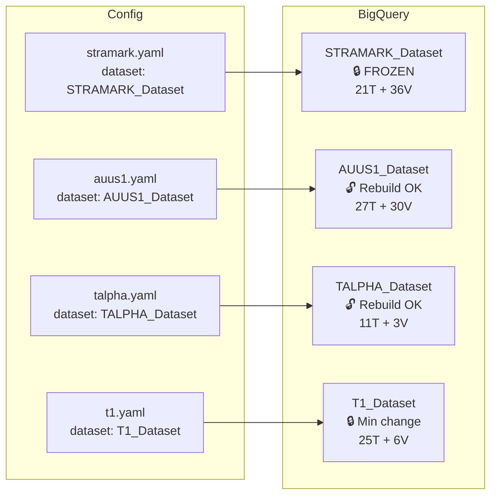

# FAOS v6 — Database System Design

> **Version:** 2.0  
> **Author:** Data Architect Agent  
> **Date:** 2026-03-07  
> **Status:** Living Document — cập nhật mỗi khi có thay đổi schema

---

## Table of Contents

1. [Business Context](#1-business-context)
2. [Architecture Overview](#2-architecture-overview)
3. [Payment Model Design](#3-payment-model-design)
4. [Data Layer Architecture](#4-data-layer-architecture)
5. [Schema Standards](#5-schema-standards)
6. [View Layer Architecture](#6-view-layer-architecture)
7. [Project Dataset Mapping](#7-project-dataset-mapping)
8. [Partitioning & Cost Strategy](#8-partitioning--cost-strategy)
9. [Adapter View Pattern](#9-adapter-view-pattern)
10. [Change Control Rules](#10-change-control-rules)
11. [New Project Setup Guide](#11-new-project-setup-guide)

---

## 1. Business Context

FAOS v6 quản lý nhiều dự án e-commerce bán hàng xuyên biên giới, mỗi dự án có thị trường và mô hình thanh toán riêng.

| Project | Markets | Payment | Currency | ROAS Model |
|:--------|:--------|:-------:|:--------:|:-----------|
| STRAMARK | 🇷🇴 Romania, 🇧🇬 Bulgaria | COD | RON, BGN | Dual (provisional ≠ confirmed) |
| T1 | 🇷🇴 Romania, 🇧🇬 Bulgaria, 🇸🇰 Slovakia | COD | RON, BGN, EUR | Dual |
| TALPHA | 🇸🇦 Middle East, 🇯🇵 Japan, 🇹🇼 Taiwan, 🇰🇷 Korea | **Mixed** | SAR, JPY, TWD, KRW | Mixed |
| AUUS1 | 🇺🇸 USA, 🇦🇺 Australia | Prepaid | USD, AUD | Single (revenue = confirmed) |

**COD (Cash On Delivery):** Thu tiền khi giao hàng → `provisional_revenue` (đơn tạo) ≠ `confirmed_revenue` (đơn giao thành công).

**Prepaid:** Khách trả tiền trước → `provisional_revenue` = `confirmed_revenue`.

**Mixed:** Cùng project nhưng market khác nhau có model khác nhau (ví dụ TALPHA: Korea = Prepaid, Middle East = COD).

---

## 2. Architecture Overview



---

## 3. Payment Model Design

### 3.1 `dim_country_payment` — Auto-Detect Table

```sql
-- Seed data: country → payment model mapping
INSERT INTO `{DATASET}.dim_country_payment` VALUES
  ('RO', 'Romania',      'COD',     'EU',          'RON', TRUE),
  ('BG', 'Bulgaria',     'COD',     'EU',          'BGN', TRUE),
  ('SK', 'Slovakia',     'COD',     'EU',          'EUR', TRUE),
  ('SA', 'Saudi Arabia', 'COD',     'MIDDLE_EAST', 'SAR', TRUE),
  ('AE', 'UAE',          'COD',     'MIDDLE_EAST', 'AED', TRUE),
  ('OM', 'Oman',         'COD',     'MIDDLE_EAST', 'OMR', TRUE),
  ('JP', 'Japan',        'COD',     'ASIA',        'JPY', TRUE),
  ('TW', 'Taiwan',       'COD',     'ASIA',        'TWD', TRUE),
  ('KR', 'Korea',        'PREPAID', 'ASIA',        'KRW', FALSE),
  ('US', 'USA',          'PREPAID', 'NA',          'USD', FALSE),
  ('AU', 'Australia',    'PREPAID', 'OCEANIA',     'AUD', FALSE);
```

### 3.2 ROAS Calculation Logic

```sql
-- In vw_fact_daily_pnl_flex:
CASE
  WHEN cp.requires_dual_roas = TRUE THEN  -- COD
    STRUCT(
      revenue_all_orders      AS provisional_revenue,
      revenue_delivered_only   AS confirmed_revenue
    )
  ELSE  -- Prepaid
    STRUCT(
      revenue_all_orders      AS provisional_revenue,
      revenue_all_orders      AS confirmed_revenue  -- same!
    )
END
```

**Kết quả:** Views P&L output **cùng columns** cho cả COD lẫn Prepaid → downstream views (dashboard, AI) không cần biết payment model.

---

## 4. Data Layer Architecture

### 4.1 Physical Tables (per dataset)

| Table | Purpose | Cols | Partition | Cluster |
|:------|:--------|:----:|:---------:|:--------|
| `sale_order` | POS orders | 73 | — | — |
| `order_items` | POS items | 25 | — | — |
| `fb_ads_data` | Meta Ads | 21+ | — | — |
| `fb_adset_data` | Meta Adsets | 11 | — | — |
| `fb_campaign_data` | Meta Campaigns | 10 | — | — |
| `customers` | POS customers | var | — | — |
| `product_template` | Products | 16 | — | — |
| `product_variations` | Variants | 19 | — | — |

> **Note:** Current tables không có partitioning vì data volume nhỏ (<500MB per dataset). Cost ước tính ~$0.002/query. Nếu scale >1GB thì ADD partition — không cần refactor.

### 4.2 Dimension Tables

| Table | Purpose | Key |
|:------|:--------|:----|
| `dim_marketer` | Marketer info | marketer_id |
| `dim_marketer_mapping` | Page→Marketer | page_id |
| `dim_market_mapping` | Market→Region | market_code |
| `dim_status_mapping` | Order status codes | status_code |
| `dim_country_payment` ← **NEW** | Country→Payment model | country_code |
| `page_marketer` | FB Page→Marketer | page_id |
| `product_cogs` | Cost of goods | product_id |
| `cost_exchange_rates` | Currency rates | currency_pair |

### 4.3 AI Agent Tables

| Table | Purpose | Partition | Retention |
|:------|:--------|:---------:|:---------:|
| `agent_run_log` | Workflow monitoring | DATE(started_at) | 365d |
| `ai_prediction_log` | AI predictions | DATE(created_at) | 365d |
| `approval_logs` | Decision audit trail | DATE(created_at) | 730d |
| `capi_push_log` | CAPI push idempotency | DATE(pushed_at) | 365d |

---

## 5. Schema Standards

> [!IMPORTANT]
> Mọi table/view mới **PHẢI** tuân thủ các tiêu chuẩn dưới đây.

### 5.1 Data Types

| Type | Use For | Example |
|:-----|:--------|:--------|
| `STRING` | IDs, names, enums | order_id, campaign_name, status |
| `FLOAT64` | Money (đã ÷100 từ ETL) | spend, revenue, cogs |
| `INT64` | Counts | impressions, clicks, orders |
| `DATE` | Date keys (partition) | report_date, order_date |
| `TIMESTAMP` | Exact time + audit | created_at, sync_time |
| `BOOL` | Flags | is_active, requires_dual_roas |
| `JSON` | Flexible nested | meta_api_response |

### 5.2 Naming Convention

```
Tables:      snake_case, no prefix      → sale_order, fb_ads_data
Views:       vw_ prefix                 → vw_dashboard_overview
Marts:       mart_ prefix               → mart_performance_master
Dimensions:  dim_ prefix                → dim_country_payment
Staging:     staging_ prefix            → staging_fb_ads_data
Adapter:     vw_{source}_standard       → vw_fb_ads_standard
Columns:     snake_case                 → campaign_name, total_orders
```

### 5.3 Null Safety

```sql
-- ALWAYS use COALESCE for computed columns
COALESCE(spend, 0) AS spend
SAFE_DIVIDE(revenue, NULLIF(spend, 0)) AS roas
```

### 5.4 Dedup Pattern

```sql
-- ROW_NUMBER for latest version of each record
ROW_NUMBER() OVER (
    PARTITION BY id
    ORDER BY sync_time DESC
) AS _row_num
-- Then filter WHERE _row_num = 1
```

---

## 6. View Layer Architecture

```
Layer 0: Raw Tables (physical)
  │
Layer 1: Dedup + Adapter Views
  │  vw_sale_order_dedup, vw_fb_ads_data_dedup
  │  vw_fb_ads_standard ← NEW (adapter)
  │
Layer 2: Fact Views (joins + computed columns)
  │  vw_fact_orders, vw_fact_ads_performance
  │  vw_fact_marketer_perf, vw_fact_campaign_perf
  │
Layer 3: Mart Views (heavy aggregation)
  │  mart_performance_master
  │  vw_fact_daily_pnl_v2 (existing, COD)
  │  vw_fact_daily_pnl_flex ← NEW (COD + Prepaid)
  │
Layer 4: Consumer Views (thin, specific)
  ├── Dashboard: vw_dashboard_overview, _ads, _products, etc.
  └── AI Agent:  vw_daily_momentum, _marketer_momentum, _creative_fatigue
```

**Rule:** Mỗi view chỉ đọc từ layer trên nó hoặc raw tables. Không skip layers để tránh dependency spaghetti.

---

## 7. Project Dataset Mapping



| Dataset | Maturity | Dashboard | AI Agent | Adapter View Needed? |
|:--------|:--------:|:---------:|:--------:|:--------------------:|
| STRAMARK | ⭐⭐⭐⭐⭐ | ✅ Full | ✅ Full | ❌ (is the standard) |
| AUUS1 | ⭐⭐⭐⭐ | ✅ Full | ⚠️ Partial | ✅ For Prepaid model |
| TALPHA | ⭐⭐ | ✅ Custom | ❌ No AI | ✅ For `date_start` + mixed model |
| T1 | ⭐⭐⭐ | ✅ Partial | ❌ No AI | ✅ Minimal adapter |

---

## 8. Partitioning & Cost Strategy

### 8.1 Current State

| Metric | Value |
|:-------|:------|
| Total data volume (all datasets) | ~2GB |
| Avg query scan | ~50MB |
| Estimated cost per query | ~$0.0003 |
| Monthly query volume | ~10,000 |
| **Monthly cost estimate** | **~$3** |

> **Verdict:** Volume hiện tại **quá nhỏ** để partitioning tạo khác biệt cost đáng kể. Tuy nhiên, nên chuẩn bị partition columns cho khi scale.

### 8.2 When to Add Partitioning

| Trigger | Action |
|:--------|:-------|
| Dataset >1GB | ADD `PARTITION BY DATE(date)` cho `fb_ads_data` |
| Dataset >5GB | ADD `PARTITION BY DATE(inserted_at)` cho `sale_order` |
| Query cost >$50/month | Consider materialized views cho dashboard aggregations |

### 8.3 Cost Optimization Rules

```
✅ SELECT chỉ columns cần thiết (không SELECT *)
✅ WHERE filter trên date columns (partition pruning)
✅ LIMIT cho exploratory queries
✅ Views (free, luôn fresh) thay vì tables cho computed columns
❌ Không CROSS JOIN
❌ Không query staging tables trực tiếp từ dashboard
```

---

## 9. Adapter View Pattern

### 9.1 Vấn đề

Mỗi dataset có schema `fb_ads_data` hơi khác nhau (column names, types, order). Không thể dùng chung SQL views.

### 9.2 Giải pháp

Tạo `vw_fb_ads_standard` per dataset — **output columns giống hệt nhau** bất kể input khác nhau.

```
STRAMARK fb_ads_data ──→ vw_fb_ads_standard (passthrough)
AUUS1    fb_ads_data ──→ vw_fb_ads_standard (reorder + add missing)
TALPHA   fb_ads_data ──→ vw_fb_ads_standard (date_start→date, actions→purchases)
T1       fb_ads_data ──→ vw_fb_ads_standard (passthrough)
```

### 9.3 Standard Output Schema

| Column | Type | Description |
|:-------|:----:|:-----------|
| ad_id | STRING | |
| ad_name | STRING | |
| adset_id | STRING | |
| adset_name | STRING | |
| campaign_id | STRING | |
| campaign_name | STRING | |
| account_id | STRING | |
| date | DATE | **Standardized** — CAST from STRING or date_start |
| spend | FLOAT64 | |
| impressions | INT64 | |
| reach | INT64 | |
| clicks | INT64 | |
| cpm | FLOAT64 | |
| cpc | FLOAT64 | |
| ctr | FLOAT64 | |
| frequency | FLOAT64 | |
| purchases | INT64 | **Standardized** — from actions_purchase if needed |
| purchase_value | FLOAT64 | |
| leads | FLOAT64 | |
| messaging_conversations_started | INT64 | |
| add_to_cart | INT64 | |
| sync_time | STRING/TIMESTAMP | |

---

## 10. Change Control Rules

> [!CAUTION]
> **Mỗi lần thay đổi database, PHẢI đọc lại document này và làm theo checklist.**

### 10.1 Severity Matrix

| Hành động | Severity | Approval |
|:----------|:--------:|:--------:|
| ADD column (NULLABLE) | 🟢 Low | Self |
| ADD new table | 🟢 Low | Self |
| ADD new view | 🟡 Medium | Self + test |
| MODIFY existing view SQL | 🟠 High | Test on T1 first |
| MODIFY fact/mart view | 🔴 Critical | Full regression |
| RENAME/DELETE column | ⛔ Forbidden | Never |
| CHANGE column type | ⛔ Forbidden | Never |

### 10.2 Deploy Order

```
Always: small → big, low-risk → high-risk

1. T1 (25 tables)       ← test here first
2. TALPHA (11 tables)   ← verify cross-model
3. AUUS1 (27 tables)    ← verify Prepaid model
4. STRAMARK (21 tables) ← deploy LAST, verify everything
```

### 10.3 Mandatory Checklist

```markdown
## Pre-Change
- [ ] Read this document (DATABASE_SYSTEM_DESIGN.md)
- [ ] Read SCHEMA_FROZEN.md
- [ ] Identify affected tables/views
- [ ] List ALL consumer views (use dependency graph)
- [ ] Confirm: ADD only? No RENAME/DELETE?

## Execution
- [ ] Update SCHEMA_FROZEN.md BEFORE coding
- [ ] Deploy to T1 first
- [ ] Verify T1 dashboard works
- [ ] Deploy remaining datasets in order
- [ ] Verify STRAMARK dashboard works (LAST)

## Post-Change
- [ ] Commit all changes
- [ ] Update this document if architecture changed
- [ ] Update .auto-memory/INDEX.md with lessons
```

---

## 11. New Project Setup Guide

### 11.1 Prerequisites

- Project YAML in `config/projects/{project}.yaml`
- Meta Ad Account IDs
- Poscake Shop IDs
- Countries list for `dim_country_payment`

### 11.2 Setup Steps

| # | Step | Tool |
|---|:-----|:-----|
| 1 | Create BQ dataset `{PROJECT}_Dataset` | `scripts/init_project_dataset.py` |
| 2 | Create core tables (standardized schema) | Auto |
| 3 | Seed `dim_country_payment` with project countries | Auto |
| 4 | Create adapter view `vw_fb_ads_standard` | Auto |
| 5 | Create dedup views | Auto |
| 6 | Create dashboard views | Auto |
| 7 | Create AI views (if AI agent enabled) | Auto |
| 8 | Clone sync script from template | Manual |
| 9 | Clone dashboard components from template | Manual |
| 10 | Run initial sync (--days 90) | Manual |
| 11 | Verify dashboard | Manual |

### 11.3 Config YAML Template

```yaml
project:
  id: "new_project"
  name: "New Project"
  
bigquery:
  project: "levelup-465304"
  dataset: "NEWPROJECT_Dataset"
  
markets:
  - code: "RO"
    payment: "COD"
    currency: "RON"
  - code: "US"
    payment: "PREPAID"
    currency: "USD"

meta_ads:
  accounts:
    - id: "act_123456"
      name: "Main Account"

poscake:
  shops:
    - id: "100123"
      name: "Main Shop"
      
ai_agent:
  enabled: false  # Enable after views are deployed
```

---

*Document version 2.0 | Generated: 2026-03-07*  
*Source: BQ live scan (4 datasets) + Data Architect Agent analysis + Code trace*
