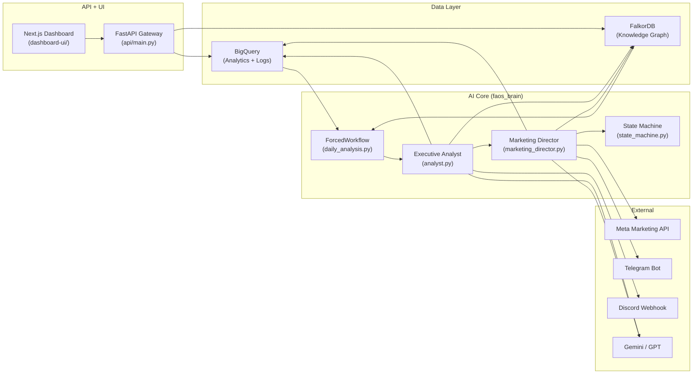

# SYSTEM_ARCHITECTURE.md — Bản Đồ Kiến Trúc FAOS v6

> **Version:** 1.0 — Frozen 2026-03-02  
> **Audience:** Dev / SRE / Handover Team

---

## Table of Contents

1. [Component Overview](#1-component-overview)
2. [Data Flow — End to End](#2-data-flow--end-to-end)
3. [BigQuery Schema](#3-bigquery-schema)
4. [FalkorDB Schema](#4-falkordb-schema)
5. [API Gateway](#5-api-gateway)
6. [Frontend Architecture](#6-frontend-architecture)
7. [External Integrations](#7-external-integrations)
8. [File Tree Map](#8-file-tree-map)

---

## 1. Component Overview



| Component | Tech Stack | Port | Purpose |
|:----------|:-----------|:----:|:--------|
| **BigQuery** | Google Cloud | — | Analytics warehouse + log store |
| **FalkorDB** | Redis-compatible graph DB | 6379 | SOPs, Lessons, Personality, Decision nodes |
| **FastAPI** | Python 3.12 + Uvicorn | 8000 | REST API + SSE event stream |
| **Next.js** | React 19 + TurboPack | 3000 | Dashboard UI (Audit, Live Feed, Memory, Settings) |
| **Meta API** | facebook-business SDK | — | Budget mutations on Facebook Ads |
| **Telegram** | Bot API | — | Approval buttons (Duyệt / Bỏ qua / Rollback) |
| **Discord** | Webhook | — | Reports + alerts |
| **LLM** | Gemini 2.0 Flash (primary), GPT-4o (fallback) | — | Reasoning engine for both agents |

---

## 2. Data Flow — End to End

### 2.1 Daily Flow (08:00)

```
┌─────────────┐     ┌─────────────────┐     ┌──────────────────┐
│  POS System  │────>│  ETL / Sync     │────>│  BigQuery        │
│  (Shopify)   │     │  (07:45 cron)   │     │  raw + views     │
└─────────────┘     └─────────────────┘     └────────┬─────────┘
                                                      │
                                              ┌───────▼────────┐
                                              │ DATA_VALIDATION │
                                              │ (ForcedWorkflow)│
                                              └───────┬────────┘
                                                      │ pass
                                              ┌───────▼────────┐
                  ┌────────────────────────────│  ANALYST       │
                  │  SOPs + Personality        │  (7-step)      │
                  │                            └───────┬────────┘
         ┌────────▼──────────┐                        │ AnalystOutput
         │    FalkorDB       │                 ┌──────▼─────────┐
         │  (Knowledge Graph)│                 │  DIRECTOR      │
         └────────┬──────────┘                 │  (route → exec)│
                  │  Lessons                   └──────┬─────────┘
                  │                                   │
                  │                    ┌──────────────┼──────────────┐
                  │                    │              │              │
                  │            ┌───────▼───┐  ┌──────▼──────┐ ┌────▼─────┐
                  │            │ AUTO_EXEC │  │ PENDING_    │ │ DROPPED  │
                  │            │ → Meta API│  │ HUMAN       │ │ (forbid) │
                  │            └─────┬─────┘  │ → Telegram  │ └──────────┘
                  │                  │        └──────┬──────┘
                  │                  │               │
                  │           ┌──────▼───────────────▼──────┐
                  └───────────│       BQ: approval_logs     │
                              │       BQ: ai_prediction_log │
                              │       FalkorDB: Decision    │
                              └─────────────────────────────┘
```

### 2.2 Reflection Flow (18:00)

```
BQ: ai_prediction_log (T-1) + vw_daily_momentum (T-0)
    → Analyst.run_reflection()
    → Calculate accuracy_pct, direction_correct
    → UPDATE ai_prediction_log SET actual_value, accuracy_pct
```

### 2.3 CAPI Push Flow (21:00)

```
BQ: approval_logs (today's successful executions)
    → capi_push.py
    → Meta Conversions API (CAPI)
    → BQ: capi_push_log
```

---

## 3. BigQuery Schema

### 3.1 Dataset: `STRAMARK_Dataset`

> Project: `levelup-465304`

#### Core Tables

| Table | Purpose | Written By |
|:------|:--------|:-----------|
| `daily_performance` | Daily aggregated metrics (spend, revenue, ROAS, orders) | ETL Sync |
| `ad_performance_*` | Raw ad-level performance data | ETL Sync |
| `ai_prediction_log` | AI predictions + later evaluation with actuals | Analyst |
| `approval_logs` | Decision audit trail (all statuses) | Director |
| `agent_run_log` | Agent execution metadata (start, end, status, errors) | Both agents |
| `capi_push_log` | CAPI push results (event_id, match_score) | CAPI workflow |

#### Materialized Views (for Analyst Step 3)

| View | Purpose | Key Columns |
|:-----|:--------|:------------|
| `vw_daily_momentum` | Project-level daily KPIs with moving averages | `roas`, `roas_ma3`, `roas_ma7`, `roas_momentum`, `revenue_success` |
| `vw_marketer_momentum` | Per-marketer performance + momentum | `marketer_name`, `roas`, `cpa`, `total_orders`, `momentum` |
| `vw_product_lifecycle` | BCG classification for products | `product_name`, `lifecycle_stage`, `roas_ma7`, `days_active` |

#### Table: `ai_prediction_log`

| Column | Type | Description |
|:-------|:-----|:------------|
| `prediction_id` | STRING | Unique ID (pred_xxx) |
| `prediction_date` | DATE | Date prediction was made |
| `agent` | STRING | "analyst" |
| `project_id` | STRING | stramark / auus1 / zen8 |
| `run_id` | STRING | Run identifier |
| `metric` | STRING | roas / total_orders / revenue / cpa |
| `entity_type` | STRING | project / campaign / marketer |
| `entity_id` | STRING | Nullable — entity Meta ID |
| `entity_name` | STRING | Display name |
| `predicted_value` | FLOAT | T+1 prediction |
| `actual_value` | FLOAT | Filled at T+1 reflection |
| `accuracy_pct` | FLOAT | Filled at reflection |
| `direction_correct` | BOOL | Filled at reflection |
| `confidence_pct` | FLOAT | Agent's self-assessment |
| `reasoning` | STRING | Why agent predicted this |
| `evaluated_at` | TIMESTAMP | When reflection ran |
| `report_date` | DATE | Same as prediction_date (alias) |
| `created_at` | TIMESTAMP | Row creation time |

#### Table: `approval_logs`

| Column | Type | Description |
|:-------|:-----|:------------|
| `log_id` | STRING | Unique log entry |
| `decision_id` | STRING | Decision ID (dec_YYYY-MM-DD_NNN) |
| `agent` | STRING | "director" |
| `project_id` | STRING | Project |
| `action` | STRING | scale_budget / kill_campaign / pause_adset / resume_campaign |
| `entity_type` | STRING | campaign / adset |
| `entity_id` | STRING | Meta API entity ID |
| `entity_name` | STRING | Display name |
| `change_detail` | STRING | "$80→$100 (+25%)" |
| `change_value_before` | FLOAT | Budget before (cents) |
| `change_value_after` | FLOAT | Budget after (cents) |
| `reasoning` | STRING | Why (truncated to 1000 chars) |
| `risk_level` | INT | 1-5 |
| `approval_status` | STRING | EXECUTED / APPROVED / REJECTED / EXPIRED / ROLLED_BACK |
| `approved_by` | STRING | SYSTEM_AUTO / human:name |
| `approval_channel` | STRING | auto / telegram / discord |
| `meta_api_response` | STRING | Raw Meta API response |
| `meta_api_success` | BOOL | API call succeeded? |
| `outcome_verdict` | STRING | POSITIVE / NEGATIVE / NEUTRAL (T+24h review) |
| `created_at` | TIMESTAMP | When decision was made |

---

## 4. FalkorDB Schema

### 4.1 Graph Name: `faos_knowledge`

> Connection: Redis protocol, port 6379, host from `FALKORDB_HOST`

### 4.2 Node Types

| Node Label | Description | Key Properties |
|:-----------|:------------|:---------------|
| `SOP` | Standard Operating Procedure rule | `id`, `name` (category), `description` (rule_text), `rules_json`, `priority`, `active` |
| `PersonalityConfig` | AI personality/risk settings | `risk_level`, `auto_budget_limit`, `daily_auto_ceiling`, `target_roas`, `roas_danger`, `roas_excellent` |
| `Lesson` | Learned insight from past runs | `id`, `insight`, `evidence`, `category`, `confidence` (LOW/MED/HIGH), `source_agent`, `validated_count` |
| `Decision` | Record of a Director decision | `id`, `action`, `entity_name`, `entity_id`, `market`, `change_pct`, `budget_change_cents`, `risk_level`, `confidence`, `requires_approval`, `execution_success`, `timestamp`, `run_id` |
| `AdAccountConfig` | AI Delegation Matrix entry | `project_id`, `account_id`, `account_name`, `managed_by` (AI/HUMAN) |
| `Memory` | Agent memory entries | `id`, `type`, `content`, `source_agent`, `timestamp` |

### 4.3 Edge Types (Relationships)

| Edge | From → To | Meaning |
|:-----|:----------|:--------|
| `GOVERNS` | SOP → Decision | SOP rule triggered this decision |
| `LEARNED_FROM` | Lesson → Decision | Lesson derived from decision outcome |
| `CONTROLS` | AdAccountConfig → Decision | Account delegation for decision |
| `PREDICTS` | Prediction → Lesson | Prediction led to learning |
| `INFLUENCES` | Lesson → Decision | Past lesson influenced new decision |

### 4.4 Cypher Examples

```cypher
-- Fetch active SOPs
MATCH (s:SOP) WHERE s.active = true
RETURN s.id, s.name, s.description, s.rules_json, s.priority
ORDER BY s.priority

-- Fetch Personality (singleton)
MATCH (p:PersonalityConfig) RETURN p LIMIT 1

-- Fetch high-confidence lessons
MATCH (l:Lesson) WHERE l.confidence IN ['MEDIUM', 'HIGH']
RETURN l.insight, l.confidence, l.category, l.validated_count
ORDER BY l.validated_count DESC LIMIT 10

-- Check AI delegation for account
MATCH (a:AdAccountConfig)
WHERE a.project_id = 'stramark' AND a.account_id = 'act_123'
RETURN a.managed_by
```

---

## 5. API Gateway

> **File**: `faos_brain/api/main.py`  
> **Port**: 8000 (Uvicorn)

### 5.1 Route Map

| Router File | Prefix | Endpoints |
|:------------|:-------|:----------|
| `agent_feed.py` | `/api/agent-feed` | `GET /{agent}/feed` (SSE stream) |
| `audit_api.py` | `/api/audit` | `GET /approvals` |
| `intelligence_api.py` | `/api/ai-intelligence` | `GET /accuracy`, `GET /win-rate`, `GET /lessons` |
| `memory_api.py` | `/api/memory` | `GET /graph-stats`, `GET /lessons`, etc. |
| `settings_api.py` | `/api/settings` | Delegation matrix CRUD |
| `main.py` | `/api` | `GET /health` |

### 5.2 Authentication & Dependencies

```python
# Dependency injection (api/main.py)
def get_bq_client() -> bigquery.Client:
    """Singleton BQ client from GOOGLE_APPLICATION_CREDENTIALS."""

def get_graph_conn() -> FalkorDBConnection:
    """FalkorDB connection from settings."""
```

No API key auth currently — backend is protected by VPS firewall (port 8000 allow only from frontend).

---

## 6. Frontend Architecture

> **Framework**: Next.js 15 (App Router) + React 19
> **Directory**: `dashboard-ui/`

### 6.1 Page Structure

```
app/
├── page.tsx                          # Landing / redirect
├── agent-control/
│   ├── layout.tsx                    # ProjectContext provider
│   ├── page.tsx                      # Settings / Cài Đặt
│   ├── live-feed/page.tsx            # SSE terminal
│   ├── audit/page.tsx                # Accuracy chart + Decision log
│   └── memory/page.tsx               # FalkorDB explorer
```

### 6.2 Key Components

| Component | File | Data Source |
|:----------|:-----|:-----------|
| `LiveFeed` | `components/agent-control/LiveFeed.tsx` | SSE: `/api/agent-feed/{agent}/feed` |
| `AIAuditDashboard` | `components/agent-control/AIAuditDashboard.tsx` | `/api/ai-intelligence/accuracy` + `/api/audit/approvals` |
| `AIMemoryExplorer` | `components/agent-control/AIMemoryExplorer.tsx` | `/api/memory/*` |
| `DelegationMatrix` | `components/agent-control/DelegationMatrixPanel.tsx` | `/api/settings/delegation-matrix` |

### 6.3 Environment Variables

| Variable | Example | Where Set |
|:---------|:--------|:----------|
| `NEXT_PUBLIC_API_URL` | `http://164.68.101.179:8000` | `.env.local` or VPS env |

> ⚠️ **CRITICAL**: Thay đổi `NEXT_PUBLIC_*` → **BẮT BUỘC** `npm run build` lại. Next.js bake chúng vào build time.

---

## 7. External Integrations

### 7.1 Meta Marketing API

| Operation | SDK Method | Safety |
|:----------|:-----------|:-------|
| Scale budget | `Campaign.api_update(daily_budget=...)` | Through 6 routing gates |
| Kill campaign | `Campaign.api_update(status=PAUSED)` | Always requires human approval |
| Pause adset | `AdSet.api_update(status=PAUSED)` | Through routing gates |
| Resume campaign | `Campaign.api_update(status=ACTIVE)` | Through routing gates |

Config: `META_ACCESS_TOKEN`, `META_APP_ID`, `META_APP_SECRET` in `.env`

### 7.2 LLM Providers

| Priority | Provider | Model | Use Case |
|:---------|:---------|:------|:---------|
| 1 (Primary) | Google Gemini | `gemini-2.0-flash-001` | Default for both agents |
| 2 (Fallback) | OpenAI | `gpt-4o` | If Gemini fails |
| 3 (Emergency) | Rule-based | N/A | If all LLMs unavailable |

Config: `GEMINI_API_KEY`, `OPENAI_API_KEY` in `.env`

### 7.3 Telegram / Discord

- **Telegram**: Inline keyboard buttons for approval (Duyệt / Bỏ qua / Rollback)
- **Discord**: Webhook posts for daily reports + alerts
- **Webhook Server**: `faos_brain/webhook_server.py` — receives Telegram callbacks

---

## 8. File Tree Map

```
faos_brain/
├── __init__.py
├── analyst.py               # Executive Analyst agent (Pillar 2)
├── marketing_director.py    # Marketing Director agent (Pillar 3)
├── runner.py                # CLI orchestrator (daily heartbeat)
├── state_machine.py         # 3-level state machines + forbidden transitions
├── config.py                # Settings from .env (Pydantic)
├── llm_client.py            # LLM fallback chain (Gemini → GPT → rule-based)
├── webhook_server.py        # Telegram callback handler
├── prompts/
│   ├── analyst_system.md    # Analyst system prompt (COD logic, 3-axis, rules)
│   └── director_system.md   # Director system prompt (lifecycle, safety table)
├── models/
│   ├── agents.py            # AnalystOutput, MarketerRow, MarketRow, ProductBCG
│   ├── decisions.py         # DirectorDecision, ProposedAction, ApprovalLogEntry
│   ├── delegation.py        # DelegationMatrix, AdAccountDelegation, ManagedBy enum
│   └── predictions.py       # Prediction, ReflectionResult
├── graph/
│   ├── connection.py        # FalkorDB client (Redis protocol)
│   ├── seed_data.py         # Seed SOPs, Personality, sample data
│   └── schemas.py           # Node/Edge schema definitions
├── workflows/
│   ├── daily_analysis.py    # ForcedWorkflow orchestrator
│   ├── daily_review.py      # T+24h decision review
│   ├── capi_push.py         # Meta Conversions API push
│   └── data_validation.py   # BQ data gate checks
└── api/
    ├── main.py              # FastAPI app factory + dependencies
    ├── agent_feed.py         # SSE endpoint for live feed
    ├── audit_api.py          # Approval logs endpoint
    ├── intelligence_api.py   # Accuracy + win-rate endpoints
    ├── memory_api.py         # FalkorDB explorer endpoint
    └── settings_api.py       # Delegation matrix CRUD
```

---

*Last updated: 2026-03-02 | FAOS v6 Documentation Freeze*
