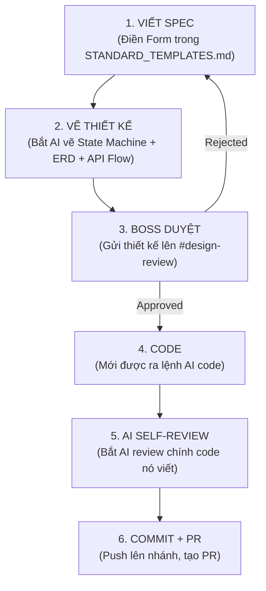
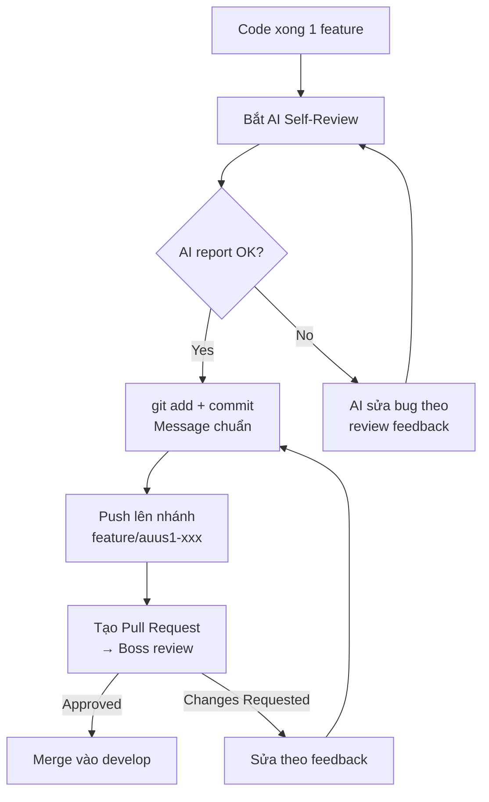

# 📖 FAOS v6 — CẨM NANG ĐÀO TẠO PROJECT LEADER

> **Phiên bản:** 1.0 — 2026-03-02
> **Đối tượng:** Project Leaders (AUUS1, ZEN8, và các dự án nhánh tương lai)
> **Mục tiêu:** Điều khiển AI (Claude/Cursor) hiệu quả, không phá vỡ kiến trúc hệ thống Core FAOS v6

---

## 📑 MỤC LỤC — SLIDE OUTLINE

| Slide | Chủ đề | Thời lượng |
|:-----:|:-------|:----------:|
| 1 | Tổng quan FAOS v6 & Vai trò của Leader | 10 phút |
| 2 | **QUY TẮC SINH TỬ: Design First, Code Later** | 20 phút |
| 3 | **TRỊ BỆNH NÃO CÁ VÀNG: Context Loading** | 15 phút |
| 4 | **CHIA NHỎ PROMPT: Quy tắc 4 bước** | 20 phút |
| 5 | **KỶ LUẬT GIT: Review & Revert** | 15 phút |
| 6 | Demo thực hành + Q&A | 30 phút |

---

## SLIDE 1: TỔNG QUAN & VAI TRÒ

### Kiến trúc phân vùng

```
┌─────────────────────────────────────────────────┐
│          🔴 VÙNG ĐỎ — DO NOT TOUCH             │
│     faos_brain/  ·  prompts/  ·  models/        │
│     analyst.py  ·  marketing_director.py        │
│     state_machine.py  ·  config.py              │
│        → CHỈ Boss mới được sửa                  │
├─────────────────────────────────────────────────┤
│          🟢 VÙNG XANH — LÃNH THỔ CỦA BẠN      │
│     app/projects/[TÊN_DỰ_ÁN]/                  │
│     sql/views/[TÊN_DỰ_ÁN]/                     │
│     api/routers/[TÊN_DỰ_ÁN]/                   │
│     sync/[TÊN_DỰ_ÁN]/                          │
│        → Thoải mái sáng tạo                     │
└─────────────────────────────────────────────────┘
```

### Vai trò của bạn
- Xây dựng **Data Pipeline** riêng cho dự án (Meta Ads, POS, 3PL → BigQuery)
- Tạo **Dashboard UI** chuyên biệt trên nhánh Git riêng
- **KHÔNG** chạm vào AI Core (`faos_brain/`), **KHÔNG** sửa schema gốc

---

## SLIDE 2: QUY TẮC SINH TỬ — DESIGN FIRST, CODE LATER

> [!CAUTION]
> **TUYỆT ĐỐI CẤM** yêu cầu AI gõ code mà chưa vẽ thiết kế. Nếu vi phạm, Pull Request sẽ bị **REJECT ngay lập tức**.

### Quy trình bắt buộc



### Cách dùng AI vẽ thiết kế

#### Bước 1: Vẽ State Machine
```
PROMPT MẪU:
"Hãy vẽ State Machine Diagram bằng Mermaid cho luồng đồng bộ đơn hàng 
từ Pancake POS về BigQuery. Các state bao gồm: IDLE, FETCHING, 
TRANSFORMING, LOADING, VALIDATING, DONE, ERROR. Ghi rõ trigger và 
guard condition cho mỗi transition."
```

#### Bước 2: Vẽ Database ERD
```
PROMPT MẪU:
"Vẽ ERD bằng Mermaid cho dữ liệu đơn hàng Pancake POS. Bao gồm bảng: 
orders, order_items, customers, products. Ghi rõ kiểu dữ liệu, 
primary key, foreign key. Tuân thủ naming convention: snake_case, 
prefix tên dự án."
```

#### Bước 3: Vẽ luồng API
```
PROMPT MẪU:
"Vẽ Sequence Diagram bằng Mermaid cho luồng: Frontend gọi API lấy 
doanh thu theo ngày → API query BigQuery view → Trả kết quả JSON. 
Ghi rõ HTTP method, endpoint path, request/response schema."
```

### ⛔ Những sai lầm chết người

| ❌ SAI | ✅ ĐÚNG |
|:-------|:---------|
| "Code cho tao hệ thống sync đơn hàng" | "Vẽ State Machine cho luồng sync đơn hàng trước" |
| "Tạo database cho dự án" | "Vẽ ERD với đầy đủ kiểu dữ liệu và constraints" |
| "Làm API dashboard" | "Vẽ Sequence Diagram cho API lấy doanh thu" |

---

## SLIDE 3: TRỊ BỆNH NÃO CÁ VÀNG — CONTEXT LOADING

> [!WARNING]
> AI có **bộ nhớ cá vàng** — mỗi session chat mới, nó quên SẠCH mọi thứ.
> Nếu không nạp context, AI sẽ tự bịa kiến trúc mới → **PHÁ VỠ HỆ THỐNG**.

### Quy tắc BẮT BUỘC khi mở session mới

Mỗi khi mở Cursor/Claude session mới, **LUÔN LUÔN** thực hiện:

```
BƯỚC 1: Copy nội dung file docs/SYSTEM_ARCHITECTURE.md vào chat

BƯỚC 2: Copy nội dung file docs/SCHEMA_FROZEN.md vào chat

BƯỚC 3: Copy nội dung file docs/LEADER_AI_ONBOARDING_PROMPT.md vào chat

BƯỚC 4: Nói: "Hãy xác nhận mày đã hiểu kiến trúc hệ thống. 
         Liệt kê lại các thư mục mày ĐƯỢC PHÉP và KHÔNG ĐƯỢC PHÉP 
         chạm vào."
```

### Kỹ thuật nạp context hiệu quả

| Kỹ thuật | Mô tả | Khi nào dùng |
|:---------|:-------|:-------------|
| **Full Architecture Dump** | Paste toàn bộ `SYSTEM_ARCHITECTURE.md` | Mở session mới |
| **Schema Anchor** | Paste `SCHEMA_FROZEN.md` | Trước khi code DB/SQL |
| **File Tree Reference** | Chạy `tree -L 2` rồi paste kết quả | Khi AI lạc đường thư mục |
| **Previous Code Paste** | Paste file code đã viết từ session trước | Khi tiếp tục code dở |

### ⛔ Dấu hiệu AI bị "ngáo" (mất context)

| 🚩 Dấu hiệu | 🛑 Hành động |
|:-------------|:------------|
| AI đề xuất tạo file trong `faos_brain/` | **DỪNG NGAY.** Nhắc lại vùng lãnh thổ |
| AI bịa tên bảng BigQuery khác schema | **DỪNG NGAY.** Paste lại `SCHEMA_FROZEN.md` |
| AI đề xuất cài thêm framework (Django, Flask) | **DỪNG NGAY.** Hệ thống dùng FastAPI |
| AI tự ý đổi cấu trúc thư mục gốc | **DỪNG NGAY.** Paste lại file tree |

---

## SLIDE 4: QUY TẮC CHIA NHỎ PROMPT — NGUYÊN TẮC 4 BƯỚC

> [!IMPORTANT]
> **TUYỆT ĐỐI CẤM** yêu cầu AI "làm từ A đến Z" trong một prompt.
> AI sẽ ảo tưởng sức mạnh → code nửa vời → lỗi chồng lỗi → mất thời gian gấp 3.

### Pipeline 4 Bước Bắt Buộc

```
┌─────────────────────────────────────────────────────┐
│                    SPRINT CỦA 1 FEATURE             │
│                                                     │
│  PROMPT 1 ──▶ Code Database Schema (SQL DDL)        │
│       ✅ Verify: Schema tạo thành công trên BQ      │
│                                                     │
│  PROMPT 2 ──▶ Code Sync Logic (ETL Pipeline)        │
│       ✅ Verify: Data xuất hiện đúng trong bảng     │
│                                                     │
│  PROMPT 3 ──▶ Code API Endpoint (FastAPI Router)    │
│       ✅ Verify: Curl test trả đúng JSON            │
│                                                     │
│  PROMPT 4 ──▶ Code UI Component (React/Recharts)    │
│       ✅ Verify: Dashboard hiển thị đúng biểu đồ   │
│                                                     │
│  ⚠️ CHỈ CHUYỂN SANG BƯỚC SAU KHI BƯỚC TRƯỚC PASS  │
└─────────────────────────────────────────────────────┘
```

### Ví dụ thực tế — Xây Pipeline Đơn hàng Pancake POS

#### Prompt 1 — Database
```
"Tạo file SQL DDL cho bảng `auus1_orders` trong dataset AUUS1_Dataset 
trên BigQuery. Schema gồm: order_id (STRING, PK), order_date (DATE), 
customer_name (STRING), total_amount (FLOAT64), status (STRING), 
created_at (TIMESTAMP). Partition theo order_date."
```
✅ **Checkpoint:** Chạy SQL trên BigQuery Console, xác nhận bảng tạo thành công.

#### Prompt 2 — Sync Logic
```
"Viết Python script sync_pancake_orders.py trong thư mục 
app/projects/auus1/sync/. Script gọi Pancake API lấy đơn hàng ngày 
hôm qua, transform sang schema bảng auus1_orders, rồi INSERT vào 
BigQuery. Áp dụng idempotency bằng MERGE ON order_id."
```
✅ **Checkpoint:** Chạy script, kiểm tra data trong BigQuery.

#### Prompt 3 — API
```
"Viết FastAPI router file trong api/routers/auus1/orders.py. Tạo 
endpoint GET /api/auus1/orders/daily-revenue?date=YYYY-MM-DD. Query 
bảng auus1_orders, trả JSON {date, total_revenue, total_orders}."
```
✅ **Checkpoint:** `curl http://localhost:8000/api/auus1/orders/daily-revenue?date=2026-03-01`

#### Prompt 4 — UI
```
"Tạo React component DailyRevenueChart trong 
app/projects/auus1/components/DailyRevenueChart.tsx. Dùng Recharts 
vẽ line chart doanh thu 30 ngày gần nhất. Gọi API 
/api/auus1/orders/daily-revenue. Xử lý Loading state bằng skeleton, 
Error state bằng alert banner."
```
✅ **Checkpoint:** Mở browser, verify biểu đồ hiển thị đúng.

---

## SLIDE 5: KỶ LUẬT GIT — REVIEW & REVERT

> [!CAUTION]
> **CẤM** bắt AI tự sửa lỗi bằng cách đè code lên code lỗi.
> Sau 2-3 lần sửa đè, file sẽ **NÁT HOÀN TOÀN** và không thể recover.

### Quy trình Git bắt buộc



### Quy tắc Self-Review (Bắt buộc trước khi commit)

Paste prompt này sau khi AI code xong:

```
"DỪNG LẠI. KHÔNG code thêm. Hãy review lại toàn bộ code mày vừa viết.
Kiểm tra theo checklist sau:
1. ❓ Code có chạm vào file ngoài vùng xanh (app/projects/, sql/, api/routers/) không?
2. ❓ Có import nào từ faos_brain/ không? (CẤM)
3. ❓ Tên bảng BigQuery có đúng naming convention [project]_[entity] không?
4. ❓ Query SQL có dùng parameterized query không? (chống SQL injection)
5. ❓ Error handling có đầy đủ không? (try/except, HTTP status codes)
6. ❓ Có hardcode credentials nào không? (phải dùng env variables)
Liệt kê kết quả từng mục. Nếu có lỗi, sửa ngay."
```

### Quy tắc Commit Message

```
FORMAT: [PROJECT] TYPE: Mô tả ngắn gọn

VÍ DỤ:
[AUUS1] feat: add Pancake POS order sync pipeline
[AUUS1] fix: handle duplicate order_id in MERGE query
[ZEN8] feat: add daily revenue API endpoint
[ZEN8] ui: add DailyRevenueChart component
```

### 🚨 Xử lý khi code bị nát

```bash
# TÌNH HUỐNG: AI sửa đè 2-3 lần, file bị nát
# ❌ SAI: Bắt AI "sửa lại file này cho đúng" (nó sẽ nát thêm)
# ✅ ĐÚNG: Revert về commit cuối cùng hoạt động

# Xem lịch sử commit
git log --oneline -10

# Revert file cụ thể về commit trước
git checkout HEAD~1 -- path/to/broken_file.py

# Hoặc revert toàn bộ commit lỗi
git revert <commit-hash>

# Sau đó MỞ SESSION AI MỚI, nạp lại context, code lại từ đầu
```

### Quy tắc Branching

```
main                    ← Production (CHỈ Boss merge)
├── develop             ← Integration (Boss review trước khi merge)
│   ├── feature/auus1-order-sync     ← Nhánh của Leader AUUS1
│   ├── feature/auus1-dashboard      ← Nhánh của Leader AUUS1
│   ├── feature/zen8-data-pipeline   ← Nhánh của Leader ZEN8
│   └── feature/zen8-ui              ← Nhánh của Leader ZEN8
```

---

## PHỤ LỤC: CHECKLIST HÀNG NGÀY CHO LEADER

```
☐ Mở session AI mới → Nạp SYSTEM_ARCHITECTURE.md + SCHEMA_FROZEN.md
☐ Xác nhận AI hiểu đúng vùng lãnh thổ
☐ Điền Form thiết kế (STANDARD_TEMPLATES.md) trước khi code
☐ Chia nhỏ prompt theo 4 bước (DB → Sync → API → UI)
☐ Checkpoint verify sau mỗi bước
☐ Bắt AI self-review trước khi commit
☐ Commit message đúng format [PROJECT] TYPE: message
☐ Push lên nhánh feature, tạo PR cho Boss review
☐ KHÔNG bắt AI sửa đè code lỗi → git revert + session mới
```

---

*Tài liệu thuộc Gói Bàn Giao FAOS v6 — Chief Architect Sign-off: 2026-03-02*
