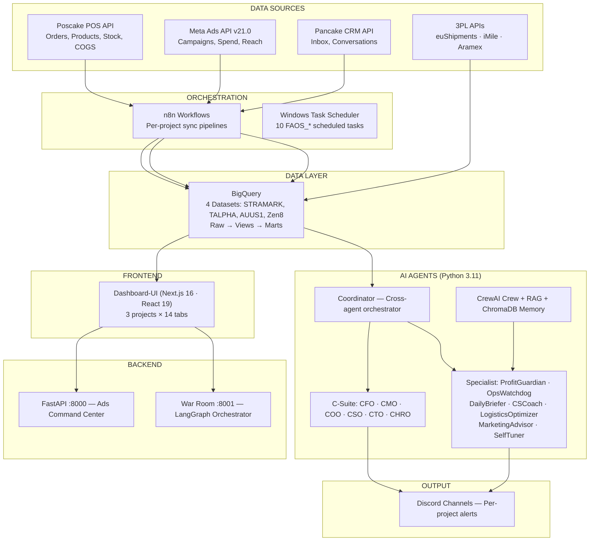
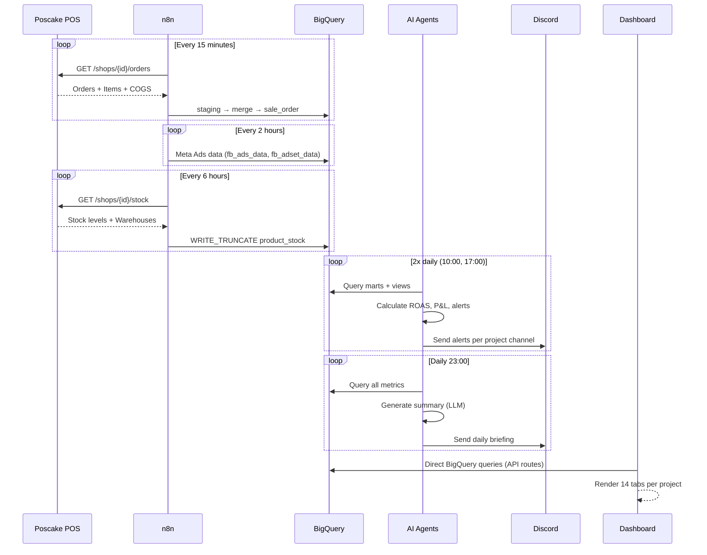

# FAOS v3 — System Overview

> **FAOS** (Federated Agent Operating System) is a multi-project AI-powered e-commerce operations platform. It monitors advertising performance, order fulfillment, inventory, and profitability across multiple independent e-commerce projects, delivering automated alerts and actionable insights through Discord and a real-time web dashboard.

## Architecture



## Multi-Project Isolation

Each e-commerce project operates **independently**:
- **Separate config**: `config/projects/{project_id}.yaml` — API keys, markets, team, fulfillment
- **Separate n8n workflows**: `n8n/{project_id}/` — isolated sync pipelines
- **Separate BQ datasets**: `{PROJECT}_Dataset` with per-project tables and views
- **Separate Discord channels**: Per-project webhook for alerts
- **Separate dashboard pages**: `/stramark`, `/talpha`, `/auus1` with per-project tabs
- **Shared code**: Same agent logic, parameterized by `project_id`

```python
# How agents run per-project
for project_id in get_active_projects():
    ProfitGuardian(project_id).run()
    OpsWatchdog(project_id).run()
    DailyBriefer(project_id).run()
```

## Adding a New Project

1. Copy `config/projects/_template.yaml` → `config/projects/{new_project}.yaml`
2. Fill in: API keys, POS config, markets, team, Discord webhook
3. Create n8n folder: `n8n/{new_project}/`
4. Import n8n workflow templates (clone from `n8n/_shared/`)
5. Create BQ dataset: `{PROJECT}_Dataset` in BigQuery
6. Deploy SQL views: `python tools/deploy_all_views.py --project {new_project}`
7. Run: `python tools/sync_products.py --apply` to pull products
8. Create dashboard pages: copy from existing project template
9. System auto-detects new project on next `run_all.py` cycle

See [06_PROJECT_CLONE_GUIDE.md](file:///c:/Users/LE%20MO/Desktop/AGENT/docs/06_PROJECT_CLONE_GUIDE.md) for full guide.

## Tech Stack

| Component | Technology | Purpose |
|:---|:---|:---|
| Data Warehouse | Google BigQuery (4 datasets) | All operational data |
| Workflow Engine | n8n (self-hosted) | API sync, scheduled ETL |
| AI Agents | Python 3.11 + BaseAgent framework | Business logic + alerts |
| AI Crew | CrewAI + ChromaDB | RAG, knowledge management |
| LLM Providers | Google Gemini + OpenAI (abstracted) | Natural language summaries, analysis |
| POS System | Poscake (Pancake POS) | Orders, products, inventory |
| CRM | Pancake | Customer inbox, conversations |
| Ads Platform | Meta (Facebook/Instagram) via Graph API v21.0 | Campaign management |
| 3PL (EU) | euShipments (InOut BG) | STRAMARK fulfillment |
| 3PL (GCC) | iMile, PostaPlus, Aramex | TALPHA fulfillment |
| 3PL (US/AU) | AMI, NAZA | AUUS1 fulfillment |
| Backend API | FastAPI (2 servers: :8000, :8001) | Ads Command Center + War Room |
| Frontend | Next.js 16, React 19, TailwindCSS 3 | Dashboard UI |
| Charts | Recharts | Data visualization |
| Data Tables | TanStack React Table | Interactive tables |
| Notifications | Discord Webhooks | Alerts and reports |
| Config | YAML files | Per-project configuration |
| Scheduling | Windows Task Scheduler | 10 FAOS_* batch files |

## File Structure

```
AGENT/
├── README.md                      # Project readme
├── .env                           # Environment secrets
├── requirements.txt               # Python dependencies
├── run_all.py                     # Main entry point
├── bigquery_key.json              # GCP service account
│
├── docs/                          # Documentation (37 files)
│   ├── README.md                  # Index — doc map
│   ├── 00_SYSTEM_OVERVIEW.md      # You are here
│   ├── 02_DATABASE_MASTER_SPEC.md # Source of truth — schema, status, currency
│   ├── 08_AGENT_SPECS.md          # 12+ AI Agent specs
│   ├── 13_SYSTEM_AUDIT.md         # Full-stack audit (v2.0)
│   ├── 17_3PL_AUTOMATION_REFERENCE.md # 3PL automation reference
│   └── ... (17 numbered + extras)
│
├── config/
│   ├── projects/                  # Per-project YAML configs (8 + template)
│   ├── manual_data/               # CSV/mapping data
│   ├── naming/                    # Naming registries
│   ├── cost_*.csv                 # Cost data files
│   ├── thresholds.yaml            # Alert thresholds
│   └── schedules.yaml             # Schedule definitions
│
├── agents/                        # AI Agent implementations (25 files)
│   ├── base_agent.py              # Base class (multi-project)
│   ├── coordinator.py             # Cross-agent orchestrator
│   ├── profit_guardian.py         # ROAS + P&L monitoring (CFO)
│   ├── ops_watchdog.py            # Operations alerts (COO)
│   ├── marketing_advisor.py       # Marketing analysis (CMO)
│   ├── daily_briefer.py           # Daily summary (uses LLM)
│   ├── cs_coach.py                # CS staff performance
│   ├── logistics_optimizer.py     # Logistics + carrier analysis
│   ├── cfo_agent.py / cmo_agent.py / coo_agent.py  # C-Suite
│   ├── cso_agent.py / cto_agent.py / chro_agent.py  # C-Suite
│   ├── self_tuner.py              # Auto-optimization
│   ├── llm/                       # LLM abstraction layer (Gemini + OpenAI)
│   ├── memory/                    # ChromaDB memory + journals
│   └── crew/                      # CrewAI crew (RAG, tools, tasks)
│
├── tools/                         # Shared utilities (49 files)
│   ├── bq_client.py               # BigQuery wrapper
│   ├── config_loader.py           # Project config loader
│   ├── discord.py                 # Discord notification sender
│   ├── deploy_all_views.py        # SQL view deployer
│   ├── etl_monitor.py             # ETL pipeline monitor
│   ├── generate_n8n_workflows.py  # N8N workflow generator
│   ├── scheduled/                 # 10 FAOS_* batch files
│   └── ... (sync, backfill, health, analytics tools)
│
├── sql/                           # SQL definitions (51 files)
│   ├── stramark/                  # STRAMARK views + marts (10)
│   ├── auus1/                     # AUUS1 views (7)
│   ├── talpha/                    # TALPHA schema + views
│   ├── views/                     # Shared views (12)
│   ├── tables/                    # DDL statements (4)
│   └── SCHEMA_FROZEN_v3.0.md     # Frozen schema reference
│
├── n8n/                           # n8n workflow definitions (54 files)
│   ├── _shared/                   # Template workflows
│   ├── stramark/                  # 12 workflows
│   ├── talpha/                    # 7 workflows
│   ├── auus1/                     # 6 workflows
│   └── zen8/pialpha/...           # Other projects (5 each)
│
├── modules/                       # Feature modules
│   └── ads-command-center/        # Full-stack ads management
│       ├── backend/               # FastAPI routers + services
│       ├── frontend/              # React components
│       └── n8n/                   # Workflow templates
│
├── dashboard-ui/                  # Frontend (Next.js 16 + React 19)
│   ├── src/app/                   # Pages (stramark, talpha, auus1, admin)
│   ├── src/components/            # Components (68 files)
│   │   ├── stramark/tabs/         # 14 STRAMARK tabs
│   │   ├── talpha/tabs/           # 7 TALPHA tabs
│   │   ├── auus1/tabs/            # 14 AUUS1 tabs
│   │   ├── ads-command-center/    # Ads Command UI
│   │   ├── war-room/              # War Room UI
│   │   └── ui/                    # Shared UI primitives
│   └── src/lib/                   # Utilities (bigquery, constants)
│
├── war_room/                      # LangGraph AI orchestrator (15 files)
│   ├── orchestrator.py            # Main orchestration
│   ├── nodes/                     # 7 decision nodes
│   └── actions/                   # 3 action handlers
│
├── directives/                    # Workflow directives (6 .md files)
├── memory/                        # Agent memory/knowledge store
├── outputs/                       # Agent outputs (142 files)
└── tests/                         # Test files (12)
```

## Data Flow



## Current Projects

| ID | Name | Status | Markets | POS Shops | Ad Accounts | 3PL |
|:---|:---|:---|:---|:---:|:---:|:---|
| `STRAMARK` | Stramark | ✅ Active | Romania | 1 (EU) | 2 | euShipments, TCE |
| `talpha` | Tiểu Alpha | ✅ Active | SA, AE, KW, OM, QA, BH | 6 | 8 | iMile, PostaPlus, Aramex |
| `AUUS1` | PiAlpha US-AU | ✅ Active | US, AU | 2 | 2 | AMI, NAZA |
| `zen8` | Zen8 | ✅ Active | SA, AE, KW, BH, OM, QA | 1+ | — | — |
| `pialpha` | PiAlpha | ✅ Active | SA, KW, AU, AE, US, QA, JP | 7 | — | — |
| `trendify` | Trendify | ✅ Active | US | 1 | — | — |
| `hnle` | HNLE | 🔧 Setup | — | — | — | — |
| `t1` | T1 | 🔧 Setup | — | — | — | — |

## Related Documents

- [13_SYSTEM_AUDIT.md](13_SYSTEM_AUDIT.md) — Full-stack audit with complete file inventory
- [02_DATABASE_MASTER_SPEC.md](02_DATABASE_MASTER_SPEC.md) — Database schema source of truth
- [08_AGENT_SPECS.md](08_AGENT_SPECS.md) — Complete agent specifications
- [17_3PL_AUTOMATION_REFERENCE.md](17_3PL_AUTOMATION_REFERENCE.md) — 3PL integration reference

---

*Updated: 2026-02-24 | Version: 3.1*
