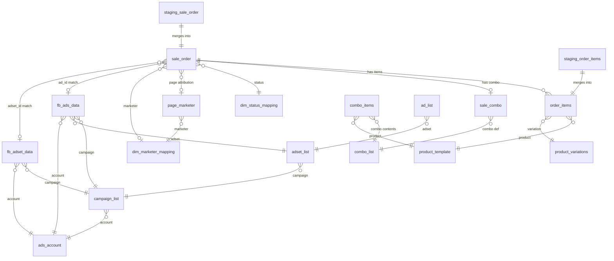

# DATABASE MASTER SPEC — FAOS Data Platform

> **Version:** 2.1 — DEFINITIVE
> **Date:** 2026-02-19
> **Scope:** ALL projects (STRAMARK, AUUS1, Zen8)
> **⚠️ THIS IS THE SINGLE SOURCE OF TRUTH. All other DB docs defer to this file.**

---

## 1. Architecture Overview

```
┌─────────────────────────────────────────────────────────────────────┐
│  DATA SOURCES         │  ETL          │  BIGQUERY        │  OUTPUT │
│───────────────────────│───────────────│──────────────────│─────────│
│  Poscake API ─────────│──► n8n ──────►│ staging_* ─merge►│         │
│  Meta Ads API ────────│──► n8n ──────►│ Raw Tables ──────│──► Views│
│  Pancake API ─────────│──► n8n ──────►│ Dim Tables ──────│──► Marts│
│  Google Sheets ───────│──► n8n ──────►│ Reference Tables │──► AI   │
│  Manual Config ───────│──────────────►│                  │──► Dash │
└─────────────────────────────────────────────────────────────────────┘
```

### Data Flow

```
API Response → n8n → staging_sale_order → MERGE → sale_order (clean)
                                                      ↓
                                   vw_fact_orders (enriched, attributed)
                                                      ↓
                             mart_performance_master (aggregated, per marketer/day)
```

### Dataset Strategy (Per-Project Isolation)

| Dataset | Region | Project | Shop ID |
|---|---|---|---|
| `STRAMARK_Dataset` | US | STRAMARK (Romania) | 1635307570 |
| `AUUS1_Dataset` | US | AUUS1 (US/AU) | Multiple |
| `Zen8_Dataset` | africa-south1 | Zen8 (Middle East) | Multiple |

> Each dataset has its own complete set of tables. Dim tables duplicated per dataset due to cross-region limitation.

---

## 2. Complete Table Inventory

### 2.1 Per-Project Tables (11 tables × N projects)

| # | Table | Type | Source | Sync | Rows (STRAMARK) |
|---|---|---|---|---|---|
| 1 | `sale_order` | Raw/Transaction | Poscake API | Daily via staging | ~2,000 |
| 2 | `order_items` | Raw/Transaction | Poscake API | Daily via staging | ~2,900 |
| 3 | `product_template` | Master | Poscake API | Weekly | ~17 |
| 4 | `product_variations` | Master | Poscake API | Weekly | ~78 |
| 5 | `customers` | Master | Poscake API | Daily via staging | ~1,500 |
| 6 | `fb_ads_data` | Transaction | Meta API (ad level) | Daily delete+insert | ~145 |
| 7 | `fb_adset_data` | Transaction | Meta API (adset level) | Daily delete+insert | NEW |
| 8 | `fb_campaign_data` | Master | Meta API | Daily delete+insert | ~3,400 |
| 9 | `sale_combo` | Transaction | Poscake API (in order) | With order sync | NEW |
| 10 | `combo_items` | Reference | Config/Google Sheet | Manual/weekly | NEW |
| 11 | `page_marketer` | Reference | Config/Google Sheet | Manual/weekly | NEW |

### 2.2 Staging Tables (2 per project)

| # | Table | Mirrors | Purpose |
|---|---|---|---|
| 1 | `staging_sale_order` | `sale_order` | Receives raw n8n data, merged daily |
| 2 | `staging_order_items` | `order_items` | Receives raw n8n data, merged daily |

### 2.3 Dimension Tables (shared per dataset)

| # | Table | Type | Rows | Managed By |
|---|---|---|---|---|
| 1 | `dim_status_mapping` | Config | 17 | Manual SQL |
| 2 | `dim_marketer_mapping` | Config | ~8 | Manual SQL |
| 3 | `dim_market_mapping` | Config | ~5 | Manual SQL |
| 4 | `dim_shop_project` | Config | ~3 | Manual SQL |
| 5 | `cost_exchange_rates` | Config | ~2 | Manual SQL |

### 2.4 Existing Tables from Zen8 (Shared Reference)

| # | Table | Purpose | DEV Origin |
|---|---|---|---|
| 1 | `Page_List` | FB pages per project | tl.docx ✅ |
| 2 | `ad_list` | FB ad catalog | tl.docx ✅ |
| 3 | `ads_account` | FB ad accounts | tl.docx ✅ |
| 4 | `adset_list` | FB adset catalog | tl.docx ✅ |
| 5 | `campaign_list` | FB campaign catalog | tl.docx ✅ |
| 6 | `combo_list` | Poscake combo catalog | tl.docx ✅ |
| 7 | `country` | Country reference | tl.docx ✅ |
| 8 | `currencies` | Currency reference | tl.docx ✅ |

### 2.5 SQL Views (per project)

| # | View | Layer | Source File |
|---|---|---|---|
| 1 | `fact_order_items_dedup` | Fact | `sql/stramark/01_fact_order_items_dedup.sql` |
| 2 | `vw_fact_orders` | Fact | `sql/stramark/02_vw_fact_orders.sql` |
| 3 | `mart_performance_master` | Mart Tier 1 | `sql/stramark/03_mart_performance_master.sql` |
| 4 | `mart_market_intelligence` | Mart Tier 2 | `sql/stramark/04_mart_market_intelligence.sql` |
| 5 | `mart_product_insights` | Mart Tier 3 | `sql/stramark/05_mart_product_insights.sql` |
| 6 | `vw_fact_daily_pnl_v2` | Mart | `sql/stramark/06_vw_fact_daily_pnl_v2.sql` |

---

## 3. Field-Level Schema

### 3.1 sale_order (40+ fields)

| Field | Type | Source API | ÷100? | Notes |
|---|---|---|---|---|
| `id` | STRING | Poscake `id` | | PK (with shop_id) |
| `system_id` | INT64 | Poscake `system_id` | | |
| `shop_id` | STRING | Poscake `shop_id` | | PK part 2 |
| `shop_name` | STRING | Poscake `shop_name` | | |
| `project_id` | STRING | Derived from shop_id | | |
| `status` | INT64 | Poscake `status` | | **STRAMARK=INT**, Zen8=STRING |
| `status_name` | STRING | Poscake `status_name` | | |
| `cod` | FLOAT64 | Poscake `cod` | ✅ **YES** | Actual cash collected |
| `total_price` | FLOAT64 | Poscake `total_price` | ✅ **YES** | Gross price before discount |
| `total_price_after_sub_discount` | FLOAT64 | Poscake | ✅ **YES** | Net price after discount |
| `total_discount` | FLOAT64 | Poscake `total_discount` | ✅ **YES** | |
| `shipping_fee` | FLOAT64 | Poscake `shipping_fee` | ✅ **YES** | Shop-paid shipping |
| `partner_fee` | FLOAT64 | Poscake `partner_fee` | ✅ **YES** | 3PL fee |
| `return_fee` | FLOAT64 | Poscake `return_fee` | ✅ **YES** | Return cost |
| `surcharge` | FLOAT64 | Poscake `surcharge` | ✅ **YES** | COD fee etc |
| `marketer` | STRING | Poscake `marketer` | | JSON: `{'name': '..'}` |
| `ad_id` | STRING | Poscake `ad_id` | | From Messenger ads |
| `adset_id` | STRING | Poscake `adset_id` | | From web conversion UTM |
| `ads_source` | STRING | Poscake `ads_source` | | Campaign name text match |
| `page_id` | STRING | Poscake `page_id` | | FB page that generated order |
| `p_utm_source` | STRING | UTM params | | |
| `p_utm_campaign` | STRING | UTM params | | |
| `p_utm_medium` | STRING | UTM params | | May contain adset_id! |
| `p_utm_term` | STRING | UTM params | | May contain ad_id! |
| `inserted_at` | STRING | Poscake `inserted_at` | | ⚠️ STRING not TIMESTAMP |
| `order_currency` | STRING | Poscake `order_currency` | | RON/USD/AUD/etc |

> **CRITICAL:** STRAMARK values are in **bani** (smallest unit). Divide by 100 for display.
> Zen8 and AUUS1 values are in **full currency units**. Do NOT divide.

### 3.2 fb_ads_data (ad-level daily)

| Field | Type | Source API | Notes |
|---|---|---|---|
| `ad_id` | STRING | Meta `ad_id` | PK (with date+account_id) |
| `ad_name` | STRING | Meta `ad_name` | |
| `date` | STRING | Meta `date_start` | YYYY-MM-DD |
| `spend` | FLOAT64 | Meta `spend` | **Always USD** |
| `impressions` | INT64 | Meta `impressions` | |
| `reach` | INT64 | Meta `reach` | Unique users |
| `clicks` | INT64 | Meta `clicks` | All clicks |
| `campaign_id` | STRING | Meta `campaign_id` | FK to campaign_list |
| `campaign_name` | STRING | Meta `campaign_name` | For attribution match |
| `adset_id` | STRING | Meta `adset_id` | FK to adset_list |
| `account_id` | STRING | Meta `account_id` | FK to ads_account |

### 3.3 fb_adset_data (adset-level daily) — NEW

| Field | Type | Source API | Notes |
|---|---|---|---|
| `adset_id` | STRING | Meta `adset_id` | PK (with date) |
| `adset_name` | STRING | Meta `adset_name` | |
| `date` | STRING | Meta `date_start` | YYYY-MM-DD |
| `spend` | FLOAT64 | Meta `spend` | USD |
| `impressions` | INT64 | Meta `impressions` | |
| `reach` | INT64 | Meta `reach` | |
| `clicks` | INT64 | Meta `clicks` | |
| `campaign_id` | STRING | Meta `campaign_id` | Parent campaign |
| `campaign_name` | STRING | Meta `campaign_name` | Reference |
| `account_id` | STRING | Meta `account_id` | |

### 3.4 sale_combo — NEW

| Field | Type | Source | Notes |
|---|---|---|---|
| `order_id` | STRING | Poscake order response | FK to sale_order.id |
| `combo_id` | STRING | Poscake combo data | FK to combo_list |
| `combo_name` | STRING | Poscake | Display name |
| `quantity` | INT64 | Poscake | Combos per order |
| `combo_value` | FLOAT64 | Poscake | ÷100 for STRAMARK |
| `shop_id` | STRING | Poscake | |

### 3.5 page_marketer — NEW

| Field | Type | Source | Notes |
|---|---|---|---|
| `page_id` | STRING | Manual/config | FK to sale_order.page_id |
| `marketer_id` | STRING | Manual | FK to dim_marketer_mapping |
| `marketer_name` | STRING | Manual | |
| `project_id` | STRING | Manual | |
| `is_active` | BOOL | Manual | Soft delete |

---

## 4. Attribution Logic (Priority Order)

```sql
-- Order → Marketer attribution (4 levels)
COALESCE(
  pm.marketer_name,          -- Level 1: page_marketer table (page_id match)
  mm.marketer_name,          -- Level 2: dim_marketer_mapping (campaign code)
  marketer_from_field,       -- Level 3: Raw marketer field from Poscake
  'Unknown'                  -- Level 4: Fallback
) AS marketer_name

-- Order → Campaign attribution (4 levels)
COALESCE(
  ac.campaign_name,          -- Level 1: ad_id match via fb_ads_data
  asc2.campaign_name,        -- Level 2: adset_id match via fb_ads_data
  o.ads_source,              -- Level 3: Text match via ads_source field
  'Organic/Unknown'          -- Level 4: Fallback
) AS campaign_name
```

---

## 5. Business Rules

### 5.1 Currency Handling

| Project | Currency | Stored As | Display Formula |
|---|---|---|---|
| STRAMARK | RON | **Bani** (1/100 RON) | `value / 100.0` |
| AUUS1 | USD/AUD | **Full units** | `value` (no division) |
| Zen8 | USD | **Full units** | `value` (no division) |

### 5.2 Status Groups

> ⚠️ **Updated 2026-02-19** — Fixed status code mapping based on actual POS data.
> Previous version had incorrect mappings for codes 3, 5, 6, 8.

| Status Code | Name | Group | Revenue Impact | Included in ROAS? |
|---|---|---|---|---|
| 0 | new | new | none | ❌ |
| 1 | confirmed | confirmed | none | ❌ |
| 2 | picking | processing | none | ❌ |
| 3 | shipping | shipping | L2_shipped | ❌ |
| 4 | packing | processing | none | ❌ |
| 5 | packed | processing | none | ❌ |
| **6** | **delivered** | **success** | **L3_success** | ✅ |
| **8** | **cancelled** | **cancelled** | none | ❌ |
| 9 | pending | processing | none | ❌ |
| 11 | waitting | processing | none | ❌ |
| **16** | **completed** | **success** | **L4_cod_collected** | ✅ |
| 20 | ordered | processing | EXCLUDED | ❌ |

> [!CAUTION]  
> Dashboard PHẢI filter theo `status_group` (success/cancelled), KHÔNG phải `status_name` (delivered/returned).
> `status_group = 'success'` bao gồm cả `delivered` (code 6) và `completed` (code 16).

### 5.3 Combo Rules (from tl.docx)

1. Every order on Poscake uses combo format
2. **1 order = 1 combo type only** (no mixed combos)
3. Revenue attribution goes to the product marked `is_revenue_product = TRUE` in `combo_items`
4. If not identifiable → default to "Unknown Product"

### 5.4 Campaign Naming Convention

**Dev convention (Zen8/existing):**
```
[TênSP]_[MãSP]_[MãQG]_[MãNS]_[CTBán]_[Giá]_TùyChỉnh
```

**STRAMARK convention:**
```
DD.MM - ProductCode - Market - CampaignType - Brand - MarketerCode
Example: 04.02 - D04 - Romania - CĐ - Aurelia Wear - LC
```

### 5.5 Marketer Revenue Attribution (from tl.docx)
- Marketer gets revenue credit based on the **FB Page they manage**
- Use `page_marketer` table: `sale_order.page_id → page_marketer.marketer_id`
- Fallback: parse from `marketer` field or campaign name

### 5.6 Exchange Rates
- Company-level unified rates (not per-project)
- Time-varying: different rates for different periods
- Stored in `cost_exchange_rates` table

---

## 6. Sync Patterns (from tl.docx)

| Data | n8n Pattern | BQ Write Mode | Frequency |
|---|---|---|---|
| Orders | Poscake API → staging → merge | staging→delete+insert | Daily |
| Order Items | With order sync | staging→delete+insert | Daily |
| FB Ads Data | Meta API → delete+insert | Delete by date range → INSERT | Daily |
| FB Adset Data | Meta API → delete+insert | Delete by date range → INSERT | Daily |
| FB Campaign Data | Meta API → delete+insert | Delete by date range → INSERT | Daily |
| Products | Poscake API → pagination | WRITE_TRUNCATE | Weekly |
| Customers | Poscake API → staging → merge | staging→delete+insert | Daily |
| Combos | Poscake API → pagination | WRITE_TRUNCATE | Weekly |
| Page-MKT | Google Sheet | WRITE_TRUNCATE | Weekly |
| KPIs | Google Sheet | WRITE_TRUNCATE | Weekly |
| Stock | Poscake API → N8N 06 | WRITE_TRUNCATE | Every 6h |

### n8n Workflow Catalog (from tl.docx)

| # | Workflow | Trigger | Data | Optimizations Needed |
|---|---|---|---|---|
| 1 | Lấy DS_ads chung | Cron | ad_list metadata | ✅ OK (delete-insert) |
| 2 | Lấy DS_adset chung | Cron | adset_list metadata | ✅ OK |
| 3 | Lấy DS_campaign chung | Cron | campaign_list metadata | ✅ OK |
| 4 | Lấy dữ liệu ads TKQC chi tiêu | Cron | fb_ads_data daily | ✅ OK (delete-insert) |
| 5 | **NEW: Lấy dữ liệu adset TKQC** | Cron | fb_adset_data daily | 🔴 NEEDS CREATION |
| 6 | Update DS TK quảng cáo | Cron | ads_account | ✅ OK |
| 7 | Lấy danh sách combo | Cron | combo_list | ✅ OK |
| 8 | **Webhook_Update đơn hàng** | Webhook | sale_order | ⚠️ MUST write to staging |
| 9 | **Lấy đơn hàng hàng ngày** | Cron | sale_order batch | ⚠️ MUST write to staging |
| 10 | **NEW: Merge staging** | After sync | staging→main | 🔴 NEEDS CREATION |
| 11 | Lấy SP từ poscake | Cron | product_template | ✅ OK (truncate) |
| 12 | **[STR] 06 Stock Sync** | Cron 6h | product_stock + warehouse_list | ✅ Active (N8N ID: lIqFXldaeDQjb7Id) |
| 13 | Lấy poscake_page | Cron | Page_List | ✅ OK |
| 14 | Đẩy dữ liệu Page lên BQ | Cron | Page_List to BQ | ✅ OK |
| 15 | MKT Report | Cron | Discord report | ✅ OK |
| 16 | POS_webhook | Webhook | Order events | ⚠️ MUST write to staging |

---

## 7. ERD — Entity Relationships



---

## 8. Files Reference

| File | Purpose | Status |
|---|---|---|
| `sql/tables/create_poscake_tables.sql` | Core 5 tables (sale_order, order_items, etc) | ✅ Active |
| `sql/tables/create_dim_tables.sql` | Dim tables (status, marketer, market, shop) | ✅ Active |
| `sql/tables/create_staging_tables.sql` | Staging tables for merge pattern | ✅ NEW |
| `sql/tables/create_reference_tables.sql` | New tables (page_marketer, fb_adset_data, sale_combo, combo_items) | ✅ NEW |
| `sql/stramark/merge_staging_orders.sql` | Staging → Main merge SQL | ✅ NEW |
| `sql/stramark/0[1-6]_*.sql` | Core views and marts | ✅ Active |
| `docs/DATABASE_MASTER_SPEC.md` | THIS FILE — definitive schema | ✅ Active |
| `DATA_MAPPING_SPEC.md` | API field → BQ column mapping | ✅ Active (complementary) |
| `config/lv.drawio` | Dev ERD diagram | 📖 Reference only |
| `config/tl.docx` | Dev system documentation | 📖 Reference only |

> **Superseded files** (kept for reference but THIS doc is authoritative):
> - `docs/07_DATABASE_SPEC.md`
> - `docs/DASHBOARD_ARCHITECTURE_BLUEPRINT.md`
