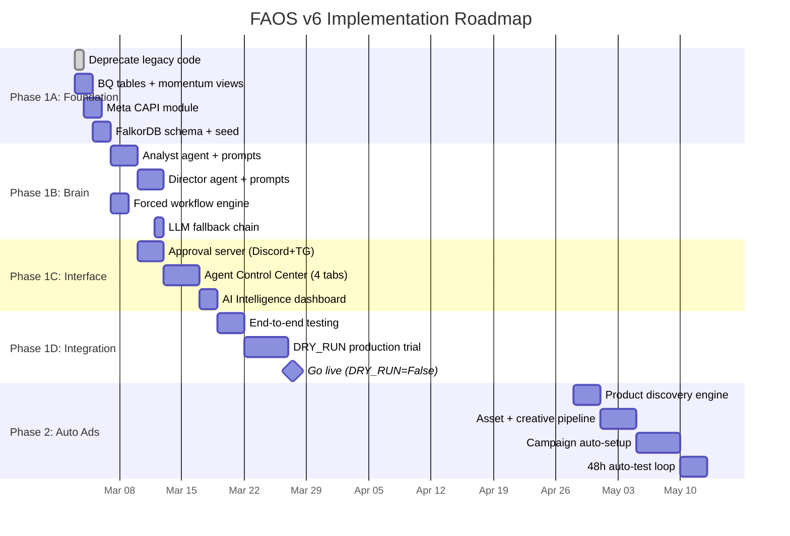

# 04 — Phân Rã Công Việc & Lộ Trình Triển Khai (WBS & Roadmap)

> **Project**: FAOS v6 — Agentic Workflow & Human-in-the-Loop  
> **Version**: 1.0 | **Date**: 2026-03-01  
> **Author**: System Architect  
> **Status**: Draft — Pending Review

---

## Mục Lục

1. [Tổng Quan Timeline](#1-tổng-quan-timeline)
2. [Phase 1: Foundation — Data Pipeline & Memory](#2-phase-1-foundation--data-pipeline--memory)
3. [Phase 1: Brain — AI Agents](#3-phase-1-brain--ai-agents)
4. [Phase 1: Interface — Approval & Dashboard](#4-phase-1-interface--approval--dashboard)
5. [Phase 1: Integration & Launch](#5-phase-1-integration--launch)
6. [Phase 2: Automated Campaign Execution](#6-phase-2-automated-campaign-execution)
7. [Risk Register](#7-risk-register)
8. [Definition of Done](#8-definition-of-done)

---

## 1. Tổng Quan Timeline



### Tóm Tắt Milestones

| Milestone | Target Date | Điều Kiện |
|:--|:--|:--|
| 🏗️ Foundation complete | Mar 07 | BQ views working, FalkorDB seeded, CAPI pushes test events |
| 🧠 Brain complete | Mar 13 | Both agents run daily_analysis successfully on test data |
| 🖥️ Interface complete | Mar 19 | Approval buttons work, Control Center renders, charts show data |
| 🧪 E2E test pass | Mar 22 | Full workflow runs with DRY_RUN=True on 1 project |
| 🚀 Go-live | Mar 27 | DRY_RUN=False on STRAMARK, bot approvals live |
| 📊 Phase 1 stable | Apr 27 | 30 days running, accuracy > 70%, no critical bugs |
| 🤖 Phase 2 start | Apr 28 | After Phase 1 stable for 1 month |

---

## 2. Phase 1A: Foundation — Data Pipeline & Memory

### Sprint 1: Week 1 (Mar 3-7)

---

#### WBS 1.1 — Deprecate Legacy Code

| # | Task | File/Dir | Effort | Done Criteria |
|:--|:--|:--|:--|:--|
| 1.1.1 | Tạo `_deprecated/` directory | `_deprecated/` | 15min | Dir exists |
| 1.1.2 | Move `agents/` → `_deprecated/agents/` | 22 files | 15min | Git mv, no import errors |
| 1.1.3 | Move `war_room/` → `_deprecated/war_room/` | 12 files | 15min | Git mv |
| 1.1.4 | Move `services/openfang/` → `_deprecated/openfang/` | 6 files | 15min | Git mv |
| 1.1.5 | Update `.gitignore` — DON'T ignore `_deprecated/` | `.gitignore` | 5min | Committed |
| 1.1.6 | Update `SYSTEM_CONTEXT.md` — remove old refs | `SYSTEM_CONTEXT.md` | 30min | No broken refs |
| 1.1.7 | Update `RULES.md` — add v6 architecture | `RULES.md` | 30min | V6 documented |

**Estimated**: 2 hours  
**Dependencies**: None  
**Risk**: Low — pure file reorganization

---

#### WBS 1.2 — BigQuery New Tables & Views

| # | Task | File | Effort | Done Criteria |
|:--|:--|:--|:--|:--|
| 1.2.1 | Create `ai_prediction_log` table | `sql/v6/01_ai_prediction_log.sql` | 30min | Table exists in STRAMARK + AUUS1 |
| 1.2.2 | Create `approval_logs` table | `sql/v6/02_approval_logs.sql` | 30min | Table exists |
| 1.2.3 | Create `agent_run_log` table | `sql/v6/03_agent_run_log.sql` | 20min | Table exists |
| 1.2.4 | Create `capi_push_log` table | `sql/v6/04_capi_push_log.sql` | 15min | Table exists |
| 1.2.5 | Create `vw_daily_momentum` view | `sql/v6/05_vw_daily_momentum.sql` | 45min | View returns MA3/MA7/momentum |
| 1.2.6 | Create `vw_marketer_momentum` view | `sql/v6/06_vw_marketer_momentum.sql` | 45min | View returns per-marketer MA + verdict |
| 1.2.7 | Create `vw_product_lifecycle` view | `sql/v6/07_vw_product_lifecycle.sql` | 45min | View returns BCG classification |
| 1.2.8 | Verify views on both datasets | `sql/v6/verify_v6_views.py` | 30min | All views return data for Feb |
| 1.2.9 | Update `SCHEMA_FROZEN_v4.0.md` | `sql/SCHEMA_FROZEN_v4.0.md` | 30min | New schema documented |

**Estimated**: 5 hours  
**Dependencies**: None — can run parallel with 1.1  
**Risk**: Medium — SQL bugs in WINDOW functions; test on real data

---

#### WBS 1.3 — Meta CAPI Module

| # | Task | File | Effort | Done Criteria |
|:--|:--|:--|:--|:--|
| 1.3.1 | Create `meta_capi.py` — SHA256 hashing utils | `faos_agents/tools/meta_capi.py` | 1h | Hash functions pass unit tests |
| 1.3.2 | Create CAPI push function | `faos_agents/tools/meta_capi.py` | 2h | Sends test events to Meta (test_event_code) |
| 1.3.3 | Create BQ → CAPI query | `faos_agents/tools/meta_capi.py` | 1h | Query returns success orders |
| 1.3.4 | Dedup logic (capi_push_log) | `faos_agents/tools/meta_capi.py` | 30min | Re-run doesn't push duplicates |
| 1.3.5 | Create push scheduler | `faos_brain/workflows/capi_push.py` | 30min | Runs at 21:00 daily |
| 1.3.6 | Test with Meta Test Events tool | Manual | 1h | Events visible in Meta Events Manager |

**Estimated**: 6 hours  
**Dependencies**: 1.2.4 (capi_push_log table)  
**Risk**: High — needs active Meta API token; refresh before starting  
**Blockers**: Meta System User access token must be refreshed

---

#### WBS 1.4 — FalkorDB Schema & Seed Data

| # | Task | File | Effort | Done Criteria |
|:--|:--|:--|:--|:--|
| 1.4.1 | Create schema definitions | `faos_brain/graph/schema.py` | 1h | All 7+ node types defined |
| 1.4.2 | Create seed loader | `faos_brain/graph/loader.py` | 2h | Seed SOPs, thresholds, personality |
| 1.4.3 | Write default SOPs | `faos_brain/graph/seed_data.json` | 1h | ROAS, Budget, Scale rules |
| 1.4.4 | Write default PersonalityConfigs | `faos_brain/graph/seed_data.json` | 30min | Analyst + Director defaults |
| 1.4.5 | Create Cypher index commands | `faos_brain/graph/schema.py` | 30min | Indexes on id, name, timestamp |
| 1.4.6 | Test seed → query → verify | `tests/test_graph_schema.py` | 1h | CRUD operations work |
| 1.4.7 | Verify Docker AI stack healthy | Docker Compose check | 30min | FalkorDB + Graphiti + SimpleMem up |

**Estimated**: 7 hours  
**Dependencies**: Docker AI stack running (`docker compose up -d`)  
**Risk**: Medium — FalkorDB container stability

---

## 3. Phase 1B: Brain — AI Agents

### Sprint 2: Week 2 (Mar 7-13)

---

#### WBS 2.1 — Forced Workflow Engine

| # | Task | File | Effort | Done Criteria |
|:--|:--|:--|:--|:--|
| 2.1.1 | Create `ForcedWorkflow` class | `faos_brain/workflows/daily_analysis.py` | 2h | 7-step enforcement works |
| 2.1.2 | SSE event emitter | `faos_brain/api/agent_status.py` | 1.5h | Events stream to `/api/agent/{name}/feed` |
| 2.1.3 | Run logger (→ BQ `agent_run_log`) | `faos_brain/workflows/daily_analysis.py` | 1h | Each run logged with timing + counts |
| 2.1.4 | Error handling + retry logic | `faos_brain/workflows/daily_analysis.py` | 1h | Retry schedule per step |
| 2.1.5 | Unit tests for workflow | `tests/test_forced_workflow.py` | 1h | All steps execute in order |

**Estimated**: 6.5 hours  
**Dependencies**: 1.4 (FalkorDB seeded)

---

#### WBS 2.2 — Executive AI Analyst

| # | Task | File | Effort | Done Criteria |
|:--|:--|:--|:--|:--|
| 2.2.1 | Create `ExecutiveAnalyst` class | `faos_brain/analyst.py` | 3h | Class implements all 7 steps |
| 2.2.2 | Write system prompt (full version) | `faos_brain/prompts/analyst_system.md` | 1h | 3-axis, reflection, predictions |
| 2.2.3 | Context builder (SOP+History+Data→prompt) | `faos_brain/analyst.py` | 1.5h | Correct context injection |
| 2.2.4 | Output parser (LLM text → dataclass) | `faos_brain/analyst.py` | 2h | Structured output extracted |
| 2.2.5 | BQ query functions (momentum, marketer, product) | `faos_agents/tools/bigquery_tool.py` | 2h | Queries return from new views |
| 2.2.6 | Graphiti MCP integration (fetch SOPs, save lessons) | `faos_agents/tools/knowledge_graph_tool.py` | 1.5h | CRUD works via MCP |
| 2.2.7 | SimpleMem integration (recall, save) | `faos_agents/memory/agent_memory.py` | 1h | Agent-scoped read/write |
| 2.2.8 | Discord report sender | `faos_agents/tools/discord_tool.py` | 30min | Report sends to channel |
| 2.2.9 | Reflection workflow (T+1 compare) | `faos_brain/workflows/daily_review.py` | 2h | Accuracy calculated, lessons saved |
| 2.2.10 | Test on STRAMARK real data | Manual | 2h | Full analysis runs without error |

**Estimated**: 16.5 hours  
**Dependencies**: 2.1 (workflow engine), 1.2 (BQ views), 1.4 (FalkorDB)

---

#### WBS 2.3 — AI Marketing Director

| # | Task | File | Effort | Done Criteria |
|:--|:--|:--|:--|:--|
| 2.3.1 | Create `MarketingDirector` class | `faos_brain/marketing_director.py` | 3h | Class implements decision flow |
| 2.3.2 | Write system prompt (full version) | `faos_brain/prompts/director_system.md` | 1h | Safety rules, approval matrix |
| 2.3.3 | Context builder (Personality+History+Perf→prompt) | `faos_brain/marketing_director.py` | 1.5h | Full context injection |
| 2.3.4 | Output parser (LLM text → DirectorDecision list) | `faos_brain/marketing_director.py` | 2h | Decisions extracted |
| 2.3.5 | `can_auto_execute()` logic | `faos_brain/marketing_director.py` | 1h | Thresholds match spec |
| 2.3.6 | State snapshot for rollback | `faos_brain/marketing_director.py` | 1h | Pre-action state saved |
| 2.3.7 | Meta API execute functions | `faos_agents/tools/meta_ads_tool.py` | 2h | Budget update, pause, kill work |
| 2.3.8 | Test in DRY_RUN mode | Manual | 1.5h | Decisions generated but not executed |

**Estimated**: 13 hours  
**Dependencies**: 2.1, 2.2.6, 2.2.7 (shared Graphiti + SimpleMem)

---

#### WBS 2.4 — LLM Fallback Chain

| # | Task | File | Effort | Done Criteria |
|:--|:--|:--|:--|:--|
| 2.4.1 | GPT-4o client wrapper | `faos_brain/llm_client.py` | 1h | Retry + timeout handling |
| 2.4.2 | Gemini Flash client wrapper | `faos_brain/llm_client.py` | 1h | Secondary provider works |
| 2.4.3 | Rule-based fallback generator | `faos_brain/llm_client.py` | 1.5h | Pure rule-based analysis |
| 2.4.4 | Fallback chain: GPT→Gemini→Rules | `faos_brain/llm_client.py` | 30min | Chain falls through correctly |
| 2.4.5 | Test: simulate GPT-4o timeout | `tests/test_llm_fallback.py` | 30min | Falls to Gemini then rules |

**Estimated**: 4.5 hours  
**Dependencies**: 2.2, 2.3 (agents use LLM client)

---

## 4. Phase 1C: Interface — Approval & Dashboard

### Sprint 3: Week 3 (Mar 13-19)

---

#### WBS 3.1 — Approval Server (Discord + Telegram)

| # | Task | File | Effort | Done Criteria |
|:--|:--|:--|:--|:--|
| 3.1.1 | Create FastAPI approval server | `faos_brain/approval_server.py` | 2h | Server starts on port 8300 |
| 3.1.2 | Discord Bot Application setup | Discord Dev Portal | 1h | Bot created, invited to server |
| 3.1.3 | Discord interaction handler | `faos_brain/approval_server.py` | 2h | Approve/Reject/Rollback work |
| 3.1.4 | Discord interactive message builder | `faos_agents/tools/discord_tool.py` | 1.5h | Embed + buttons render correctly |
| 3.1.5 | Telegram Bot setup | @BotFather | 30min | Bot created, webhook set |
| 3.1.6 | Telegram callback handler | `faos_brain/approval_server.py` | 1.5h | Inline keyboard callbacks work |
| 3.1.7 | Telegram message builder | `faos_agents/tools/telegram_tool.py` | 1h | Message + inline buttons |
| 3.1.8 | Dual-channel sync (first-come wins) | `faos_brain/approval_server.py` | 1.5h | Second channel shows "already processed" |
| 3.1.9 | Timeout handler (4h/12h expiry) | `faos_brain/approval_server.py` | 1h | Expired decisions logged |
| 3.1.10 | Rollback execution | `faos_brain/approval_server.py` | 1.5h | Restore Meta API state from snapshot |
| 3.1.11 | BQ `approval_logs` writer | `faos_brain/approval_server.py` | 1h | All actions logged to BQ |
| 3.1.12 | Test full approval flow | Manual | 2h | Send→Click→Execute→Log works |

**Estimated**: 16.5 hours  
**Dependencies**: 2.3 (Director generates decisions)  
**Risk**: High — Discord Bot requires public endpoint (ngrok for dev, Cloud Run for prod)

---

#### WBS 3.2 — Agent Control Center (Next.js)

| # | Task | File | Effort | Done Criteria |
|:--|:--|:--|:--|:--|
| 3.2.1 | Create route `/agent-control` | `dashboard-ui/app/agent-control/` | 1h | Landing page renders |
| 3.2.2 | Agent card components (status, accuracy) | React components | 1.5h | Cards show live status |
| 3.2.3 | Tab 1: Live Feed (SSE client) | `agent-control/[agent]/feed.tsx` | 3h | Realtime log scrolling |
| 3.2.4 | Tab 2: Memory Manager (CRUD) | `agent-control/[agent]/memory.tsx` | 4h | List/Edit/Delete nodes |
| 3.2.5 | Memory Manager: Delete confirm dialog | React component | 1h | Confirm + reason required |
| 3.2.6 | Memory Manager: Search | React component | 1h | Full-text search works |
| 3.2.7 | Tab 3: Audit Log (table + chart) | `agent-control/[agent]/audit.tsx` | 3h | Win-rate chart renders |
| 3.2.8 | Tab 4: Personality Settings (sliders) | `agent-control/[agent]/personality.tsx` | 2.5h | Sliders save to FalkorDB |
| 3.2.9 | Backend API: Memory CRUD | `faos_brain/api/memory_api.py` | 2h | REST endpoints work |
| 3.2.10 | Backend API: Audit queries | `faos_brain/api/audit_api.py` | 1.5h | BQ queries return data |
| 3.2.11 | Backend API: Personality R/W | `faos_brain/api/personality_api.py` | 1h | FalkorDB read/write |
| 3.2.12 | Responsive styling (mobile-friendly) | CSS | 1.5h | Works on phone screen |

**Estimated**: 23 hours  
**Dependencies**: 2.1.2 (SSE emitter), 1.4 (FalkorDB)

---

#### WBS 3.3 — AI Intelligence Dashboard Tab

| # | Task | File | Effort | Done Criteria |
|:--|:--|:--|:--|:--|
| 3.3.1 | Create route `/ai-intelligence` | `dashboard-ui/app/ai-intelligence/` | 30min | Page renders |
| 3.3.2 | Prediction accuracy line chart (30d) | React + Recharts | 2h | Dual line (Analyst, Director) |
| 3.3.3 | Accuracy per metric bar chart | React + Recharts | 1.5h | 5 bars (ROAS, Orders, etc.) |
| 3.3.4 | Decision outcomes pie chart | React + Recharts | 1h | 5 slices |
| 3.3.5 | Backend BQ queries for charts | `faos_brain/api/intelligence_api.py` | 1.5h | Aggregated data returns |
| 3.3.6 | Nav integration (sidebar link) | Dashboard layout | 30min | Link works |

**Estimated**: 7 hours  
**Dependencies**: 1.2.1 (ai_prediction_log table has data)

---

## 5. Phase 1D: Integration & Launch

### Sprint 4: Week 4 (Mar 19-27)

---

#### WBS 4.1 — End-to-End Testing

| # | Task | Effort | Done Criteria |
|:--|:--|:--|:--|
| 4.1.1 | E2E test: Analyst full workflow (STRAMARK) | 2h | All 7 steps pass, report sent |
| 4.1.2 | E2E test: Director full workflow (DRY_RUN) | 2h | Decisions generated, approvals sent |
| 4.1.3 | E2E test: Approval flow (TG button click) | 1h | Click → Execute → Log |
| 4.1.4 | E2E test: Rollback flow | 1h | Click Rollback → state restored |
| 4.1.5 | E2E test: Reflection (T+1 accuracy) | 1h | Predictions compared, lessons saved |
| 4.1.6 | E2E test: Memory Manager CRUD | 1h | Create/Edit/Delete SOP from UI |
| 4.1.7 | E2E test: Live Feed SSE | 30min | Events appear in realtime |
| 4.1.8 | E2E test: Personality change → agent behavior | 1h | Change risk→auto_limit adjusts |
| 4.1.9 | E2E test: CAPI push (test events) | 1h | Events visible in Meta Manager |
| 4.1.10 | Performance test: full workflow < 60s | 30min | Analyst completes in < 60s |
| 4.1.11 | Error recovery test: kill FalkorDB mid-run | 30min | Fallback to cached SOPs |
| 4.1.12 | Error recovery test: GPT-4o timeout | 30min | Falls to Gemini then rules |

**Estimated**: 12 hours  
**Dependencies**: All Phase 1A-1C complete

---

#### WBS 4.2 — DRY_RUN Production Trial (5 days)

| Day | Task | Criteria |
|:--|:--|:--|
| Day 1 (Mar 22) | Run Analyst + Director on STRAMARK (DRY_RUN=True) | No crashes, report quality OK |
| Day 2 (Mar 23) | Check reflection accuracy (T+1) | Predictions logged, accuracy calculated |
| Day 3 (Mar 24) | Run on both STRAMARK + AUUS1 | Multi-project works |
| Day 4 (Mar 25) | Owner reviews approval messages quality | Messages clear, buttons work |
| Day 5 (Mar 26) | Final review: accuracy, stability, logs | Ready for go-live |

**Go-Live Checklist** (Mar 27):
- [ ] DRY_RUN = False in config
- [ ] Meta API token refreshed
- [ ] Discord Bot endpoint = production URL
- [ ] Telegram webhook = production URL
- [ ] FalkorDB backup taken
- [ ] Cron schedules verified (08:00 Analyst, 08:15 Director, 18:00 Reflection)
- [ ] Alert channel: owner Telegram for errors
- [ ] Rollback plan: `DRY_RUN = True` in 1 command

---

#### WBS 4.3 — Documentation Updates

| # | Task | File | Effort |
|:--|:--|:--|:--|
| 4.3.1 | Update README.md with v6 architecture | `README.md` | 1h |
| 4.3.2 | Create RUNBOOK_V6.md (ops guide) | `docs/RUNBOOK_V6.md` | 2h |
| 4.3.3 | Update SYSTEM_CONTEXT.md | `SYSTEM_CONTEXT.md` | 1h |
| 4.3.4 | Create SCHEMA_FROZEN_v4.0.md | `sql/SCHEMA_FROZEN_v4.0.md` | 1h |
| 4.3.5 | Archive old docs | `_deprecated/docs/` | 30min |

**Estimated**: 5.5 hours

---

## 6. Phase 2: Automated Campaign Execution (Auto Ad Setup)

> ⚠️ **Start condition**: Phase 1 stable ≥ 30 ngày VÀ AI prediction accuracy > 70%

### 6.1 Mục Tiêu

AI tự tìm sản phẩm winning → lấy assets → sinh copy → tạo campaign → test 48h → tự optimize.

### 6.2 Luồng Tự Động

```
Step 1: PRODUCT DISCOVERY          Step 2: ASSET COLLECTION
┌─────────────────────┐           ┌─────────────────────┐
│ BigQuery query:      │           │ Google Drive API:    │
│ mart_product_insights│           │ Folder per product   │
│ WHERE ROAS > 3.0     │──────────▶│ Get images + videos  │
│ AND momentum=UPTREND │           │ (auto-approved SKUs) │
│ AND days ≥ 7         │           │                      │
└─────────────────────┘           └──────────┬──────────┘
                                              │
Step 3: CREATIVE GENERATION        Step 4: CAMPAIGN SETUP
┌─────────────────────┐           ┌─────────────────────┐
│ GPT-4o / Gemini:     │           │ Meta Marketing API:  │
│ Generate 5 variants: │           │                      │
│ - 3 headlines        │──────────▶│ 1. Create Campaign   │
│ - 3 primary text     │           │    (Advantage+ Sales)│
│ - 2 descriptions     │           │ 2. Create 3 AdSets   │
│ Per market language   │           │    (per target mkt)  │
└─────────────────────┘           │ 3. Create 5 Ads      │
                                   │    (A/B test combos) │
                                   └──────────┬──────────┘
                                              │
Step 5: AUTO TEST & KILL
┌─────────────────────────────────────────────┐
│ 48h Monitor Loop:                            │
│                                              │
│ [0-24h] Learning phase — DO NOT TOUCH        │
│    └── Monitor: impressions? spending?        │
│                                              │
│ [24-48h] Early signal check                  │
│    └── If 0 orders after 48h → KILL          │
│    └── If ROAS < 0.5 → KILL                  │
│    └── If ROAS > 1.5 → MAINTAIN              │
│                                              │
│ [48h+] Full evaluation                       │
│    ├── Rank ads by ROAS                      │
│    ├── Kill bottom 50% (worst ads)           │
│    ├── Keep top 50% (best performing)        │
│    └── If winner found → feed back to        │
│        Director for scale decision           │
└─────────────────────────────────────────────┘
```

### 6.3 Work Breakdown — Phase 2

| # | Task | File | Effort | Dependencies |
|:--|:--|:--|:--|:--|
| P2.1 | Product discovery query | `faos_brain/auto_ads/discovery.py` | 4h | `vw_product_lifecycle` view |
| P2.2 | Google Drive API integration | `faos_agents/tools/gdrive_tool.py` | 8h | Service account setup |
| P2.3 | Creative generation prompt | `faos_brain/prompts/creative_gen.md` | 4h | Multi-language (RO, BG, EN) |
| P2.4 | Meta Campaign builder | `faos_brain/auto_ads/campaign_builder.py` | 12h | Advantage+ API v25 |
| P2.5 | A/B test matrix (headlines × text × image) | `faos_brain/auto_ads/campaign_builder.py` | 4h | Combinatorial generation |
| P2.6 | 48h monitor loop | `faos_brain/auto_ads/test_monitor.py` | 8h | Scheduled checks |
| P2.7 | Auto-kill + auto-promote logic | `faos_brain/auto_ads/test_monitor.py` | 6h | Kill/keep decisions |
| P2.8 | Approval integration | Human-in-the-loop | 4h | New campaign → approval |
| P2.9 | E2E test (DRY_RUN) | Manual | 8h | Full flow works |
| P2.10 | Production launch | Manual | 4h | First auto campaign lives |

**Total Phase 2 estimated**: 62 hours (~2-3 weeks)

### 6.4 Phase 2 Approval Matrix

| Action | Auto? | Reasoning |
|:--|:--|:--|
| Select winning product | ✅ Auto | Based on data, low risk |
| Collect assets from Drive | ✅ Auto | Read-only operation |
| Generate creative copy | ✅ Auto | LLM generation, no cost |
| Create campaign + adsets | ❌ APPROVAL | New spend commitment |
| Start campaign (activate) | ❌ APPROVAL | Real money starts flowing |
| Kill underperforming ad | ✅ Auto (< 48h) | Within test budget |
| Scale winning ad | ❌ APPROVAL | Budget increase > test |
| Create identical campaign in new market | ❌ APPROVAL | New market expansion |

---

## 7. Risk Register

| ID | Risk | Impact | Probability | Mitigation |
|:--|:--|:--|:--|:--|
| R1 | Meta API token expires mid-workflow | 🔴 High — all Meta ops fail | Medium | Auto-refresh mechanism, alert on 401 |
| R2 | GPT-4o rate limit during peak | 🟡 Medium — delayed analysis | Low | Gemini Flash fallback + rule-based |
| R3 | FalkorDB container crash | 🟡 Medium — agent loses memory | Medium | Docker restart policy, daily backup |
| R4 | LLM hallucinates budget decision | 🔴 High — wrong budget change | Low | Safety guards: max 50%, DRY_RUN, approval |
| R5 | Discord Bot endpoint down | 🟡 Medium — can't approve | Low | Telegram as backup channel |
| R6 | Knowledge Graph cold start | 🟡 Medium — AI "ngốc" 2 tuần đầu | Certain | Seed SOPs + monitor manually first 2 weeks |
| R7 | Wrong MA calculation (SQL bug) | 🔴 High — wrong momentum signals | Medium | Verify views against manual calc |
| R8 | CAPI dedup failure | 🟡 Medium — duplicated events | Low | `event_id = order_id` dedup |
| R9 | BQ costs spike from new views | 🟢 Low — but monitor | Low | Views are queries, not tables; monitor usage |
| R10 | Phase 2: LLM generates poor ad copy | 🟡 Medium — low ad performance | Medium | Human review first 10 campaigns |

---

## 8. Definition of Done

### Phase 1 — Complete When ALL True:

- [ ] Analyst runs daily at 08:00, report posted to Discord
- [ ] Director runs daily at 08:15, decisions with approval buttons
- [ ] Owner receives Telegram approval requests, can Approve/Reject/Rollback
- [ ] Reflection runs at 18:00, accuracy % logged to BQ
- [ ] Agent Control Center accessible at `/agent-control`
  - [ ] Live Feed shows realtime agent steps
  - [ ] Memory Manager CRUD works (create SOP, edit lesson, delete)
  - [ ] Audit Log shows AI vs Human comparison table
  - [ ] Personality Settings save to FalkorDB
- [ ] AI Intelligence tab shows accuracy charts
- [ ] CAPI pushes success orders to Meta daily at 21:00
- [ ] FalkorDB contains: SOPs, Personality, active Lessons
- [ ] SimpleMem contains: last 30 days of agent history
- [ ] BQ contains: `ai_prediction_log`, `approval_logs`, `agent_run_log` with data
- [ ] Momentum views return correct MA3/MA7 for all datasets
- [ ] 5-day DRY_RUN trial passed without critical errors
- [ ] AI accuracy > 60% after 7 days (target > 70% after 30 days)

### Phase 2 — Complete When ALL True:

- [ ] Auto discovery finds winning products from BQ
- [ ] Assets pulled from Google Drive automatically
- [ ] LLM generates 5 creative variants per product per market
- [ ] Campaign created via Meta API (approval required)
- [ ] 48h test loop runs → kills losers → promotes winners
- [ ] Winner fed back to Director for scaling decisions
- [ ] 10-day pilot with DRY_RUN passed

---

## Appendix: Effort Summary

| Phase | Estimated Hours | Calendar Weeks | Resources |
|:--|:--|:--|:--|
| 1A: Foundation | 20h | 1 week | 1 dev |
| 1B: Brain | 40h | 1 week | 1 dev |
| 1C: Interface | 46.5h | 1 week | 1 dev (full-stack) |
| 1D: Integration | 17.5h | 1 week | 1 dev + owner testing |
| **Phase 1 Total** | **124h** | **~4 weeks** | — |
| Phase 2: Auto Ads | 62h | 2-3 weeks | 1 dev |
| **Grand Total** | **186h** | **~7 weeks** | — |

```
Phase 1 Timeline:
Mar 03 ─────── Mar 07 ─────── Mar 13 ─────── Mar 19 ─────── Mar 27
  │  Foundation  │    Brain     │  Interface   │ Test + Launch │
  │  (20h)       │    (40h)     │  (46.5h)     │  (17.5h)      │
  └──────────────┴──────────────┴──────────────┴───────────────┘

Phase 2 Timeline (after 30d stability):
Apr 28 ─────── May 05 ─────── May 13
  │  Discovery   │  Build +     │
  │  + Assets    │  Test + Go   │
  └──────────────┴──────────────┘
```
