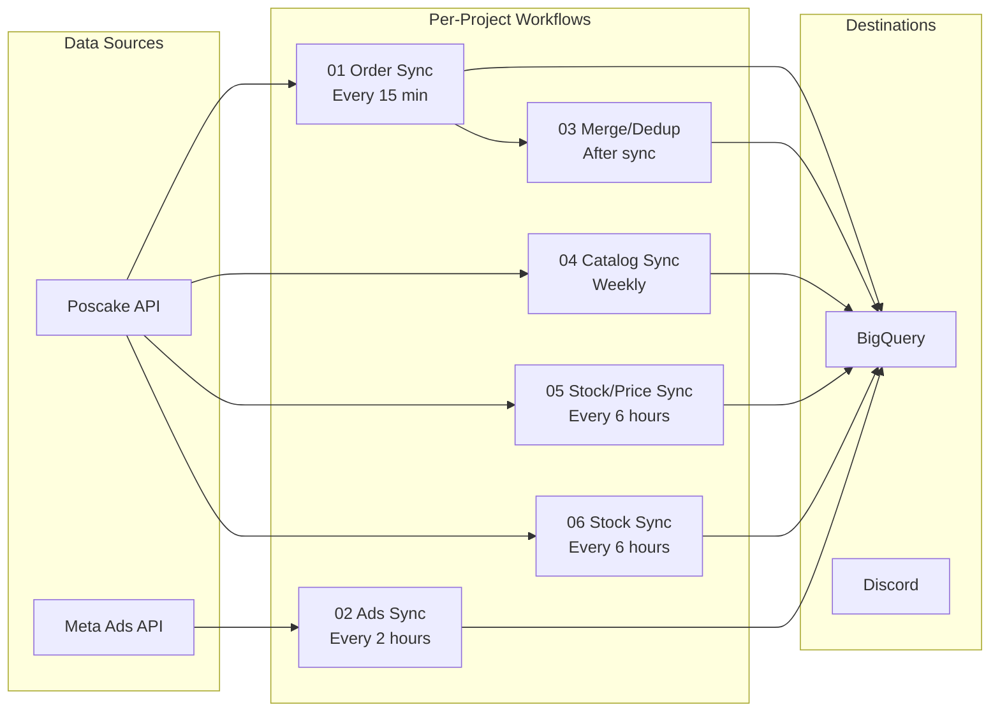

# n8n Workflow Specifications — FAOS v3

> **Updated:** 2026-02-24
> Each project has its own set of n8n workflows with **separate API credentials**. Workflows are stored in `n8n/{project_id}/` as exported JSON files. Shared templates are in `n8n/_shared/`.

## Workflow Architecture



## Directory Structure

```
n8n/
├── _shared/                       # Template workflows
│   ├── 01_Ads_Hourly_Sync.json   # Template: ads sync
│   ├── 02_Agent_Webhook_Trigger.json  # Template: webhook
│   └── js_dynamic_timerange.js    # Helper: date range
│
├── stramark/                      # STRAMARK — 12 workflows
│   ├── 01_order_sync.json        # POS order sync
│   ├── 01_pos_full_sync.json     # Full POS sync (template)
│   ├── 02_ads_sync.json          # Meta Ads daily sync
│   ├── 03_cs_performance.json    # CS staff metrics
│   ├── 03_merge_dedup.json       # Staging merge + dedup
│   ├── 04_logistics_monitor.json # Logistics alerts
│   ├── 04_meta_catalog_sync.json # Ad/Adset/Campaign lists
│   ├── 05_poscake_catalog_sync.json # Product/variation catalog
│   ├── 05_product_price_sync.json   # Product pricing
│   ├── 05_stock_intelligence.json   # Stock level alerts
│   ├── 06_stock_sync.json        # ✅ Active (ID: lIqFXldaeDQjb7Id)
│   └── _audit_live.json          # Live audit workflow
│
├── talpha/                        # TALPHA — 7 workflows
│   ├── 01_order_sync.json        # POS order sync (6 shops)
│   ├── 02_ads_sync.json          # Meta Ads (8 ad accounts)
│   ├── 03_merge_dedup.json       # Staging merge
│   ├── 04_catalog_sync.json      # Product catalog
│   ├── 05_mapping_sync.json      # Mapping data
│   ├── 06_test_product_detect.json # Product detection test
│   └── 07_alert.json             # Alert notifications
│
├── auus1/                         # AUUS1 — 6 workflows
│   ├── 01_pos_full_sync.json     # POS full sync (2 shops)
│   ├── 02_ads_sync.json          # Meta Ads (2 accounts)
│   ├── 03_cs_performance.json    # CS metrics
│   ├── 04_logistics_monitor.json # Logistics
│   ├── 05_stock_intelligence.json # Stock monitor
│   └── 06_auto_dedup.json        # Auto deduplication
│
├── zen8/          # 5 template-based workflows
├── pialpha/       # 5 template-based workflows
├── trendify/      # 5 template-based workflows
├── hnle/          # 5 template-based workflows
└── t1/            # 5 template-based workflows
```

## Naming Convention

In n8n UI, name workflows with project prefix:
```
[STR] 01 Order Sync
[STR] 02 Ads Sync
[STR] 06 Stock Sync
[TAL] 01 Order Sync
[TAL] 02 Ads Sync
[AUU] 01 POS Full Sync
```

---

## Per-Project Workflow Details

### Workflow 01: Order Sync (POS → BigQuery)

**Trigger:** Schedule — every 15 minutes
**Credentials:** Poscake API token (per project)

**Flow:**
```
Schedule (15 min)
  → HTTP Request: GET /shops/{shop_id}/orders?status=all&updated_since=last_run
  → Transform: flatten order data, extract fields
  → BigQuery: INSERT into staging_sale_order

  → HTTP Request: GET order lines for each order
  → Transform: flatten line items
  → BigQuery: INSERT into staging_order_items

  → Trigger: merge_dedup workflow
```

**Error handling:**
- On API 401: alert Discord "POS token expired for [PROJECT]"
- On API 429: retry with exponential backoff
- On BigQuery error: log and continue

---

### Workflow 02: Ads Sync (Meta → BigQuery)

**Trigger:** Schedule — every 2 hours
**Credentials:** Meta Marketing API access token (per project)

**Flow:**
```
Schedule (2h)
  → Meta API: GET /{account_id}/insights?level=ad
    Fields: ad_id, ad_name, spend, reach, impressions,
            messaging_conversation_started, campaign_name, adset_id
  → Transform: add date, project_id, page_id
  → BigQuery: DELETE by date range → INSERT into fb_ads_data

  Per ad account (STRAMARK: 2, TALPHA: 8, AUUS1: 2)
```

---

### Workflow 03: Merge/Dedup (Staging → Main)

**Trigger:** After order sync
**Purpose:** Merge staging tables into main tables, handling dedup

**Flow:**
```
  → BigQuery: Run merge_staging_orders.sql
  → BigQuery: Run fact_order_items_dedup view refresh
  → Cleanup staging tables
```

---

### Workflow 04: Catalog Sync (Meta + POS catalogs)

**Trigger:** Schedule — weekly or on-demand
**Purpose:** Sync campaign/adset/ad lists and product catalogs

**STRAMARK variant** (`04_meta_catalog_sync.json`):
```
  → Meta API: GET campaigns, adsets, ads
  → BigQuery: WRITE_TRUNCATE campaign_list, adset_list, ad_list
```

**TALPHA variant** (`04_catalog_sync.json`):
```
  → POS API: GET products, variations for all 6 shops
  → BigQuery: WRITE_TRUNCATE product_template, product_variations
```

---

### Workflow 05: Product/Price/Stock Intelligence

Multiple variants per project:

| File | Trigger | Purpose |
|:---|:---|:---|
| `05_poscake_catalog_sync.json` | Weekly | Product + variation catalog |
| `05_product_price_sync.json` | Weekly | Product pricing data |
| `05_stock_intelligence.json` | Daily 08:00 | Stock alerts to Discord |

---

### Workflow 06: Stock Sync (POS → BigQuery)

**Trigger:** Schedule — every 6 hours (0:00, 6:00, 12:00, 18:00)
**Credentials:** Poscake API token (HTTP Header Auth) + BigQuery SA

**Flow:**
```
Every 6 Hours
  → Shop Config: { shop_id, shop_name, api_url }
  → Parallel:
    ├── Fetch Warehouses: GET /shops/{shop_id}/warehouses?per_page=200&includes=products
    │   → Transform Warehouses → BQ: warehouse_list (WRITE_TRUNCATE)
    └── Fetch Stock Levels: GET /shops/{shop_id}/stock?per_page=500
        → Transform Stock → BQ: product_stock (WRITE_TRUNCATE)
```

**Write mode:** `WRITE_TRUNCATE` — always replaces entire table with latest snapshot.

> [!IMPORTANT]
> **Dashboard queries `product_stock` directly** (not via view).
> BigQuery's `CREATE OR REPLACE VIEW` can fail silently — always use `DROP + CREATE`.

> [!CAUTION]
> **BQ node `typeVersion` PHẢI = `2.1`** (KHÔNG phải `2`).
> Version `2` gây lỗi credential. See Bug #10 in `10_BUG_POSTMORTEM.md`.

**STRAMARK deployment:** ✅ Active (ID: `lIqFXldaeDQjb7Id`, credential: `6tyhXNXT1nA5PEXK`)

---

## TALPHA-Specific Workflows

### 05: Mapping Sync
Syncs dim tables and mapping data (marketer, market, product) from config.

### 06: Test Product Detect
Tests product detection logic, validates SKU mapping.

### 07: Alert
Discord alert notifications for TALPHA events.

---

## AUUS1-Specific Workflows

### 06: Auto Dedup
Automated deduplication process for AUUS1 order data.

---

## Planned Workflows (Not Yet Created)

| # | Workflow | Project | Purpose |
|:---|:---|:---|:---|
| 07 | Fulfillment Sync | STRAMARK | POS → 3PL (euShipments) order creation |
| 08 | Tracking Poll | STRAMARK | 3PL tracking → POS status update (every 2h) |

See [17_3PL_AUTOMATION_REFERENCE.md](17_3PL_AUTOMATION_REFERENCE.md) for implementation specs.

---

## Credential Management

Each project needs its own n8n credentials:

| Credential | Type | Per-Project |
|:---|:---|:---|
| Poscake API Token | HTTP Header Auth | ✅ Different per project |
| Meta Access Token | OAuth2 | ✅ Different per project |
| BigQuery Service Account | Service Account Key | ❌ Shared (same GCP project) |
| Discord Webhook | Webhook URL | ✅ Different per project |

> [!CAUTION]
> **BigQuery node `typeVersion` phải = `2.1`** khi tạo workflow qua API.

In n8n, create credentials with the naming pattern:
```
[STR] Poscake API
[STR] Meta Ads API
[STR] Discord Webhook
[TAL] Poscake API
[TAL] Meta Ads API
[AUU] Poscake API
...
```

## Deployment via N8N API

```powershell
# Create credential
$body = @{ name="[STR] Poscake API"; type="httpHeaderAuth"; data=@{name="api_key"; value="{API_KEY}"} } | ConvertTo-Json
Invoke-RestMethod -Method POST -Uri "{N8N_HOST}/api/v1/credentials" -Headers $headers -Body $body

# Create workflow (from template JSON)
$wf = Get-Content n8n/{project_id}/06_stock_sync.json | ConvertFrom-Json
Invoke-RestMethod -Method POST -Uri "{N8N_HOST}/api/v1/workflows" -Headers $headers -Body ($wf | ConvertTo-Json -Depth 10)

# Activate
Invoke-RestMethod -Method POST -Uri "{N8N_HOST}/api/v1/workflows/{workflow_id}/activate" -Headers $headers
```

## Workflow Generator Tool

`tools/generate_n8n_workflows.py` (38KB) — automatically generates N8N workflow JSON files from project configs. Largest tool in the codebase.

---

*Updated: 2026-02-24 | Version: 2.0*
