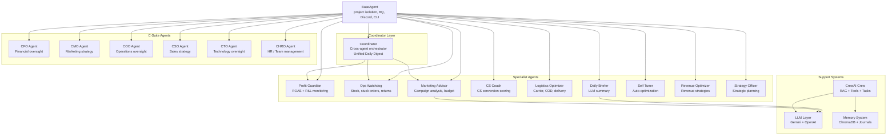

# Agent Specifications — FAOS v3

> **Updated:** 2026-02-24
> Each agent is a Python class that inherits from `BaseAgent`. Agents are **project-isolated** — they receive a `project_id` parameter and only query data for that project.

## Agent Architecture



### BaseAgent Class

```python
class BaseAgent:
    AGENT_NAME = "BaseAgent"
    AGENT_EMOJI = "🤖"

    def __init__(self, project_id: str, days: int = 1, dry_run: bool = False):
        self.project_id = project_id
        self.config = load_project_config(project_id)
        self.bq = BigQueryClient()
        self.discord = DiscordNotifier(self.config)
        self.shop_ids = config.get("poscake.shop_ids", [])

    def shop_filter(self, alias="", column="shop_id") -> str:
        """SQL WHERE clause for project isolation"""
    def project_filter(self, alias="", column="project_id") -> str:
        """SQL WHERE using project_aliases.yaml"""
    def run(self):
        """Main flow: fetch_data → analyze → format_message → send"""
    def run_silent(self):
        """Run without Discord — for Coordinator aggregation"""
```

---

## Coordinator (Daily Digest)

**File:** `agents/coordinator.py`
**Purpose:** Run all C-Level agents, aggregate results, perform cross-agent analysis, send ONE unified Discord digest.
**Schedule:** Daily

**Agent execution order:**
1. `ProfitGuardian` (A10 CFO) — runs first, writes budget_quota
2. `OpsWatchdog` (A9 COO) — uses budget context
3. `MarketingAdvisor` (G3 CMO) — optional, requires Meta API

**Logic:**
```
1. Run each sub-agent via run_silent() → collect results
2. Cross-agent analysis:
   - Low stock + high ad spend → "Wasting budget on out-of-stock products"
   - High return rate + high spend → "Spending on products customers return"
   - All agents green → "System healthy" summary
3. Format unified digest → Discord
```

---

## Specialist Agents

### Agent #1: Profit Guardian (CFO)

**File:** `agents/profit_guardian.py` (11KB)
**Purpose:** Monitor advertising ROAS and daily P&L. Alert when campaigns are unprofitable.
**Schedule:** 2x daily (10:00, 17:00 local time)
**LLM:** ❌ No

**Input:** `vw_daily_pnl`, `mart_performance_master`, `vw_true_roas`

**Logic:**
```
1. Query today's P&L from vw_daily_pnl WHERE project matches
2. Query marketer performance
3. Classify ROAS: 🟢 >2.0 | 🟡 1.3-2.0 | 🔴 <1.3
4. Calculate daily P&L: profit = revenue - ads - ffm
5. Compare with 7-day rolling average
6. If trending down OR any 🔴 → Send Discord alert
```

---

### Agent #2: Ops Watchdog (COO)

**File:** `agents/ops_watchdog.py` (9KB)
**Purpose:** Monitor stock levels, stuck orders, return rates, COD reconciliation.
**Schedule:** Every 4 hours
**LLM:** ❌ No

**Checks:** Stock critical (<3 days), stuck orders (>3 days in 'new'), return rate >25%, COD unreconciled >14 days, late deliveries.

---

### Agent #3: Daily Briefer

**File:** `agents/daily_briefer.py` (13KB)
**Purpose:** Generate end-of-day natural language summary for CEO/management.
**Schedule:** Daily at 23:00
**LLM:** ✅ Yes (Gemini/OpenAI)

**Flow:** Aggregate all metrics → Build structured prompt → LLM generates briefing → Discord

---

### Agent #4: CS Coach

**File:** `agents/cs_coach.py` (8KB)
**Purpose:** Track CS staff conversion rates (inbox → order) and coaching.
**Schedule:** Daily at 23:30
**LLM:** ❌ No

---

### Agent #5: Logistics Optimizer

**File:** `agents/logistics_optimizer.py` (11KB)
**Purpose:** Compare carrier performance, track COD, alert late deliveries.
**Schedule:** Daily at 08:00
**LLM:** ❌ No

---

### Agent #6: Marketing Advisor (CMO)

**File:** `agents/marketing_advisor.py` (19KB — largest agent)
**Purpose:** Deep campaign analysis, budget allocation recommendations, trend detection.
**Schedule:** Via Coordinator
**LLM:** ✅ Yes

---

### Agent #7: Self Tuner

**File:** `agents/self_tuner.py` (8KB)
**Purpose:** Auto-optimize agent thresholds based on historical performance.
**LLM:** ❌ No

---

### Agent #8: Revenue Optimizer

**File:** `agents/revenue_optimizer.py` (4KB)
**Purpose:** Identify revenue growth opportunities.

---

### Agent #9: Strategy Officer

**File:** `agents/strategy_officer.py` (3KB)
**Purpose:** Strategic planning and market analysis.

---

## C-Suite Agents

Higher-level agents that provide executive-level analysis:

| Agent | File | Size | Purpose |
|:---|:---|:---:|:---|
| CFO Agent | `cfo_agent.py` | 3KB | Financial oversight, budget approval |
| CMO Agent | `cmo_agent.py` | 4KB | Marketing strategy, channel allocation |
| COO Agent | `coo_agent.py` | 3KB | Operations monitoring, process optimization |
| CSO Agent | `cso_agent.py` | 3KB | Sales strategy, conversion optimization |
| CTO Agent | `cto_agent.py` + `cto/` | 4KB | Technology monitoring, system health |
| CHRO Agent | `chro_agent.py` + `chro/` | 5KB | Team performance, HR metrics |

---

## LLM Abstraction Layer (`agents/llm/`)

| File | Size | Purpose |
|:---|:---:|:---|
| `llm_provider.py` | 17KB | Unified Gemini + OpenAI provider with fallback |
| `llm_agent_service.py` | 25KB | Agent service layer for LLM interactions |
| `system_prompts.py` | 11KB | System prompt templates for each agent role |
| `tools_registry.py` | 8KB | Function tool definitions for LLM calls |
| `C_LEVEL_PROMPTS.md` | 11KB | C-Level prompt reference document |

**Features:**
- Auto-fallback: Gemini → OpenAI if one fails
- Token tracking and cost monitoring
- Structured output parsing
- Rate limit handling

---

## Memory System (`agents/memory/`)

| File | Size | Purpose |
|:---|:---:|:---|
| `agent_memory.py` | 14KB | Memory management (read/write/search) |
| `bridge_knowledge.py` | 9KB | Knowledge bridging between agents |
| `index_knowledge.py` | 9KB | Knowledge indexing for RAG |
| `chroma_db/` | — | ChromaDB persistent vector storage |
| `*_journal.json` | Variable | Per-agent activity journals |

**Active journals:**
- `marketingadvisor_journal.json` — 25KB (most active)
- `profit_guardian_journal.json` — 14KB
- `g3_journal.json` — 1KB

---

## CrewAI Crew System (`agents/crew/`)

| File | Size | Purpose |
|:---|:---:|:---|
| `crew.py` | 4KB | Crew definition and composition |
| `agents.py` | 8KB | Agent role definitions |
| `tasks.py` | 7KB | Task definitions and workflows |
| `tools.py` | 11KB | Custom tools for BigQuery, POS, Meta |
| `rag.py` | 14KB | RAG pipeline (document retrieval) |
| `knowledge_tools.py` | 3KB | Knowledge access tools |
| `token_tracker.py` | 8KB | Token usage tracking |
| `war_room_logger.py` | 10KB | War Room session logging |
| `run.py` | 10KB | Crew execution runner |
| `chromadb_data/` | — | RAG vector store (29 files) |

---

## Scheduled Tasks (Windows Task Scheduler)

| Batch File | Agent/Tool | Schedule |
|:---|:---|:---|
| `FAOS_Watchdog.bat` | OpsWatchdog | Every 4h |
| `FAOS_Guardian.bat` | ProfitGuardian | 2x daily |
| `FAOS_ETLMonitor_7AM.bat` | ETL Monitor | 7:00 AM |
| `FAOS_ETLMonitor_2PM.bat` | ETL Monitor | 2:00 PM |
| `FAOS_ETLMonitor_8PM.bat` | ETL Monitor | 8:00 PM |
| `FAOS_DailySummary.bat` | DailyBriefer | Daily 23:00 |
| `FAOS_DailyDigest.bat` | Coordinator | Daily |
| `FAOS_CSCoach.bat` | CSCoach | Daily 23:30 |
| `FAOS_Logistics.bat` | LogisticsOptimizer | Daily 8:00 |
| `FAOS_TokenCheck.bat` | Token monitoring | Periodic |

---

## Thresholds (from `config/thresholds.yaml`)

| Metric | 🟢 OK | 🟡 Warning | 🔴 Critical |
|:---|:---:|:---:|:---:|
| ROAS | > 2.0 | 1.3 – 2.0 | < 1.3 |
| Profit drop | < 30% | — | > 30% vs 7d avg |
| Stock days | > 14 | 3 – 14 | < 3 |
| Stuck orders | — | — | > 3 days in 'new' |
| Return rate | < 25% | — | > 25% |
| COD pending | < 14 days | — | > 14 days unreconciled |

---

*Updated: 2026-02-24 | Version: 2.0*
