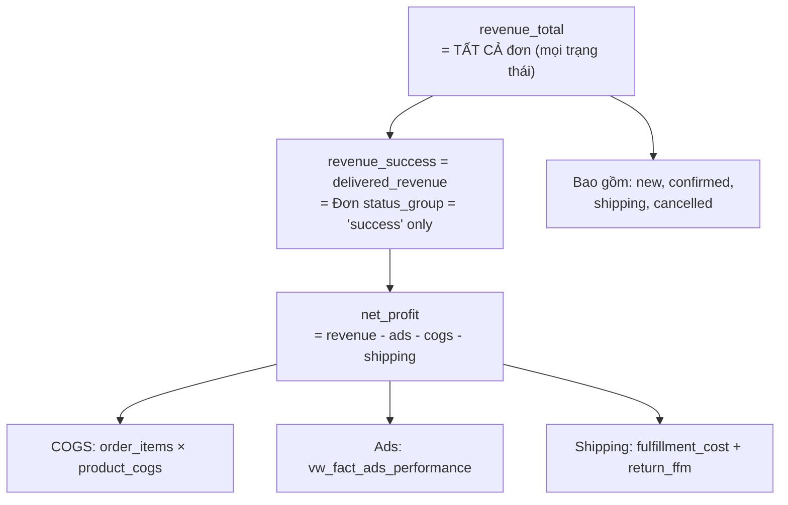
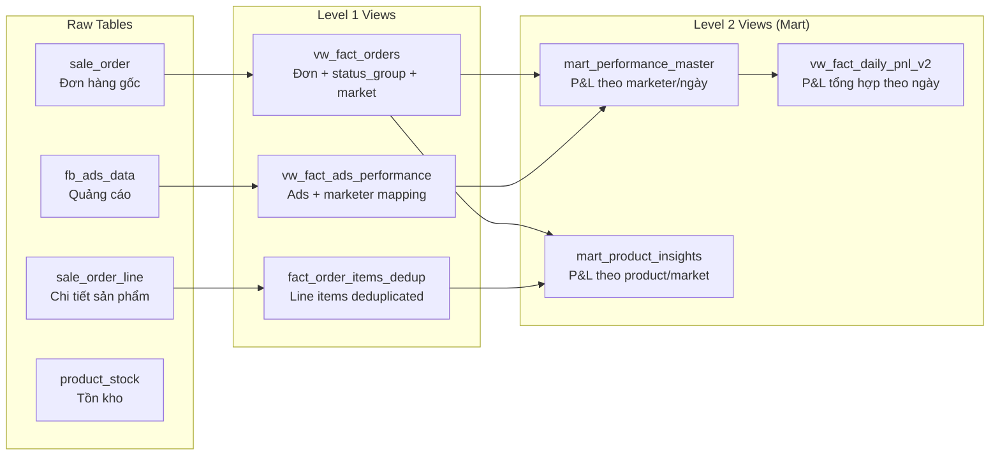
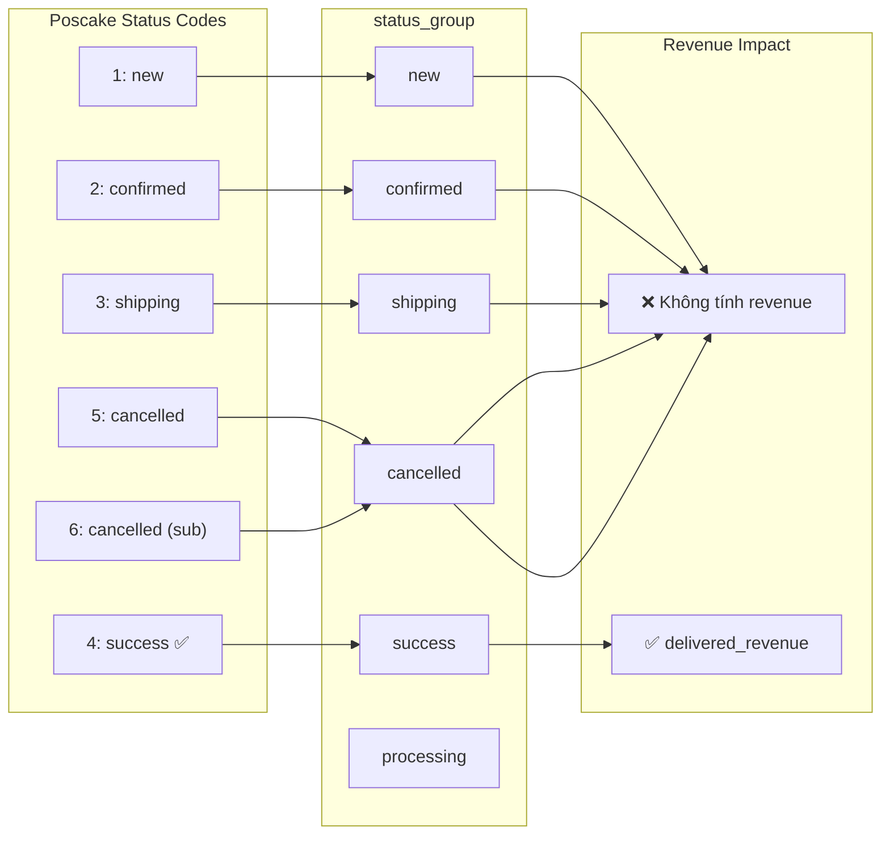

# 📊 Revenue Definitions & Dashboard Reporting Structure

> **Mục đích**: Định nghĩa CHÍNH XÁC các khái niệm doanh thu, cách tính, nguồn dữ liệu, và cấu trúc hiển thị trên dashboard. Tránh nhầm lẫn khi đọc báo cáo.

---

## 1. Các loại doanh thu trong hệ thống

### 1.1 Revenue Pipeline (Phễu doanh thu)



| # | Tên cột | Ý nghĩa | Công thức | Lưu ý |
|---|---------|---------|-----------|-------|
| 1 | `revenue_total` | **Doanh thu ĐẶT HÀNG** — tất cả đơn, mọi trạng thái | `SUM(total_price)` trên mọi đơn | Bao gồm cả đơn hủy, đang xử lý. KHÔNG dùng để đánh giá hiệu quả. |
| 2 | `revenue_success` | **Doanh thu THÀNH CÔNG** — chỉ đơn `status_group = 'success'` | `SUM(total_price) WHERE status_group = 'success'` | Tính theo **order-level** (giá trị tổng đơn hàng). |
| 3 | `delivered_revenue` | **Doanh thu GIAO THÀNH CÔNG** — cùng filter `status_group = 'success'` | Hai cách tính (xem mục 1.2) | **Cột chính được dùng trên dashboard.** |
| 4 | `revenue_lead` | **Doanh thu LEAD** — alias của `revenue_total` | `= revenue_total` | Dùng trong `vw_fact_daily_pnl_v2` để phân biệt với `revenue_success`. |
| 5 | `revenue_cod_collected` | **Thu COD** — tiền đã thu từ shipper | Hiện tại = `0` (chưa implement) | Sẽ cần kết nối API đối soái shipper. |

### 1.2 Hai cách tính `delivered_revenue`

> [!IMPORTANT]
> `delivered_revenue` có **hai cách tính khác nhau** tùy view, dẫn đến chênh lệch ~0.3%.

| View | Cách tính | Ví dụ 30 ngày |
|------|-----------|---------------|
| `mart_performance_master` | **Order-level**: `SUM(total_price) WHERE status='success'` | **91,022 RON** |
| `mart_product_insights` | **Line-item**: `SUM(qty × unit_price) WHERE status='success'` | **90,729 RON** |

**Tại sao chênh 293 RON (~0.3%)?**
- Order-level: lấy `total_price` từ đơn hàng (đã bao gồm discount, adjustment)
- Line-item: tính `qty × unit_price` trên từng sản phẩm (trước discount)
- Chênh lệch do: rounding, discount order-level, adjustment

**Đây KHÔNG phải bug** — đây là sự khác biệt tự nhiên giữa hai góc nhìn.

### 1.3 Revenue levels trong `vw_fact_orders` (raw)

| Cột | Filter | Ý nghĩa |
|-----|--------|---------|
| `total_price` | Không filter | Giá trị gốc của đơn |
| `revenue_impact` | `total_price × status_weight` | Doanh thu có trọng số theo trạng thái |
| `revenue_L1_lead` | `total_price WHERE status IN (all)` | = Doanh thu tạo đơn |
| `revenue_L2_shipped` | `total_price WHERE status IN (shipping, success)` | = Doanh thu đã chuyển đi |
| `revenue_L3_success` | `total_price WHERE status = success` | = Doanh thu thành công |
| `revenue_L4_cod_collected` | Chưa implement | = Tiền COD đã thu |

> [!WARNING]
> **KHÔNG dùng `revenue_L3_success` trực tiếp** — nó đã bị deprecated. Dùng `delivered_revenue` thay thế.
> Xem Bug #8 trong `10_BUG_POSTMORTEM.md`.

---

## 2. Cấu trúc BigQuery Views



### 2.1 Chi tiết từng View

| View | Revenue columns | Tính từ | Mục đích |
|------|----------------|---------|----------|
| `mart_performance_master` | `revenue_total`, `revenue_success`, `delivered_revenue` | `vw_fact_orders.total_price` (order-level) | Báo cáo theo **marketer + ngày** |
| `mart_product_insights` | `delivered_revenue` | `fact_order_items.qty × unit_price` (line-item) | Báo cáo theo **sản phẩm + thị trường** |
| `vw_fact_daily_pnl_v2` | `revenue_lead`, `revenue_success`, `delivered_revenue` | Từ `mart_performance_master` | Báo cáo **P&L tổng hợp theo ngày** |
| `vw_fact_orders` | `total_price`, `revenue_L1..L4` | Raw `sale_order.total_price` | **Raw data**, dùng cho query trực tiếp |

---

## 3. Dashboard Tabs — Nguồn dữ liệu & Revenue column

### 3.1 Mapping tổng quan

```
┌─────────────────────────────────────────────────────────────────────┐
│                         DASHBOARD TABS                              │
├────────────────┬──────────────────────────┬──────────────────────────┤
│     Tab        │     BQ View/Table        │   Revenue column         │
├────────────────┼──────────────────────────┼──────────────────────────┤
│ CEO Overview   │ vw_fact_daily_pnl_v2     │ delivered_revenue        │
│   (Q0: P&L)   │ mart_performance_master  │ delivered_revenue        │
│   (Q2,Q3)     │ mart_product_insights    │ delivered_revenue        │
│   (Q4: Ads)   │ vw_fact_ads_performance  │ spend_ron (overrides KPI)│
├────────────────┼──────────────────────────┼──────────────────────────┤
│ Marketing      │ mart_performance_master  │ delivered_revenue        │
│                │ vw_fact_ads_performance  │ spend_ron (merged)       │
├────────────────┼──────────────────────────┼──────────────────────────┤
│ Overview       │ mart_performance_master  │ delivered_revenue        │
├────────────────┼──────────────────────────┼──────────────────────────┤
│ Marketer Perf  │ mart_performance_master  │ delivered_revenue        │
├────────────────┼──────────────────────────┼──────────────────────────┤
│ Market Intel   │ mart_product_insights    │ delivered_revenue        │
├────────────────┼──────────────────────────┼──────────────────────────┤
│ Products       │ mart_product_insights    │ delivered_revenue        │
│ Product P&L    │ mart_product_insights    │ delivered_revenue        │
├────────────────┼──────────────────────────┼──────────────────────────┤
│ P&L            │ mart_performance_master  │ delivered_revenue        │
│                │ (NOT raw vw_fact_orders) │ net_profit from mart     │
├────────────────┼──────────────────────────┼──────────────────────────┤
│ Customer       │ vw_fact_orders (raw)     │ total_price (per order)  │
├────────────────┼──────────────────────────┼──────────────────────────┤
│ Inventory      │ product_stock (raw)      │ (không có revenue)       │
├────────────────┼──────────────────────────┼──────────────────────────┤
│ Ads Command    │ FastAPI + fb_ads_data    │ Meta spend + BQ orders   │
│ Center         │ + sale_order (adset_id)  │ total_price ÷ 100 (bani) │
└────────────────┴──────────────────────────┴──────────────────────────┘
```

### 3.2 Tại sao số liệu CÓ THỂ chênh lệch giữa các tab?

| So sánh | Nguyên nhân | Mức chênh |
|---------|-------------|-----------|
| CEO vs Marketing | Cùng `mart_performance_master` → **nên giống nhau** | 0% |
| Marketing vs Market Intel | Khác view (`perf_master` vs `product_insights`), khác cách tính | ~0.3% |
| P&L tab vs CEO | P&L dùng raw `vw_fact_orders`, CEO dùng mart view | Có thể khác |
| Ads Command vs Marketing | Ads Command tính riêng qua FastAPI, khác join logic | Có thể khác |

> [!TIP]
> **Quy tắc**: Tabs cùng dùng 1 view thì **số phải giống nhau**. Tabs khác view thì chấp nhận chênh ~0.3%.

---

## 4. Status mapping ảnh hưởng revenue



**CHỈ `status_group = 'success'`** mới được tính vào `delivered_revenue`.

---

## 5. Quy tắc khi thêm tab mới hoặc sửa query

1. **LUÔN dùng `delivered_revenue`** — đây là cột chuẩn trên tất cả dashboard tabs
2. **Xác định đúng view**: nếu báo cáo theo marketer → dùng `mart_performance_master`. Nếu theo product/market → dùng `mart_product_insights`
3. **KHÔNG mix view**: trong cùng 1 tab, cố gắng dùng 1 view chính để tránh chênh lệch
4. **P&L tab là ngoại lệ**: dùng `mart_performance_master` trực tiếp, net_profit tính từ mart
5. **Khi thêm cột mới vào view**: dùng `DROP + CREATE` (Bug #9 rule), kiểm tra `revenue_success` vẫn tồn tại (backward compat)
6. **Ads spend tổng**: dùng `vw_fact_ads_performance` (100% coverage), KHÔNG dùng mart (chỉ 48% vì unmatched campaigns)

---

## 6. Cost Structure (Chi phí)

### 6.1 COGS (Giá vốn hàng bán)

| Thuộc tính | Giá trị |
|---|---|
| **Source** | POS API: `variant.average_imported_price` |
| **Đơn vị** | Bani (RON × 100) — chia 100 khi dùng |
| **Field SAI** | `imported_price` (luôn = 0) |
| **BQ table** | `product_cogs` (cost_raw = bani, cost_ron = RON) |
| **Mart formula** | `SUM(qty × COALESCE(product_cogs.cost_raw, order_items.avg_imported_price) / 100)` |
| **Filter** | `WHERE status_group = 'success'` (**CHỈ đơn thành công**) |

> [!CAUTION]
> COGS tính cho ALL orders (kể cả cancelled/returned) là **SAI** → thổi phồng 2x.
> Đã fix bằng cách thêm `WHERE o.status_group = 'success'` trong `order_cogs` CTE.

### 6.2 Shipping / Fulfillment (3PL)

| Loại | Column | Ý nghĩa | Dùng trong P&L? |
|---|---|---|---|
| **fulfillment_cost** | `mart.fulfillment_cost` | Chi phí 3PL gửi hàng (euShipments) | ✅ Có |
| **return_fulfillment_cost** | `mart.return_fulfillment_cost` | Chi phí 3PL hoàn hàng | ✅ Có |
| **shipping_cost** | `mart.shipping_cost` | Phí ship KHÁCH TRẢ (POS fee) | ❌ **KHÔNG** |

> [!WARNING]
> `shipping_cost` là phí ship **khách trả**, KHÔNG phải chi phí kinh doanh.
> P&L chỉ trừ `fulfillment_cost + return_fulfillment_cost` (chi phí 3PL thực).
> Trước đây P&L tab trừ cả `shipping_cost` → lãi ròng bị giảm sai.

### 6.3 Ads Spend

| Nguồn | Coverage | Dùng cho |
|---|---|---|
| `mart_performance_master.ads_spend_ron` | ~48% (chỉ matched campaigns) | Monthly P&L view |
| `vw_fact_ads_performance.spend_ron` | **100%** (tất cả campaigns) | **CEO KPI tổng, Marketer table** |

> [!IMPORTANT]
> CEO tab KPI dùng total ads từ marketer table (`vw_fact_ads_performance`) vì mart chỉ match ~48% campaigns.
> Mart bỏ sót campaigns: `TA-pixelnew`, `LC trondoi`, `TA-lich`... (unmatched trong 3-level fallback).

---

*Cập nhật: 2026-02-24 | Phiên bản: 2.0*
