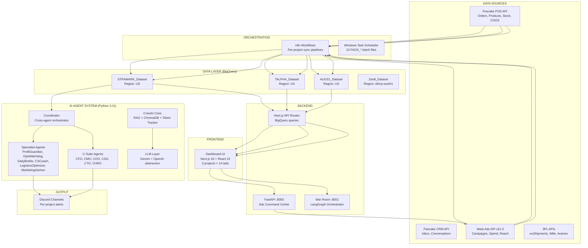

# 🔍 SYSTEM AUDIT REPORT — FAOS Platform v3

> **Date**: 2026-02-24 | **Auditor**: Antigravity AI | **Mode**: Full-Stack Audit
> **Scope**: BigQuery, N8N, Backend, Frontend, Agents, Tools, Libraries, Configurations
> **⚠️ This supersedes the previous audit from 2026-02-19.**

---

## 1. Tổng Quan Kiến Trúc



### Component Summary

| Component | Technology | Files | Status |
|:---|:---|:---:|:---:|
| **Data Warehouse** | Google BigQuery (4 datasets) | 51 SQL files | ✅ |
| **Workflow Engine** | n8n (self-hosted) | 54 JSON workflows | ✅ |
| **Backend API #1** | FastAPI (Ads Command Center) | 10 files | ⚠️ |
| **Backend API #2** | War Room (LangGraph) | 15 files | ⚠️ |
| **Frontend** | Next.js 16 + React 19 + TailwindCSS | 90 files | ✅ |
| **AI Agents** | Python 3.11 + BaseAgent framework | 25 files | ✅ |
| **CrewAI System** | CrewAI + ChromaDB + RAG | 18 files | ✅ |
| **LLM Abstraction** | Gemini + OpenAI providers | 6 files | ✅ |
| **Config** | YAML (8 projects + template) | 33 files | ✅ |
| **Scheduled Tasks** | Windows Task Scheduler | 10 .bat files | ✅ |
| **Docs** | Markdown | 37 files | ⚠️ Outdated |

---

## 2. BigQuery — Database Audit

### 2.1 Datasets

| Dataset | Region | Project(s) | Tables | Views/Marts |
|:---|:---|:---|:---:|:---:|
| `STRAMARK_Dataset` | US | STRAMARK (Romania) | 11+ | 10 |
| `TALPHA_Dataset` | US | TALPHA (GCC) | 11+ | 3+ |
| `AUUS1_Dataset` | US | AUUS1 (US/AU) | 11+ | 7 |
| `Zen8_Dataset` | africa-south1 | Zen8, PiAlpha | 11+ | 12 |

### 2.2 SQL File Inventory

| Directory | Files | Purpose |
|:---|:---:|:---|
| `sql/stramark/` | 10 | Views + marts cho STRAMARK (01–06 + merge + audit) |
| `sql/auus1/` | 7 | Views + marts cho AUUS1 (01–07) |
| `sql/talpha/` | 1 + 3 views | `create_tables.sql` + 3 views |
| `sql/views/` | 12 | Shared views (poscake, ads_perf, daily_pnl, true_roas) |
| `sql/tables/` | 4 | DDL: poscake, dim, staging, reference tables |
| Root `sql/` | 14 | Deploy scripts, frozen schemas, dim views |

### 2.3 View Layer Architecture

```
Raw Tables (sale_order, order_items, fb_ads_data, product_stock)
    ↓
Level 1: fact_order_items_dedup → vw_fact_orders → vw_fact_ads_performance
    ↓
Level 2 (Marts): mart_performance_master → mart_market_intelligence → mart_product_insights
    ↓
Level 3 (P&L): vw_fact_daily_pnl_v2
```

> Per-project SQL copies exist in `sql/{project}/` with project-specific dataset refs.

### 2.4 Key Schema Versions

| Schema Doc | Version | Date |
|:---|:---:|:---|
| `SCHEMA_FROZEN_v2.0.md` | 2.0 | Baseline |
| `SCHEMA_FROZEN_v3.0.md` | 3.0 | Current |
| `02_DATABASE_MASTER_SPEC.md` | 2.1 | 2026-02-19 |

---

## 3. N8N — Workflow Audit

### 3.1 Per-Project Workflow Inventory

#### STRAMARK (12 workflows)

| # | File | Purpose |
|:---|:---|:---|
| 1 | `01_order_sync.json` | POS order sync |
| 2 | `01_pos_full_sync.json` | Full POS sync |
| 3 | `02_ads_sync.json` | Meta Ads daily sync |
| 4 | `03_cs_performance.json` | CS staff metrics |
| 5 | `03_merge_dedup.json` | Staging merge + dedup |
| 6 | `04_logistics_monitor.json` | Logistics alerts |
| 7 | `04_meta_catalog_sync.json` | Meta campaign/adset/ad lists |
| 8 | `05_poscake_catalog_sync.json` | POS product/variation catalog |
| 9 | `05_product_price_sync.json` | Product pricing sync |
| 10 | `05_stock_intelligence.json` | Stock level alerts |
| 11 | `06_stock_sync.json` | POS stock → BQ (active: ID lIqFXldaeDQjb7Id) |
| 12 | `_audit_live.json` | Live audit workflow |

#### TALPHA (7 workflows)

| # | File | Purpose |
|:---|:---|:---|
| 1 | `01_order_sync.json` | POS order sync (6 shops) |
| 2 | `02_ads_sync.json` | Meta Ads sync (8 accounts) |
| 3 | `03_merge_dedup.json` | Staging merge |
| 4 | `04_catalog_sync.json` | Product catalog sync |
| 5 | `05_mapping_sync.json` | Mapping data sync |
| 6 | `06_test_product_detect.json` | Product detection test |
| 7 | `07_alert.json` | Alert notifications |

#### AUUS1 (6 workflows)

| # | File | Purpose |
|:---|:---|:---|
| 1 | `01_pos_full_sync.json` | POS full sync (2 shops) |
| 2 | `02_ads_sync.json` | Meta Ads sync (2 accounts) |
| 3 | `03_cs_performance.json` | CS metrics |
| 4 | `04_logistics_monitor.json` | Logistics alerts |
| 5 | `05_stock_intelligence.json` | Stock monitor |
| 6 | `06_auto_dedup.json` | Auto deduplication |

#### Other Projects (5 each, template-based)

Zen8, PiAlpha, Trendify, HNLE, T1 — each has 5 template workflows.

#### Shared (`n8n/_shared/`)

| File | Purpose |
|:---|:---|
| `01_Ads_Hourly_Sync.json` | Template: ads sync |
| `02_Agent_Webhook_Trigger.json` | Template: webhook trigger |
| `js_dynamic_timerange.js` | Helper: dynamic date range |

### 3.2 Workflow Issues

- **6 files still contain `__FILL_` placeholders** (template files, expected for undeployed projects)
- **STRAMARK has duplicate order sync**: both `01_order_sync.json` and `01_pos_full_sync.json`
- **No fulfillment/tracking workflows yet** — planned for 3PL automation

---

## 4. Backend — API Audit

### 4.1 Server Architecture

| Server | Port | Framework | Purpose |
|:---|:---:|:---|:---|
| **Ads Command Center** | 8000 | FastAPI | Meta Ads management, analytics |
| **War Room** | 8001 | FastAPI (standalone) | AI crew orchestration |
| **Dashboard API** | 3000 | Next.js API Routes | BigQuery queries for dashboard |

> ⚠️ **Two separate Python servers** — caused by CrewAI pydantic v2 conflict with FastAPI `--reload`.

### 4.2 Next.js API Routes

| Route | Purpose |
|:---|:---|
| `/api/stramark/realtime/` | Hybrid Meta+POS data, 3-pass ad attribution (35KB route!) |
| `/api/talpha/realtime/` | TALPHA realtime data |
| `/api/query/` | Generic BigQuery query executor |
| `/api/executive-report/` | Executive summary report |
| `/api/agent/` | Agent interaction API |

### 4.3 Ads Command Center Module (`modules/ads-command-center/`)

Full-stack module with:
- `backend/` — 10 files (FastAPI routers, services)
- `frontend/` — 6 files (React components for dashboard)
- `n8n/` — 2 files (workflow templates)
- `setup_bigquery.py` — BQ schema setup

### 4.4 War Room (`war_room/`)

LangGraph-based AI orchestrator:
- `orchestrator.py` — Main orchestration logic
- `state.py` — State management
- `project_config.py` — Project configuration
- `nodes/` — 7 node implementations
- `actions/` — 3 action handlers
- `mock_data.py` — Test data

---

## 5. Frontend — Dashboard Audit

### 5.1 Tech Stack

| Package | Version | Purpose |
|:---|:---:|:---|
| Next.js | 16.1.6 | React framework |
| React | 19.0.0 | UI library |
| TailwindCSS | 3.3.0 | Styling |
| @google-cloud/bigquery | 7.5.0 | Direct BQ queries |
| @tanstack/react-table | 8.21.3 | Data tables |
| Recharts | 2.12.2 | Charts & graphs |
| Axios | 1.13.5 | HTTP client |
| Lucide React | 0.344.0 | Icons |
| date-fns | 3.3.1 | Date utilities |
| js-yaml | 4.1.1 | YAML parsing |
| clsx + tailwind-merge | — | Class utilities |

### 5.2 Dashboard Structure

```
dashboard-ui/src/
├── app/
│   ├── page.tsx                    # Home redirect
│   ├── layout.tsx                  # Root layout
│   ├── globals.css                 # Global styles
│   ├── admin/                      # Admin page
│   ├── ads-command-center/         # Ads Command Center page
│   ├── stramark/                   # STRAMARK dashboard
│   ├── talpha/                     # TALPHA dashboard
│   ├── auus1/                      # AUUS1 dashboard
│   └── api/                        # API routes (5 route groups)
├── components/
│   ├── stramark/                   # STRAMARK components (14 tabs + shell)
│   ├── talpha/                     # TALPHA components (7 tabs + shell)
│   ├── auus1/                      # AUUS1 components (14 tabs + shell)
│   ├── tabs/                       # Shared tab components (14 tabs)
│   ├── ads-command-center/         # Ads Command Center UI (5 files)
│   ├── war-room/                   # War Room UI (2 files)
│   └── ui/                         # UI primitives (4 files)
└── lib/
    ├── bigquery.ts                 # BQ client
    ├── constants.ts                # Shared constants
    ├── marketer-map.ts             # Marketer mapping
    └── utils.ts                    # Utilities
```

### 5.3 Dashboard Tabs (14 per project)

| # | Tab | Data Source | Size |
|:---|:---|:---|:---:|
| 1 | CEO Overview | `vw_fact_daily_pnl_v2`, `mart_performance_master` | 38-43KB |
| 2 | Marketing | `mart_performance_master`, `vw_fact_ads_performance` | 38-48KB |
| 3 | Marketer Performance | `mart_performance_master` | 20KB |
| 4 | Products | `mart_product_insights` | 28-36KB |
| 5 | Product P&L | `mart_product_insights` | 16KB |
| 6 | P&L | `vw_fact_orders` (raw) | 15-18KB |
| 7 | Overview | `mart_performance_master` | 13KB |
| 8 | Customer | `vw_fact_orders` (raw) | 19-28KB |
| 9 | Inventory | `product_stock` (raw) | 12KB |
| 10 | Market Intelligence | `mart_product_insights` | 19KB |
| 11 | Ads Command Center | FastAPI + `fb_ads_data` + `sale_order` | 15-39KB |
| 12 | Executive Report | BQ direct + LLM | 12KB |
| 13 | Assistant | LLM chat | 5KB |
| 14 | Token Cost | Agent token tracking | 20KB |

> STRAMARK tabs are the most developed (39KB ads-command, 43KB CEO overview).
> TALPHA has 7 tabs (subset). AUUS1 has 14 tabs.

---

## 6. AI Agent System — Full Inventory

### 6.1 Agent Architecture

```
BaseAgent (base_agent.py)
    ├── Coordinator (coordinator.py)
    │   ├── ProfitGuardian (profit_guardian.py)   — A10 CFO
    │   ├── OpsWatchdog (ops_watchdog.py)         — A9 COO
    │   └── MarketingAdvisor (marketing_advisor.py) — G3 CMO
    │
    ├── C-Suite Agents
    │   ├── CFO Agent (cfo_agent.py)
    │   ├── CMO Agent (cmo_agent.py)
    │   ├── COO Agent (coo_agent.py)
    │   ├── CSO Agent (cso_agent.py)
    │   ├── CTO Agent (cto_agent.py)
    │   └── CHRO Agent (chro_agent.py + chro/)
    │
    ├── Specialist Agents
    │   ├── DailyBriefer (daily_briefer.py)        — LLM summary
    │   ├── CSCoach (cs_coach.py)                  — CS performance
    │   ├── LogisticsOptimizer (logistics_optimizer.py)
    │   ├── RevenueOptimizer (revenue_optimizer.py)
    │   ├── SelfTuner (self_tuner.py)              — Auto-optimization
    │   └── StrategyOfficer (strategy_officer.py)
    │
    ├── LLM Layer (agents/llm/)
    │   ├── llm_provider.py        — Gemini + OpenAI abstraction (16KB)
    │   ├── llm_agent_service.py   — Agent service layer (25KB)
    │   ├── system_prompts.py      — System prompt templates (11KB)
    │   ├── tools_registry.py      — Tool definitions for LLM (8KB)
    │   └── C_LEVEL_PROMPTS.md     — C-Level prompts reference (11KB)
    │
    ├── Memory System (agents/memory/)
    │   ├── agent_memory.py        — Memory management (14KB)
    │   ├── bridge_knowledge.py    — Knowledge bridging (9KB)
    │   ├── index_knowledge.py     — Knowledge indexing (9KB)
    │   ├── chroma_db/             — ChromaDB persistent storage
    │   └── *_journal.json         — Agent activity journals
    │
    └── CrewAI Crew (agents/crew/)
        ├── crew.py                — Crew definition (4KB)
        ├── agents.py              — Agent definitions (8KB)
        ├── tasks.py               — Task definitions (7KB)
        ├── tools.py               — Custom tools (11KB)
        ├── rag.py                 — RAG pipeline (14KB)
        ├── knowledge_tools.py     — Knowledge tools (3KB)
        ├── token_tracker.py       — Token usage tracking (8KB)
        ├── war_room_logger.py     — War Room logging (10KB)
        ├── run.py                 — Crew runner (10KB)
        └── chromadb_data/         — RAG vector store
```

### 6.2 Scheduled Agent Tasks (Windows Task Scheduler)

| Batch File | Agent/Tool | Schedule |
|:---|:---|:---|
| `FAOS_Watchdog.bat` | OpsWatchdog | Every 4h |
| `FAOS_Guardian.bat` | ProfitGuardian | 2x daily |
| `FAOS_ETLMonitor_7AM.bat` | ETL Monitor | 7:00 AM |
| `FAOS_ETLMonitor_2PM.bat` | ETL Monitor | 2:00 PM |
| `FAOS_ETLMonitor_8PM.bat` | ETL Monitor | 8:00 PM |
| `FAOS_DailySummary.bat` | DailyBriefer | Daily 23:00 |
| `FAOS_DailyDigest.bat` | Coordinator (unified) | Daily |
| `FAOS_CSCoach.bat` | CSCoach | Daily 23:30 |
| `FAOS_Logistics.bat` | LogisticsOptimizer | Daily 8:00 |
| `FAOS_TokenCheck.bat` | Token monitoring | Periodic |

---

## 7. Tools — Utility Inventory (49 files)

### 7.1 Core Infrastructure

| File | Lines | Purpose |
|:---|:---:|:---|
| `bq_client.py` | 6KB | BigQuery query wrapper |
| `bq_credentials.py` | 1KB | GCP credential loader |
| `config_loader.py` | 9KB | YAML config loader |
| `config.py` | 1KB | Config constants |
| `discord.py` | 5KB | Discord webhook sender |
| `logger.py` | 3KB | Structured logging |
| `name_parser.py` | 7KB | Campaign name parser |

### 7.2 Data Sync & ETL

| File | Purpose |
|:---|:---|
| `sync_products.py` | POS → BQ product sync |
| `sync_cogs.py` | POS → BQ COGS sync |
| `sync_exchange_rates.py` | Exchange rates sync |
| `pos_cost_sync.py` | POS cost data sync |
| `stramark_daily_sync.py` | STRAMARK daily full sync (16KB) |
| `stramark_order_sync.py` | STRAMARK order sync (12KB) |
| `backfill_data.py` | Historical data backfill (15KB) |
| `backfill_auus1_ads.py` | AUUS1 ads backfill |
| `pull_historical_ads.py` | Historical ads pull (8KB) |
| `retry_sync.py` | Sync retry logic (10KB) |

### 7.3 Deployment & Monitoring

| File | Purpose |
|:---|:---|
| `deploy_all_views.py` | Deploy SQL views to BQ (13KB) |
| `deploy_and_sync.py` | Full deploy + sync (12KB) |
| `deploy_n8n.py` | Deploy N8N workflows |
| `etl_monitor.py` | ETL pipeline monitor (13KB) |
| `health_check.py` | System health check (12KB) |
| `check_pipeline_health.py` | Pipeline health check |
| `audit_data_freshness.py` | Data freshness audit |

### 7.4 Analytics & Reporting

| File | Purpose |
|:---|:---|
| `daily_summary.py` | Daily summary generator |
| `alert_formatter.py` | Alert message formatting (13KB) |
| `enhance_attribution.py` | Ad attribution enhancement (13KB) |
| `check_attribution.py` | Attribution validation |
| `dashboard.py` | Dashboard data generator |
| `run_tracker.py` | Run history tracker |

### 7.5 Utilities

| File | Purpose |
|:---|:---|
| `generate_n8n_workflows.py` | Auto-generate N8N JSON (38KB — largest tool!) |
| `generate_clean_registry.py` | Clean naming registry |
| `fix_and_sync_ads.py` | Ad data fix + sync |
| `master_fix_and_lock.py` | Master data fix |
| `verify_e2e_stramark.py` | End-to-end STRAMARK verification |
| `scheduler.py` | Task scheduling logic |
| `setup_schedule.py` | Schedule setup |

---

## 8. Configuration Audit

### 8.1 Active Projects

| Project ID | Name | Status | Markets | Shops | Ad Accounts | 3PL | Currency |
|:---|:---|:---:|:---|:---:|:---:|:---|:---:|
| `STRAMARK` | Stramark | ✅ Active | Romania | 1 | 2 | euShipments, TCE | RON |
| `talpha` | Tiểu Alpha | ✅ Active | SA, AE, KW, OM, QA, BH | 6 | 8 | iMile, PostaPlus, Aramex | AED |
| `AUUS1` | PiAlpha US-AU | ✅ Active | US, AU | 2 | 2 | AMI, NAZA | USD |
| `zen8` | Zen8 | ✅ Active | SA, AE, KW, BH, OM, QA | 1+ | — | — | USD |
| `pialpha` | PiAlpha | ✅ Active | SA, KW, AU, AE, US, QA, JP | 7 | — | — | — |
| `trendify` | Trendify | ✅ Active | US | 1 | — | — | USD |
| `hnle` | HNLE | 🔧 Setup | — | — | — | — | — |
| `t1` | T1 | 🔧 Setup | — | — | — | — | — |

### 8.2 Supporting Configs

| File | Purpose |
|:---|:---|
| `config/naming_registry.yaml` | Product/marketer/market codes |
| `config/thresholds.yaml` | Alert threshold values |
| `config/project_aliases.yaml` | Project ID aliases |
| `config/schedules.yaml` | Schedule definitions |
| `config/cost_*.csv` | Cost data (shipping, exchange rates, FFM, fixed) |
| `config/naming/*.yaml` | Per-project naming registries |
| `config/manual_data/` | Combo items, marketer registry, market mapping |

---

## 9. Libraries & Dependencies

### 9.1 Python Dependencies (`requirements.txt`)

| Category | Package | Pinned Version |
|:---|:---|:---:|
| **Core Data** | google-cloud-bigquery | 3.25.0 |
| | google-auth | 2.34.0 |
| | pandas | 2.2.2 |
| | db-dtypes | 1.3.0 |
| **Utilities** | python-dotenv | 1.0.1 |
| | requests | 2.32.3 |
| | colorama | 0.4.6 |
| | pyyaml | 6.0.2 |
| **Backend API** | fastapi | 0.129.0 |
| | uvicorn | 0.30.0 |
| | pydantic | ≥2.9.0 |
| **AI/Agent** | crewai | ≥0.80.0 |
| | chromadb | 0.5.0 |
| | google-generativeai | ≥0.8.0 |
| | openai | ≥1.50.0 |

### 9.2 JavaScript Dependencies (`package.json`)

| Category | Package | Version |
|:---|:---|:---:|
| **Framework** | Next.js | ^16.1.6 |
| | React / React-DOM | ^19.0.0 |
| **Data** | @google-cloud/bigquery | ^7.5.0 |
| | @tanstack/react-table | ^8.21.3 |
| | axios | ^1.13.5 |
| **UI** | recharts | ^2.12.2 |
| | lucide-react | ^0.344.0 |
| | tailwindcss | ^3.3.0 |
| | clsx | ^2.1.0 |
| | tailwind-merge | ^2.2.1 |
| **Utilities** | date-fns | ^3.3.1 |
| | js-yaml | ^4.1.1 |

---

## 10. Documentation Audit

### 10.1 Current Doc Inventory (37 files in `docs/`)

| # | File | Purpose | Status |
|:---|:---|:---|:---:|
| 00 | `SYSTEM_OVERVIEW.md` | Architecture overview | ⚠️ Outdated |
| 02 | `DATABASE_MASTER_SPEC.md` | Schema, status, currency | ⚠️ Needs TALPHA/AUUS1 |
| 03 | `DATA_DICTIONARY.md` | BQ tables/columns | ✅ |
| 04 | `NAMING_CONVENTION.md` | Campaign naming rules | ✅ |
| 05 | `N8N_WORKFLOWS.md` | Workflow specs | ⚠️ Outdated |
| 06 | `PROJECT_CLONE_GUIDE.md` | Clone procedure | ✅ |
| 07 | `OPERATIONS_RUNBOOK.md` | Operational procedures | ✅ |
| 08 | `AGENT_SPECS.md` | Agent logic/thresholds | ⚠️ Only 5 of 12+ agents |
| 09 | `UTM_TRACKING_GUIDE.md` | UTM setup for FB Ads | ✅ |
| 10 | `BUG_POSTMORTEM.md` | Known bugs + prevention | ✅ |
| 11 | `REVENUE_DEFINITIONS.md` | Revenue types + dashboard mapping | ✅ |
| 12 | `NEW_PROJECT_SETUP_FORM.md` | Setup form template | ✅ |
| 13 | `SYSTEM_AUDIT.md` | **THIS FILE** | ✅ Updated |
| 14 | `PROJECT_KICKOFF_VERIFICATION.md` | Kickoff checklist | ✅ |
| 15 | `TALPHA_PRE_GOLIVE_GUIDE.md` | TALPHA go-live guide | ✅ |
| 15 | `AUUS1_PRE_GOLIVE_GUIDE.md` | AUUS1 go-live guide | ✅ |
| 16 | `CLONE_GOLIVE_GUIDE.md` | Clone + go-live combo | ✅ |
| 17 | `3PL_AUTOMATION_REFERENCE.md` | 3PL automation (STRAMARK+euShipments) | ✅ NEW |
| — | `MARKETER_SOP_STRAMARK.md` | STRAMARK marketer SOP | ✅ |
| — | `STRAMARK_FULFILLMENT_ANALYSIS.md` | Fulfillment cost analysis | ✅ |
| — | `TALPHA_SETUP_CHECKLIST.md` | TALPHA setup checklist | ✅ |
| — | `PHASE1–4 + MASTER_PLAN` | Project expansion docs | ✅ |
| — | `TECH_STACK_SPEC.md` | Technology stack | ✅ |
| — | `etl_best_practices.md` | ETL guidelines | ✅ |

### 10.2 `docs/README.md` Gap

**README lists only 10 numbered docs** but there are **17+ numbered docs + 10 additional docs**. README needs updating to include all.

---

## 11. Previous Issues Status (from 2026-02-19 Audit)

| ID | Issue | Status | Notes |
|:---|:---|:---:|:---|
| **C1** | `STRAMARK_Dataset` hardcode in 50+ SQL queries | ❌ Still open | Per-project tabs partially mitigate |
| **C2** | `executive-report/route.ts` hardcode GCP project | ❌ Still open | — |
| **C3** | Two backend servers (8000 + 8001) | ❌ Still open | Pydantic v2 conflict persists |
| **C4** | `requirements.txt` version mismatch | ⚠️ Partially fixed | Updated to 0.129.0, crewai added |
| **C5** | N8N `__FILL_` placeholders | ✅ By design | Template pattern, documented |
| **C6** | `bigquery_key.json` at root | ❌ Still open | Cloud deploy concern |
| **W1** | Loose files at root | ❌ Still open | SQL dumps, md files still at root |
| **W2** | API_BASE inconsistent | ❌ Still open | 3 hardcode, 3 env var |
| **W3** | STRAMARK branding hardcode | ❌ Still open | Per-project shells mitigate |
| **W4** | `marketer-map.ts` STRAMARK only | ⚠️ Partially | Per-project constants.ts exists |
| **W5** | Old `dashboard/` directory | ❌ Still exists | 17 files, likely unused |

---

## 12. New Issues Found (2026-02-24)

### 🔴 CRITICAL

#### N1. `stramark/realtime/route.ts` is 35KB — overly complex single file

**Issue**: The realtime API route contains the entire 3-pass attribution logic, Meta API calls, POS API calls, and BQ queries in one 35KB file.

**Impact**: Difficult to maintain, test, or reuse for other projects.

**Fix**: Extract into separate service modules (attribution, meta_api, pos_api, bq_queries).

---

#### N2. Documentation severely outdated

**Issue**: Core docs (00, 05, 08) don't reflect the current system:
- 8 projects vs 6 documented
- 12+ agents vs 5 documented
- 12 STRAMARK workflows vs 6 documented
- Dashboard is multi-project (not documented)

**Impact**: New devs/AI agents get wrong system picture.

**Fix**: Update all core docs (this audit is Phase 1).

---

### 🟡 WARNING

#### N3. TALPHA config has `⚠️ CÒN THIẾU` fields

**Issue**: Multiple fields pending: Saudi POS fix, Qatar + Bahrain API keys, several return fees.

#### N4. AUUS1 ad account access issue

**Issue**: `act_1093049475876128` reported 400/timeout. Config notes "verify access."

#### N5. No automated tests

**Issue**: `tests/` directory has 12 files but no CI/CD pipeline references found.

#### N6. Memory/journal files growing

**Issue**: `agents/memory/marketingadvisor_journal.json` is 25KB and growing.

---

## 13. Tổng Kết

| Category | Count | Status |
|:---|:---:|:---:|
| 🔴 Critical (New) | 2 | Route complexity + docs outdated |
| 🔴 Critical (Old, still open) | 4 | Dataset hardcode, split servers, key exposure, executive-report |
| 🟡 Warning (New) | 4 | TALPHA gaps, AUUS1 access, no CI/CD, journal growth |
| 🟡 Warning (Old, still open) | 3 | Loose files, API_BASE, old dashboard |
| ✅ Fixed/By Design | 3 | N8N templates, requirements, marketer-map |

### File Count Summary

| Type | Count |
|:---|:---:|
| Python files (agents + tools + modules) | ~100 |
| TypeScript/TSX files (dashboard-ui) | ~90 |
| SQL files | 51 |
| N8N JSON workflows | 54 |
| YAML configs | 33 |
| Markdown docs | 37+ |
| Batch scripts | 10 |
| **Total tracked files** | **~375** |

**Kết luận**: Hệ thống FAOS v3 đã phát triển đáng kể so với audit trước (2026-02-19), thêm TALPHA, AUUS1, 3PL automation, CrewAI, LLM layer. Ưu tiên #1 là cập nhật documentation để phản ánh đúng thực tế. Ưu tiên #2 là refactor `realtime/route.ts` (35KB). Các issue cũ (dataset hardcode, split servers) vẫn cần fix cho scalability.

---

*Cập nhật: 2026-02-24 | Phiên bản: 2.0*
