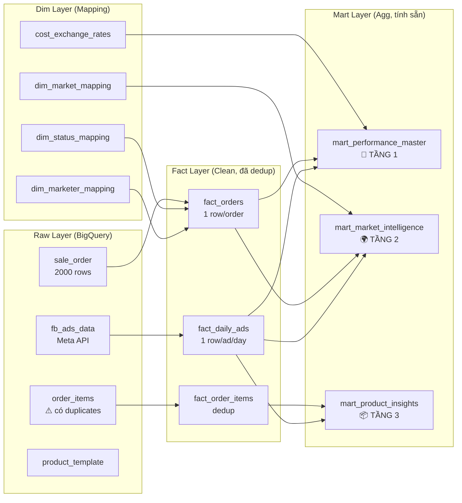

# 🏗️ DASHBOARD ARCHITECTURE BLUEPRINT
## Data Mart Design cho E-commerce COD Cross-border

> **Version**: 2.0 | **Updated**: 2026-02-15
> **Tư duy CMO**: Mọi con số → Scale hoặc Kill

---

## 1. DATA FLOW: Raw → Clean → Mart → Dashboard



---

## 2. DATA MAPPING STRATEGY (Cực kỳ quan trọng)

### 2.1 Join Key: Ads ↔ Orders

Dựa trên audit thực tế:

| Field | Tỷ lệ có data | Vai trò |
|---|---|---|
| `ad_id` | **89%** STRAMARK, **89.5%** AUUS1 | **Primary Join Key** — Poscake tự track khi user click ads |
| `adset_id` | 50% STRAMARK, 0% AUUS1 | **Secondary Join Key** — fallback khi ko có ad_id |
| `p_utm_source` | Có nhưng chưa audit | **Tertiary** — dùng khi campaign đặt UTM đúng |
| `page_id` | Có | Dùng để xác định Brand/Page |

### 2.2 Attribution Logic (SQL)

```sql
-- 3 tầng attribution
CASE
    -- Tầng 1: Match chính xác ad_id
    WHEN o.ad_id IS NOT NULL AND o.ad_id != '' 
        AND a.ad_id IS NOT NULL 
    THEN 'DIRECT_AD'
    
    -- Tầng 2: Match qua adset_id  
    WHEN o.adset_id IS NOT NULL AND o.adset_id != '' 
    THEN 'ADSET_MATCH'
    
    -- Tầng 3: Có nguồn Facebook nhưng ko match được ad
    WHEN o.ads_source = 'Facebook' 
    THEN 'ORGANIC_FB'
    
    -- Không có attribution
    ELSE 'UNKNOWN'
END AS attribution_type
```

> **Thực tế**: 89% đơn có `ad_id` → attribution rate rất tốt. 11% còn lại = Messenger/Organic/Manual.

---

## 3. DIMENSION TABLES (Mapping)

### dim_status_mapping (Đã có ✅)
| status_code | status_name | status_group | revenue_impact |
|---|---|---|---|
| 0 | new | processing | pending |
| 3 | delivered | **success** | positive |
| 16 | received_money | **success** | positive |
| 5 | returned | returned | negative |
| 6 | cancelled | cancelled | zero |

### dim_marketer_mapping (Đã có ✅)
| marketer_id | marketer_name | campaign_code | raw_name |
|---|---|---|---|
| ANHNT | Nguyễn Tuấn Anh | TA | Tuấn Anh, Tuan Tum |
| TUKT | Kim Thanh Tú | TÚ | Kim Tu, Tú |
| CHIPTL | Phạm Thị Linh Chi | LC | Linh Chi |
| LETC | Trần Cẩm Lệ | Lệ | Cẩm Lệ, Trần Cẩm Lệ |

### dim_market_mapping (Đã có ✅)
| raw_market | market_code | market_name |
|---|---|---|
| Romania, romania | RO | Romania |
| Croatia, Coroatia, croatia | HR | Croatia |

### cost_exchange_rates (Đã có ✅)
| from → to | rate | note |
|---|---|---|
| USD → RON | 4.6 | Tạm fix, cập nhật theo thực tế |

---

## 4. FACT TABLES (Clean Layer)

### 4.1 fact_orders — 1 row per order

> ⚠️ **BUG PHÁT HIỆN**: `order_items` có duplicate sync (1 order → 1,238 rows!). Cần dedup.

```sql
-- Logic dedup: ROW_NUMBER by order_id, lấy sync mới nhất
-- Giá trị tiền: /100 (Poscake lưu bani, 16900 = 169 RON)
-- Marketer: REGEXP_EXTRACT từ Python dict
-- Revenue: L1 (lead) → L2 (shipped) → L3 (success) → L4 (COD collected)
```

**Schema**:

| Column | Type | Source | Logic |
|---|---|---|---|
| order_id | STRING | sale_order.id | PK |
| order_date | DATE | inserted_at | PARSE |
| status_code | INT64 | status | CAST |
| status_group | STRING | dim_status | JOIN |
| marketer_id | STRING | dim_marketer | JOIN |
| marketer_name | STRING | dim_marketer | JOIN |
| total_price | FLOAT64 | total_price/100 | Bani→RON |
| shipping_fee | FLOAT64 | shipping_fee/100 | Bani→RON |
| cod | FLOAT64 | cod/100 | Thu hộ |
| ad_id | STRING | sale_order | Attribution |
| adset_id | STRING | sale_order | Attribution |
| ads_source | STRING | sale_order | Facebook/TikTok |
| attribution_type | STRING | Computed | DIRECT_AD/ADSET/ORGANIC/UNKNOWN |
| revenue_L1 | FLOAT64 | Computed | Tất cả đơn |
| revenue_L2 | FLOAT64 | Computed | Shipped+ |
| revenue_L3 | FLOAT64 | Computed | Success only |
| revenue_L4 | FLOAT64 | Computed | COD collected |

### 4.2 fact_order_items — Deduped

```sql
-- Dedup strategy: ROW_NUMBER() OVER (
--   PARTITION BY order_id, product_id, variation_id 
--   ORDER BY sync_time DESC
-- ) = 1
-- Giá: retail_price/100, avg_imported_price/100
```

### 4.3 fact_daily_ads — 1 row per ad per day

```sql
-- Dedup: fb_ads_data đã clean (1 row/ad_id/date)
-- Parse campaign_name: DD.MM - PRODUCT - MARKET - TYPE - BRAND - MKTER
-- Normalize market via dim_market_mapping
```

---

## 5. MART TABLES (Aggregated for Dashboard)

### 🎯 TẦNG 1: mart_performance_master

**Mục đích**: CEO/CMO mở Dashboard → thấy ngay hiệu suất tổng thể và từng Marketer.

**Grain**: 1 row per `(report_date, marketer_id)`

| Metric | Formula | Ý nghĩa |
|---|---|---|
| **ad_spend_ron** | spend_usd × fx_rate | Chi phí ads quy RON |
| **revenue_L1** | SUM(total_price) all orders | DT Lead (tất cả đơn) |
| **revenue_L3** | SUM where status_group='success' | DT Thực (đã giao) |
| **revenue_L4** | SUM where status=16 | Đã nhận tiền COD |
| **partner_debt** | L3 - L4 | 3PL chưa trả |
| **net_profit** | L3 - ads_ron - shipping - cogs | Lợi nhuận ròng |
| **real_roas** | revenue_L3 / ad_spend_ron | ROAS thực (**KHÔNG dùng FB ROAS**) |
| **real_cpa** | ad_spend_ron / total_orders | Chi phí mỗi đơn |
| **cpm** | spend / impressions × 1000 | Thị trường đắt? |
| **ctr** | clicks / impressions × 100 | Content tốt? |
| **cr_click** | orders / clicks × 100 | Sale chốt tốt? |
| **cr_message** | orders / messages × 100 | Mess convert? |
| **delivery_rate** | success / (success+return+cancel) | Giao thành công? |
| **return_rate** | returned / total | Tỷ lệ hoàn |
| **avg_order_value** | revenue_L1 / total_orders | Giá trị TB/đơn |

**SQL Diagnostic Logic (tại sao campaign nát?)**:

```sql
CASE
    WHEN cpm > 15 THEN '🔴 CPM cao → Thị trường quá đắt'
    WHEN ctr < 0.8 THEN '🟡 CTR thấp → Content dở, đổi creative'
    WHEN cr_click < 2 THEN '🟠 CR thấp → Landing page hoặc Sale kém'
    WHEN real_roas >= 3 THEN '🟢 SCALE → Tăng budget nhanh'
    WHEN real_roas >= 1.5 THEN '⚪ MONITOR → Theo dõi thêm'
    ELSE '🔴 KILL → Cắt ngay'
END AS diagnosis
```

### 🌍 TẦNG 2: mart_market_intelligence

**Grain**: 1 row per `(report_date, market_code, marketer_id)`

| Metric | Formula |
|---|---|
| **market_spend_ron** | Ads spend by market (parse campaign) |
| **market_revenue_L3** | Orders matched to market's campaigns |
| **market_roas** | L3 / spend |
| **delivery_rate** | success / total orders in market |
| **return_rate** | returned / total |
| **market_cpm** | spend / impr × 1000 |
| **market_aov** | avg order value in market |

**Ma trận Mkter × Market**:
```
            Romania    Croatia
ANHNT(TA)   ROAS 3.2   ROAS -
TUKT(TÚ)    ROAS 4.1   -
CHIPTL(LC)  ROAS 2.8   ROAS 1.2
LETC(Lệ)    ROAS 3.5   -
```

### 📦 TẦNG 3: mart_product_insights

**Grain**: 1 row per `(report_date, product_code, marketer_id, market_code)`

| Metric | Formula |
|---|---|
| **units_sold** | Từ deduped order_items |
| **units_returned** | return_quantity from items |
| **gross_revenue** | qty × retail_price/100 |
| **cogs** | qty × avg_imported_price/100 |
| **gross_margin** | (revenue - cogs) / revenue |
| **product_ads_spend** | Parse campaign → product_code → match |
| **cpps** | ads_spend / units_sold (**Cost Per Product Sold**) |
| **product_roas** | gross_profit / ads_spend |

---

## 6. METRIC DEFINITIONS (Công thức chính xác)

### Real ROAS (Quan trọng nhất)
```
Real ROAS = Revenue_L3_Success (RON) ÷ Ad_Spend (RON)

Trong đó:
- Revenue_L3 = SUM(total_price/100) WHERE status IN (3, 16)
- Ad_Spend RON = SUM(fb_ads.spend) × exchange_rate
- ⚠️ KHÔNG dùng "purchase value" từ Facebook Pixel (ảo)
```

### Real CPA
```
Real CPA = Ad_Spend (RON) ÷ Total_Orders
         = (spend_usd × 4.6) ÷ COUNT(DISTINCT order_id)
```

### Delivery Rate
```
Delivery Rate = Success_Orders ÷ (Success + Returned + Cancelled)
              = COUNTIF(status_group='success') ÷ 
                COUNTIF(status_group IN ('success','returned','cancelled'))
```

### CPPS (Cost Per Product Sold)
```
CPPS = Product_Ads_Spend (RON) ÷ Units_Sold

Trong đó:
- Product_Ads_Spend = SUM(spend) WHERE campaign_product_code = product.custom_id
- Units_Sold = SUM(quantity) from deduped order_items WHERE status_group = 'success'
```

---

## 7. DATA QUALITY ISSUES (Cần sửa)

### 🔴 Critical

| Issue | Impact | Fix |
|---|---|---|
| `order_items` duplicate sync | L20 hiện 79,487 thay vì ~270 | Dedup: ROW_NUMBER + delete duplicates |
| Giá lưu bani (×100) | Revenue inflate 100× | Chia 100 trong view (đã fix ✅) |
| Campaign biến thể | TA-pixelnew, LC trondoi ko match | Normalize hoặc chờ đặt tên chuẩn |

### 🟡 Warning

| Issue | Impact | Fix |
|---|---|---|
| fx rate hardcode | P&L lệch khi tỷ giá thay đổi | Bổ sung daily fx rate table |
| AUUS1 thiếu adset_id | Attribution chỉ qua ad_id | Kiểm tra sync script |
| Thiếu COGS một số SP | Margin = 0% | Cập nhật avg_imported_price |

### ⚪ Enhancement

| Issue | Fix |
|---|---|
| UTM tracking chưa dùng | Parse p_utm_* fields để match Organic |
| Messages count = 0 | Kiểm tra Meta API fields cho Messenger campaigns |
| TikTok orders (19 đơn) | Cần TikTok Ads API sync |

---

## 8. CÂU HỎI NGƯỢC (Data Gaps)

> [!IMPORTANT]
> Cần confirm trước khi implement:

1. **COGS (Giá vốn)**: `avg_imported_price` trên Poscake có chính xác không? Hay mày nhập giá vốn riêng?
2. **Shipping cost thực tế**: `partner_fee` trong sale_order = phí vận chuyển thực? Hay chỉ là phí niêm yết?
3. **TikTok Ads**: 19 đơn từ TikTok — có muốn tích hợp TikTok Ads API để track spend?
4. **Multi-product orders**: 1 đơn có 2+ SP khác nhau → phân bổ ads spend cho SP nào? (Option: chia đều, hoặc theo tỷ trọng revenue)
5. **Currency**: AUUS1 dùng gì? USD? AUD? Cần tỷ giá riêng?
