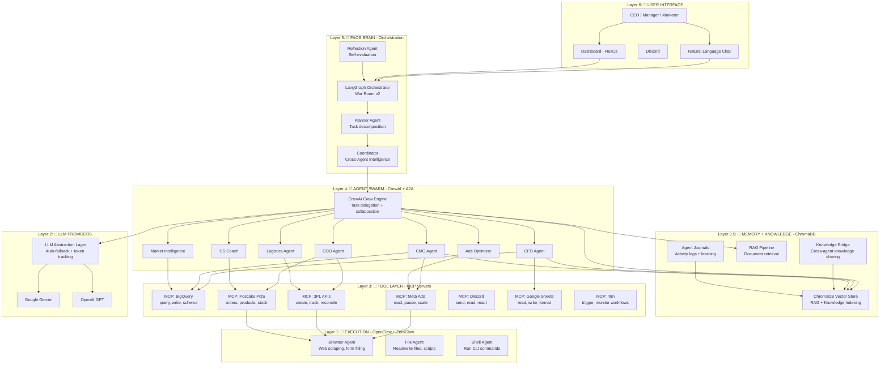
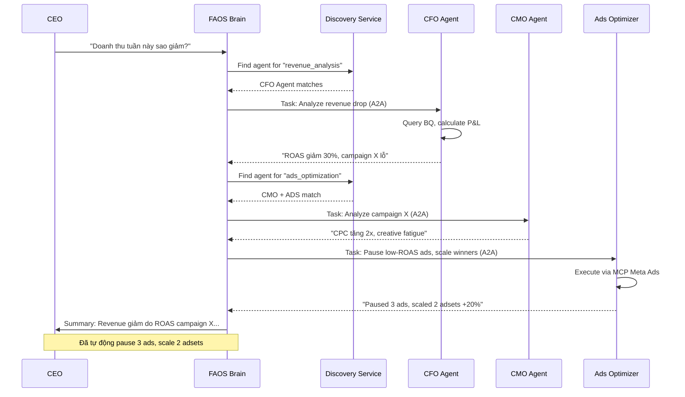
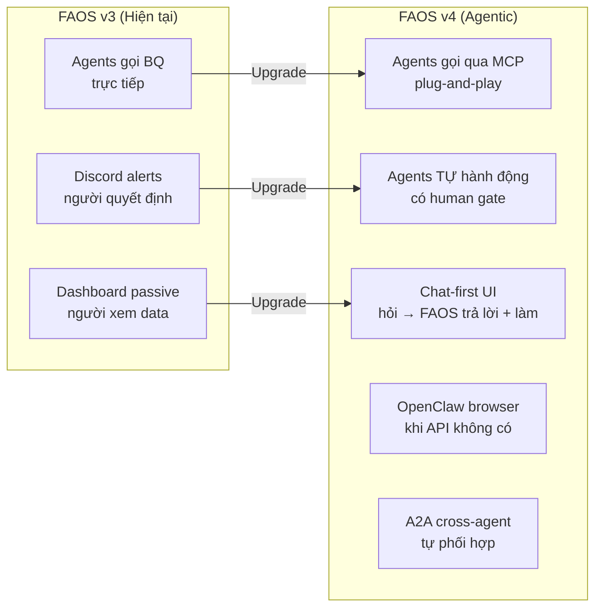

# 🧠 FAOS AGENTIC VISION — Kiến Trúc Toàn Năng

> **Ngày tạo**: 2026-02-24
> **Tầm nhìn**: FAOS là **Bộ Não** (Brain) — điều phối tất cả hoạt động kinh doanh e-commerce
> OpenClaw/ZeroClaw là **Tay Chân** (Hands) — thực thi hành động trên web, app, hệ thống
> MCP + A2A là **Hệ Thần Kinh** (Nervous System) — kết nối tiêu chuẩn giữa tất cả

---

## 1. Tầm Nhìn: FAOS Toàn Năng

```
┌─────────────────────────────────────────────────────────────┐
│                    🧠 FAOS BRAIN                            │
│                                                             │
│   CEO/User giao nhiệm vụ bằng ngôn ngữ tự nhiên           │
│   "Doanh thu tuần này giảm, tìm nguyên nhân và sửa"       │
│                                                             │
│   → FAOS tự phân tích data                                  │
│   → Tự tìm ra nguyên nhân (ROAS giảm ở ad account X)      │
│   → Tự pause ads kém, scale ads tốt                        │
│   → Tự tạo đơn 3PL, check tracking                        │
│   → Tự gửi báo cáo cho CEO qua Discord                    │
│   → Tự điều chỉnh alert thresholds cho lần sau             │
│                                                             │
│   Tất cả — KHÔNG CẦN CAN THIỆP THỦ CÔNG                   │
└─────────────────────────────────────────────────────────────┘
```

### Hiện tại vs Tương lai

| Khía cạnh | Hiện tại (v3) | Tương lai (v4 Agentic) |
|:---|:---|:---|
| **Ra quyết định** | Người xem dashboard → quyết định | Agent phân tích → đề xuất → tự thực thi |
| **Ads management** | Agent chỉ alerts → người pause/scale | Agent tự pause/scale qua Meta API |
| **3PL** | Manual hoặc bán-tự động | Tự tạo đơn, check tracking, xử lý return |
| **Báo cáo** | Người vào dashboard | Agent chủ động push insights |
| **Cross-project** | Mỗi project riêng biệt | Agents share knowledge cross-project |
| **Phản ứng** | Reactive (có vấn đề → alert) | Proactive (dự đoán vấn đề → ngăn trước) |
| **Tích hợp** | Custom APIs, hardcoded | MCP standard → plug-and-play mọi tool |
| **Giao tiếp giữa agents** | Coordinator gọi tuần tự | A2A protocol → agents tự tìm nhau |
| **Thực thi web** | Không có | OpenClaw/ZeroClaw browse, fill forms, scrape |

---

## 2. Kiến Trúc 6 Lớp (Six-Layer Architecture)



### Mô tả từng lớp

| Layer | Vai trò | Công nghệ | Status |
|:---|:---|:---|:---:|
| **L6: UI** | Người dùng tương tác qua NL hoặc dashboard | Next.js, Discord, Chat API | ✅ Có |
| **L5: Brain** | Phân rã task → planning → giao việc → đánh giá | LangGraph (War Room) | ✅ Có |
| **L4: Swarm** | Agents collaborate, delegate tasks | **CrewAI** + A2A Protocol + BaseAgent | ✅ Có |
| **L3.5: Memory** | Knowledge storage, RAG, cross-agent learning | **ChromaDB** + JSON Journals | ✅ Có |
| **L3: Tools** | Chuẩn hóa external APIs thành MCP servers | MCP (Model Context Protocol) | 🔜 Planned |
| **L2: LLM** | Language model inference + fallback | Gemini + OpenAI (abstracted) | ✅ Có |
| **L1: Execution** | Browser automation, CLI, file ops | OpenClaw / ZeroClaw | 🔜 Planned |

---

## 3. Công Nghệ Chi Tiết

### 3.1 MCP — Model Context Protocol (Agent → Tool)

**MCP là gì?** Chuẩn "USB-C cho AI" — 1 protocol duy nhất để kết nối mọi tool/API.

```
Trước MCP:
  Agent A cần BigQuery → viết custom connector
  Agent B cần BigQuery → viết custom connector KHÁC
  Agent C cần Meta Ads → viết custom connector

Sau MCP:
  MCP Server: BigQuery → 1 server, TẤT CẢ agents dùng chung
  MCP Server: Meta Ads → 1 server, TẤT CẢ agents dùng chung
```

**FAOS cần xây dựng 7 MCP Servers:**

| MCP Server | Tools Exposed | Priority |
|:---|:---|:---:|
| `mcp-bigquery` | `query`, `write_rows`, `list_tables`, `get_schema`, `deploy_view` | 🔴 P0 |
| `mcp-meta-ads` | `get_insights`, `pause_ad`, `scale_budget`, `list_campaigns`, `create_ad` | 🔴 P0 |
| `mcp-poscake` | `get_orders`, `get_products`, `get_stock`, `update_status` | 🔴 P0 |
| `mcp-3pl` | `create_order`, `get_tracking`, `list_shipments`, `reconcile_cod` | 🟡 P1 |
| `mcp-discord` | `send_message`, `send_embed`, `create_thread`, `react` | 🟡 P1 |
| `mcp-n8n` | `trigger_workflow`, `get_executions`, `pause_workflow` | 🟢 P2 |
| `mcp-google-sheets` | `read_range`, `write_range`, `create_sheet` | 🟢 P2 |

**Cấu trúc MCP Server mẫu:**

```python
# mcp_servers/bigquery/server.py
from mcp.server import Server, Tool, Resource

server = Server("faos-bigquery")

@server.tool("query")
async def query(sql: str, project_id: str = None) -> dict:
    """Execute a BigQuery SQL query and return results."""
    client = get_bq_client(project_id)
    return client.query(sql).to_dict()

@server.tool("deploy_view")
async def deploy_view(view_name: str, sql: str, dataset: str) -> str:
    """Create or replace a BigQuery view."""
    ...

@server.resource("schema/{dataset}/{table}")
async def get_schema(dataset: str, table: str) -> dict:
    """Get table schema as structured data."""
    ...
```

---

### 3.2 A2A — Agent-to-Agent Protocol (Agent ↔ Agent)

**A2A là gì?** Chuẩn để agents tự tìm nhau và giao việc — Google phát triển, đã open-source.

```
Trước A2A:
  Coordinator phải BIẾT TRƯỚC danh sách agents → gọi tuần tự

Sau A2A:
  Agent CFO phát hiện ROAS thấp → broadcast "Cần phân tích ads"
  Agent CMO TỰ NHẬN vì có Agent Card match → phân tích → trả kết quả
  Agent CFO nhận kết quả → quyết định pause campaign → giao cho Ads Optimizer
```

**Mỗi FAOS agent cung cấp Agent Card:**

```json
{
  "name": "faos-cfo",
  "description": "Financial oversight agent — P&L, ROAS, budget approval",
  "capabilities": ["financial_analysis", "budget_approval", "roas_monitoring"],
  "input_modes": ["text", "structured_data"],
  "output_modes": ["text", "structured_data", "discord_embed"],
  "endpoint": "http://localhost:8100/a2a/cfo",
  "authentication": {"type": "bearer", "token_env": "FAOS_A2A_TOKEN"}
}
```

**Flow A2A trong FAOS:**



---

### 3.3 LangGraph 2.0 — Brain Orchestration

**LangGraph 2.0** (dự kiến Q2 2026): Engine cho "bộ não" FAOS.

**Tính năng quan trọng cho FAOS:**

| Feature | Ứng dụng trong FAOS |
|:---|:---|
| **State Graph** | Quản lý trạng thái phức tạp: "đang phân tích" → "cần human approval" → "đang thực thi" |
| **Human-in-the-Loop** | CEO approve trước khi scale budget > $500/ngày |
| **Checkpoints** | Resume nếu server restart giữa chừng |
| **Multi-Agent** | Phối hợp CFO + CMO + COO trong 1 workflow |
| **Streaming** | Real-time updates cho dashboard khi agent đang làm việc |
| **A2A + MCP support** | Native support cho cả 2 protocols |

**Cấu trúc War Room v2:**

```python
# war_room/orchestrator_v2.py
from langgraph.graph import StateGraph, END
from langgraph.prebuilt import ToolNode

class FAOSState(TypedDict):
    task: str                    # Nhiệm vụ từ user
    plan: list[str]              # Plan đã phân rã
    current_step: int
    agent_results: dict          # Kết quả từ các agents
    actions_taken: list[dict]    # Hành động đã thực thi
    needs_approval: bool         # Cần human approve?
    final_report: str

graph = StateGraph(FAOSState)

# Nodes
graph.add_node("planner", planner_node)         # Phân rã task
graph.add_node("dispatcher", dispatcher_node)    # Giao việc cho agents
graph.add_node("executor", executor_node)        # Thực thi actions
graph.add_node("reflector", reflector_node)      # Đánh giá kết quả
graph.add_node("reporter", reporter_node)        # Tạo báo cáo
graph.add_node("human_gate", human_approval)     # Chờ approval

# Edges
graph.add_edge("planner", "dispatcher")
graph.add_conditional_edges("dispatcher", route_to_agents)
graph.add_conditional_edges("executor", check_approval)
graph.add_edge("human_gate", "executor")
graph.add_edge("reflector", decide_next)
graph.add_edge("reporter", END)
```

---

### 3.4 OpenClaw / ZeroClaw — Tay Chân

**Khi nào cần "tay chân"?** Khi API không đủ — cần browser interaction:

| Tình huống | API có? | Cần Browser? |
|:---|:---:|:---:|
| Pause Facebook ad | ✅ Graph API | ❌ |
| Đăng nhập euShipments dashboard | ❌ | ✅ OpenClaw |
| Tải bảng COD reconciliation PDF | ❌ | ✅ OpenClaw |
| Cập nhật pricing trên Poscake web UI | ⚠️ Partial | ✅ OpenClaw as fallback |
| Scrape competitor pricing | ❌ | ✅ OpenClaw |
| Kiểm tra ad creative trên web | ❌ | ✅ OpenClaw |

**Tích hợp:**

```python
# OpenClaw chạy như 1 MCP server — FAOS agents gọi qua MCP
@server.tool("browse_and_extract")
async def browse(url: str, action: str, selector: str = None) -> str:
    """Use OpenClaw browser to navigate, extract, or interact with web pages."""
    claw = OpenClawClient()
    result = await claw.execute({
        "url": url,
        "action": action,    # "extract_text", "click", "fill_form", "screenshot"
        "selector": selector
    })
    return result
```

**OpenClaw vs ZeroClaw — chọn gì cho FAOS?**

| Tiêu chí | OpenClaw | ZeroClaw |
|:---|:---|:---|
| Browser automation | ✅ Native (CDP + Playwright) | ❌ Không native |
| Resource usage | ~500MB RAM | ~50MB RAM |
| UI | Web UI | CLI only |
| Best for | Browser tasks, web scraping | Lightweight CLI agents, IoT |
| **Cho FAOS** | ✅ **Chọn OpenClaw** cho browser | ✅ ZeroClaw cho lightweight tasks |

---

### 3.5 CrewAI + ChromaDB — Agent Collaboration & Memory (ĐÃ CÓ)

> ⚠️ **Đây là 2 thành phần ĐANG CHẠY PRODUCTION** — không phải planned.

#### CrewAI — Multi-Agent Task Execution

CrewAI là framework cho phép nhiều agents phối hợp hoàn thành tasks phức tạp. FAOS sử dụng CrewAI trong `agents/crew/`:

```python
# agents/crew/crew.py — Đã hoạt động
from crewai import Crew, Agent, Task

# Crew = Nhóm agents với roles cụ thể
crew = Crew(
    agents=[cfo_agent, cmo_agent, coo_agent],
    tasks=[analyze_revenue, optimize_ads, monitor_ops],
    verbose=True
)

# Crew tự phân công, tự giao việc, tự tổng hợp kết quả
result = crew.kickoff()
```

**Đã triển khai:**

| File | Size | Vai trò |
|:---|:---:|:---|
| `crew.py` | 4KB | Crew composition + kickoff |
| `agents.py` | 8KB | Agent role definitions (CFO, CMO, COO) |
| `tasks.py` | 7KB | Task definitions cho từng agent |
| `tools.py` | 11KB | 6 BQ tools: `query_bigquery`, `get_overview_kpis`, `get_daily_pnl`, `get_campaign_performance`, `get_marketer_performance`, `get_product_performance` |
| `run.py` | 10KB | Crew runner (CLI + multi-project) |
| `token_tracker.py` | 8KB | Token usage + cost tracking |
| `war_room_logger.py` | 10KB | Session logging cho War Room |

**Vai trò trong kiến trúc v4:**
- **Hiện tại**: CrewAI = task execution engine cho C-Suite agents
- **Tương lai**: CrewAI + A2A = agents vừa chạy trong crew, vừa giao tiếp với agents bên ngoài crew

#### ChromaDB — Vector Memory & RAG

ChromaDB là vector database cho phép agents **nhớ** và **học** qua thời gian:

```python
# agents/memory/agent_memory.py — Đã hoạt động
class AgentMemory:
    def store(self, agent_id, content, metadata):
        """Lưu insight/action vào ChromaDB vector store"""
        self.collection.add(documents=[content], metadatas=[metadata])

    def recall(self, query, agent_id=None, top_k=5):
        """Tìm kiếm semantic — agent nhớ lại kiến thức liên quan"""
        return self.collection.query(query_texts=[query], n_results=top_k)
```

**Đã triển khai:**

| File | Size | Vai trò |
|:---|:---:|:---|
| `agent_memory.py` | 14KB | Read/write/search memory |
| `bridge_knowledge.py` | 9KB | **Cross-agent knowledge sharing** — agent A học từ agent B |
| `index_knowledge.py` | 9KB | Index documents vào ChromaDB cho RAG |
| `agents/crew/rag.py` | 14KB | RAG pipeline — retrieve relevant docs khi agent cần |
| `agents/crew/knowledge_tools.py` | 3KB | CrewAI tools gọi knowledge base |
| `chroma_db/` | — | Persistent vector storage |
| `chromadb_data/` | 29 files | RAG vector store cho CrewAI |

**Agent Journals (Learning Memory):**

| File | Size | Nội dung |
|:---|:---:|:---|
| `marketingadvisor_journal.json` | 25KB | CMO agent learning logs |
| `profit_guardian_journal.json` | 14KB | CFO agent learning logs |
| `g3_journal.json` | 1KB | G3 agent logs |

**Vai trò trong kiến trúc v4:**
- **Hiện tại**: ChromaDB = local persistent memory + RAG retrieval
- **Tương lai**: ChromaDB + Redis = distributed memory, cross-project knowledge sharing, predictive analytics từ historical patterns

#### CrewAI + ChromaDB — Kết hợp

```
User hỏi: "Tuần trước STRAMARK có chiến dịch nào tốt nhất?"

1. War Room → CrewAI Crew kickoff
2. CMO Agent nhận task
3. CMO dùng RAG (ChromaDB) → tìm context từ lần phân tích trước
4. CMO dùng tools.py → query BigQuery cho data mới
5. CMO so sánh data mới vs memory cũ → phát hiện trend
6. CMO ghi kết quả vào Journal (ChromaDB) → nhớ cho lần sau
7. Result trả về Coordinator → Discord / Dashboard
```

---

## 4. Roadmap Triển Khai

### Phase A: Foundation (Tháng 1–2)

```
Week 1-2: Xây MCP Servers
  ├── mcp-bigquery (wrap tools/bq_client.py)
  ├── mcp-meta-ads (wrap modules/ads-command-center)
  └── mcp-poscake (wrap tools/sync_products.py + API calls)

Week 3-4: Upgrade BaseAgent → MCP-native
  ├── Agents gọi tools qua MCP thay vì import trực tiếp
  ├── Thêm Agent Card cho mỗi agent (A2A ready)
  └── Test: Profit Guardian chạy qua MCP
```

### Phase B: Brain Upgrade (Tháng 3–4)

```
Week 5-6: War Room v2 (LangGraph 2.0)
  ├── Planner node: phân rã câu hỏi user → sub-tasks
  ├── Dispatcher: giao task cho agents qua A2A
  ├── Human gate: approval workflow
  └── Reflector: đánh giá kết quả, retry nếu cần

Week 7-8: Natural Language Interface
  ├── Chat endpoint: user nói → FAOS làm
  ├── Context: user hỏi "so sánh STRAMARK vs TALPHA" → FAOS query cả 2
  └── Memory: nhớ conversation history (ChromaDB)
```

### Phase C: Hands (Tháng 5–6)

```
Week 9-10: OpenClaw Integration
  ├── Deploy OpenClaw self-hosted
  ├── MCP wrapper: mcp-browser
  ├── Use case 1: Download COD reports từ 3PL dashboard
  └── Use case 2: Competitor price monitoring

Week 11-12: Auto Ads Care v2
  ├── Ads Optimizer agent + MCP Meta Ads + Rules Engine
  ├── Human approval gate cho budget > threshold
  ├── Action logging → BigQuery
  └── Rollback mechanism
```

### Phase D: Autonomous (Tháng 7+)

```
  ├── Self-tuning: agents tự điều chỉnh thresholds
  ├── Cross-project learning: STRAMARK insights → TALPHA
  ├── Predictive: dự đoán stockout 3 ngày trước
  ├── Multi-channel: TikTok + Google Ads MCP servers
  └── Full autonomous loop: Detect → Analyze → Decide → Execute → Learn
```

---

## 5. So Sánh FAOS v3 vs v4



---

## 6. Tech Stack Mục Tiêu

| Layer | Hiện tại | Mục tiêu | Status |
|:---|:---|:---|:---:|
| **Orchestration** | LangGraph (war_room) | LangGraph 2.0 + A2A Discovery | ✅→🔜 |
| **Agent Crew** | **CrewAI** (crew.py, agents.py, tasks.py, tools.py) | CrewAI + A2A inter-crew | ✅ Running |
| **Agent Framework** | BaseAgent (12+ agents, C-Suite, Specialist) | BaseAgent v2 + MCP + A2A | ✅→🔜 |
| **Memory/RAG** | **ChromaDB** (agent_memory, bridge_knowledge, RAG) | ChromaDB + Redis (distributed) | ✅ Running |
| **Knowledge** | JSON Journals + index_knowledge.py | Structured KB + auto-learning | ✅→🔜 |
| **Tool Connection** | Direct import + CrewAI @tool | MCP Servers (standardized) | ⚠️→🔜 |
| **LLM** | Gemini + OpenAI (llm_provider.py, 16KB) | + Claude 4 (if available) | ✅ Running |
| **Token Tracking** | token_tracker.py (8KB) + Token Cost tab | Integrated cost optimization | ✅ Running |
| **Browser** | Không có | OpenClaw (self-hosted) | ❌→🔜 |
| **Communication** | Discord webhooks | Discord + Slack + A2A | ✅→🔜 |
| **Dashboard** | Next.js 16 (14 tabs × 3 projects) | + Chat UI + Real-time agent status | ✅→🔜 |
| **Deployment** | Windows local | Docker Compose → Kubernetes | ⚠️→🔜 |

---

## 7. Chi Phí Ước Tính

| Component | Chi phí/tháng | Ghi chú |
|:---|---:|:---|
| BigQuery | $50–200 | Tùy query volume |
| Gemini API | $20–50 | 1M token/day đủ |
| OpenClaw (self-host) | $0 | Open-source |
| MCP Servers (self-host) | $0 | Code tự viết |
| VPS (cho OpenClaw + agents) | $20–50 | 4GB RAM đủ |
| **Tổng** | **$90–300** | Không tính ads spend |

---

## 8. Rủi Ro và Mitigation

| Rủi ro | Mức | Giải pháp |
|:---|:---:|:---|
| Agent tự pause ads sai | 🔴 | Human gate cho actions > threshold |
| LLM hallucination → sai data | 🔴 | Validate output vs BQ data |
| OpenClaw bị anti-bot | 🟡 | Dùng human-like profiles, delay |
| MCP server downtime | 🟡 | Health check + fallback direct call |
| Token cost explode | 🟡 | Token tracker + daily budget cap |
| LangGraph 2.0 delay | 🟢 | Dùng LangGraph 1.x (đã có) |

---

*FAOS v4 = Bộ Não (LangGraph) + Trí Nhớ (CrewAI + ChromaDB) + Hệ Thần Kinh (MCP + A2A) + Tay Chân (OpenClaw)*
*Mục tiêu: 80% vận hành tự động, CEO chỉ cần approve và review báo cáo.*

---

*Created: 2026-02-24*
