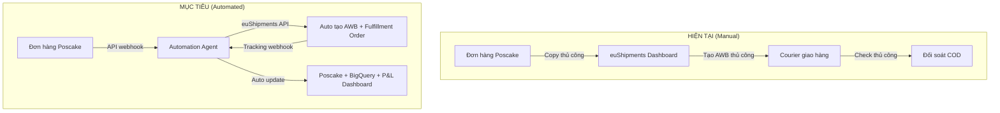

# Stramark — Phân Tích Chi Phí Fulfillment & Kế Hoạch Automation

> **Đối tác FFM:** euShipments.com (InOut BG)  
> **Kho hàng chính:** Warehouse Oradea (Romania) | Backup: Warehouse Ruse (Bulgaria)  
> **Client:** RO - SI_COMERZ - Aurelia Wear | **Discount:** 20%  
> **Dữ liệu:** 482 đơn hàng (08/2025 – 02/2026) | Currency: EUR (chưa bao gồm VAT)  
> **Ngày phân tích:** 23/02/2026

---

## 1. Chi Phí Fulfillment Thực Tế (Từ Báo Giá)

### 1.1 Phí kho & xử lý đơn — WH Oradea vs WH Bulgaria

| # | Dịch vụ | WH Oradea (EUR) | WH Ruse (EUR) |
|---|---------|:---:|:---:|
| 1 | Lưu kho / pallet / tháng | **€17** | **€17** |
| 2 | Phí tối thiểu / tháng (nếu < 300 đơn) | **€165** | **€165** |
| 3 | Pick & pack location / tháng | **€0.55** | **€0.55** |
| 4 | **Order fulfillment** (≤ 5kg, ≤ 2 items) | **€0.90** | **€0.65** |
| 5 | Extra item trong đơn | **€0.35** | **€0.35** |
| 6 | Mỗi 5kg thêm | **€0.65** | **€0.65** |
| 7 | Túi courier A4 / A3 | €0.08 / €0.13 | €0.08 / €0.13 |
| 8 | Nhận hàng vào kho (≤ 250g / > 250g) | €0.08 / €0.13 | €0.08 / €0.13 |
| 9 | **Reverse fulfillment** (hoàn hàng) | **€0.50** | **€0.65** |
| 10 | Bubble wrap / đơn | €0.36 | €0.36 |
| 11 | Gập hộp / hộp | €0.10 | €0.10 |
| 12 | Barcoding / cái | €0.05 | €0.05 |
| 13 | Extra label / cái | €0.10 | €0.10 |
| 14 | In + đính kèm tài liệu | €0.15 | €0.15 |
| 15 | Load/Unload pallet | €3.35 | €3.35 |
| 16 | Re-palletize | €3.60 | €3.60 |
| 17 | Pallet (nếu cần) | €12 | €12 |

> [!IMPORTANT]
> Oradea đắt hơn Ruse trong phí fulfillment chính (€0.90 vs €0.65), nhưng Oradea có lợi thế transit time đến Romania nhanh hơn (1-2 ngày vs 2-3 ngày từ Ruse). Đơn của Stramark chủ yếu giao Romania → **Oradea là lựa chọn tối ưu**.

### 1.2 Phí vận chuyển đến Romania (Từ WH Oradea, 20% discount)

| Trọng lượng | Cargus | Cargus PuDo | FAN | Sameday RO | EasyBox | GLS RO | GLS PuDo |
|-------------|:------:|:-----------:|:---:|:----------:|:-------:|:------:|:--------:|
| **1 kg** | **€2.33** | **€2.26** | **€2.74** | **€2.46** | **€2.14** | **€2.72** | **€2.12** |
| 2 kg | €2.33 | €2.26 | €2.74 | €2.46 | €2.14 | €2.72 | €2.12 |
| 3 kg | €2.33 | €2.26 | €2.98 | €2.64 | €2.32 | €2.84 | €2.12 |
| 5 kg | €2.42 | €2.26 | €3.47 | €3.00 | €2.69 | €3.24 | €2.12 |
| 10 kg | €2.74 | €2.26 | €4.69 | €3.90 | €3.62 | €3.61 | €2.12 |
| 15 kg | €3.48 | €2.26 | €5.92 | €4.80 | €4.55 | €4.16 | €3.36 |
| 20 kg | €4.01 | — | €7.14 | €5.70 | €5.47 | €4.77 | €3.36 |
| 30 kg | €5.86 | — | €9.59 | €7.50 | — | €7.45 | — |

> [!TIP]
> **Courier rẻ nhất cho Romania:** EasyBox Locker (€2.14/kg đầu) hoặc Cargus PuDo (€2.26). Sản phẩm thời trang thường ≤ 1-2kg → chi phí ship khoảng **€2.14 – €2.74 / đơn**.

### 1.3 Phí COD (Cash on Delivery) — Romania

| Courier | COD % | COD Min (EUR) | COD by Card | Max COD |
|---------|:-----:|:-------------:|:-----------:|:-------:|
| Cargus | — | €0.35 | €0 | 5,000 RON |
| Cargus PuDo | — | €0.35 | €0 | 5,000 RON |
| FAN | — | €0.40 | 0.75% | 5,000 RON |
| Sameday RO | — | €0.33 | €0 | 5,000 RON |
| EasyBox | 1.1% | — | €0 | 5,000 RON |
| GLS RO | — | €0.40 | 0.9% | 5,000 RON |
| GLS PuDo | — | €0.22 | 0.9% | 5,000 RON |

### 1.4 Phụ phí khác

| # | Phụ phí | EUR |
|---|---------|:---:|
| 1 | RMA (Return Management Authorization) | €1.00 |
| 2 | COD refund (hoàn tiền COD đã giao) | €3.50 |
| 3 | Admin with Authorities | €125 |
| — | Return of undelivered shipments | **By tariff** (= phí ship tương ứng) |

---

## 2. Tính Toán Chi Phí Thực Tế Mỗi Đơn Hàng

### 2.1 Đơn hàng tiêu biểu Stramark (thời trang, Romania)

Giả định: Đơn 1-2 items, ≤ 2kg, giao qua Cargus, COD ~150 RON (~€30)

```
┌──────────────────────────────────────┬──────────┐
│ Order fulfillment (pick + pack)      │  €0.90   │
│ Courier bag (A4)                     │  €0.08   │
│ Shipping (Cargus, ≤2kg)             │  €2.33   │
│ COD fee (minimum charge)             │  €0.35   │
├──────────────────────────────────────┼──────────┤
│ TỔNG CHI PHÍ / ĐƠN GIAO THÀNH CÔNG │  €3.66   │
│                                      │ ~18 RON  │
├──────────────────────────────────────┼──────────┤
│ Nếu dùng EasyBox (rẻ nhất):         │          │
│ Fulfillment + bag + shipping + COD   │  €3.45   │
│                                      │ ~17 RON  │
├──────────────────────────────────────┼──────────┤
│ Nếu dùng GLS PuDo (rẻ nhất PuDo):   │          │
│ Fulfillment + bag + shipping + COD   │  €3.32   │
│                                      │ ~16 RON  │
└──────────────────────────────────────┴──────────┘

★ ĐƠN HOÀN TRẢ (thêm):
┌──────────────────────────────────────┬──────────┐
│ Return shipping (by tariff ~€2.33)   │  €2.33   │
│ Reverse fulfillment                  │  €0.50   │
│ RMA fee                              │  €1.00   │
├──────────────────────────────────────┼──────────┤
│ TỔNG PHÍ HOÀN / ĐƠN                 │  €3.83   │
│                                      │ ~19 RON  │
└──────────────────────────────────────┴──────────┘

★ TỔNG CHI PHÍ NẾU GIAO THẤT BẠI:
  Phí giao + Phí hoàn = €3.66 + €3.83 = €7.49 (~37 RON)
```

### 2.2 Chi phí cố định hàng tháng

| Hạng mục | EUR/tháng | Ghi chú |
|----------|:---------:|---------|
| Min storage (< 300 đơn) | €165 | Bỏ qua nếu > 300 đơn/tháng |
| Storage per pallet | €17/pallet | Tùy lượng hàng tồn |
| Pick&pack location | €0.55 | Mỗi vị trí SKU |

> [!NOTE]
> Với 482 đơn trong 7 tháng ≈ **69 đơn/tháng** → đang bị tính phí min **€165/tháng** vì chưa đạt 300 đơn. Khi scale lên > 300 đơn/tháng sẽ tiết kiệm đáng kể.

### 2.3 Cập nhật `stramark_costs.csv` với giá thực

| cost_type | market | amount | currency | unit | note |
|-----------|--------|:------:|:--------:|:----:|------|
| fulfillment | Romania | 0.90 | EUR | per_order | Pick+pack WH Oradea (≤5kg, ≤2 items) |
| shipping_3pl | Romania | 2.33 | EUR | per_order | Cargus avg (≤2kg) |
| cod_fee | Romania | 0.35 | EUR | per_order | COD min charge Cargus |
| courier_bag | Romania | 0.08 | EUR | per_order | Flyer bag A4 |
| return_shipping | Romania | 2.33 | EUR | per_order | By tariff (same as shipping) |
| reverse_fulfillment | Romania | 0.50 | EUR | per_order | Return processing |
| rma_fee | Romania | 1.00 | EUR | per_order | Return management |
| storage_min | Romania | 165 | EUR | per_month | Minimum (if <300 orders/month) |
| storage_pallet | Romania | 17 | EUR | per_month | Per pallet |

---

## 3. So Sánh Courier Theo Quốc Gia (Mở Rộng Thị Trường)

### Từ WH Oradea — Giá 1kg (EUR, 20% discount)

| Quốc gia | Courier rẻ nhất | Giá | Transit |
|----------|----------------|:---:|:-------:|
| 🇷🇴 Romania | EasyBox | €2.14 | 1-2 ngày |
| 🇭🇺 Hungary | EasyBox | €2.62 | 1-2 ngày |
| 🇸🇰 Slovakia | SPS PuDo | €2.34 | 2-4 ngày |
| 🇧🇬 Bulgaria | EasyBox | €2.24 | 2-3 ngày |
| 🇵🇱 Poland | InPost Home | €3.90 | 3-4 ngày |
| 🇨🇿 Czech Rep. | CZ Post PuDo | €2.94 | 2-4 ngày |
| 🇭🇷 Croatia | DPD PuDo | €2.18 | 2-3 ngày |
| 🇸🇮 Slovenia | DPD SI | €3.32 | 2-4 ngày |
| 🇬🇷 Greece | Elta | €3.03 | 3-7 ngày |
| 🇮🇹 Italy | Poste Italiane | €5.38 | 3-5 ngày |
| 🇦🇹 Austria | DPD AT | €4.76 | 2-3 ngày |
| 🇩🇪 Germany | DHL | €5.54 | 2-3 ngày |

---

## 4. Automation Plan: POS → Fulfillment

### 4.1 Quy trình hiện tại vs mục tiêu



### 4.2 Modules cần triển khai

**Module 1: Order Sync** — Poscake → euShipments
- Khi đơn confirmed → auto tạo fulfillment order via API
- Auto chọn courier tối ưu theo weight + destination
- API docs: https://documenter.getpostman.com/view/26992907/2s93Y2S2Q8

**Module 2: Status Tracking** — Bidirectional
- Poll tracking status mỗi 2h → update Poscake + BigQuery
- Alert đơn stuck > 48h

**Module 3: COD Reconciliation**
- Match COD protocols với orders → tính P&L chính xác
- Alert chênh lệch > 5%

**Module 4: Tăng Delivery Rate** (70% → 85-90%)
- Pre-delivery SMS xác nhận (€0 nếu dùng Cargus/FAN)
- Address validation trước khi tạo AWB
- Smart retry cho đơn giao thất bại lần 1
- Blacklist khách hoàn nhiều

### 4.3 Roadmap

| Phase | Thời gian | Nội dung |
|-------|:---------:|----------|
| **1. Foundation** | Tuần 1-2 | Xin API token, test API, cập nhật costs |
| **2. Auto Orders** | Tuần 3-4 | Module 1+2: Auto sync + tracking |
| **3. Finance** | Tuần 5-6 | Module 3: COD reconcile + P&L integration |
| **4. Optimize** | Tuần 7-8 | Module 4: SMS, retry, blacklist |

---

## 5. Tổng Kết Impact

| Metric | Hiện tại | Sau Automation |
|--------|:--------:|:--------------:|
| Chi phí FFM/đơn (Oradea, Cargus) | ~€3.66 (~18 RON) | ~€3.32 (chuyển GLS PuDo) |
| Thời gian xử lý | 15-30 phút/đơn | **< 1 phút** |
| Tỷ lệ sai sót | ~5-8% | **< 1%** |
| Tỷ lệ giao thành công | ~70-75% | **85-90%** |
| Đối soát COD | Manual, 1-2 tuần | **Tự động hàng ngày** |
| Chi phí đơn hoàn | €7.49 (~37 RON) | Giảm 20% nhờ giảm return |
