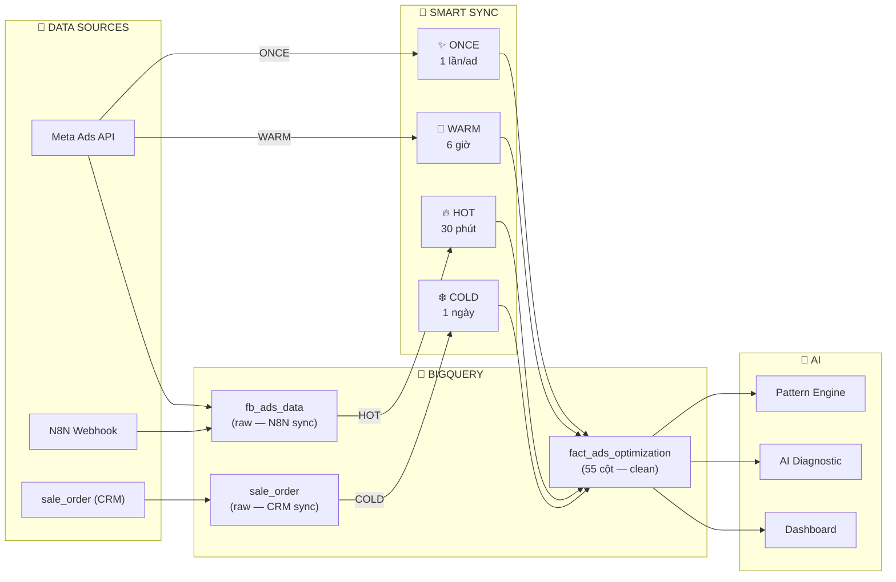

# FAOS v6 — Ads Optimization: Database & Sync Architecture

> **Version**: 1.0 · **Template project**: STRAMARK  
> **Mục đích**: Tài liệu kỹ thuật để replicate cho các dự án khác (zen8, trendify, HNLE, AUUS1, TALPHA, T1)

---

## 1. Tổng quan kiến trúc



---

## 2. Database Schema

### 2.1 `fact_ads_optimization` (Bảng chính — 55 cột)

> Mỗi project có **1 bảng riêng** trong dataset riêng: `{PROJECT}_Dataset.fact_ads_optimization`

**Primary Key**: `(ad_id, report_date)` — mỗi ad 1 dòng/ngày

#### Identity (6 cột)
| Cột | Kiểu | Mô tả |
|-----|------|-------|
| `ad_id` | STRING ⊛ | Meta Ad ID |
| `ad_name` | STRING | Tên ad |
| `adset_id` | STRING | Adset ID |
| `adset_name` | STRING | Tên adset |
| `campaign_id` | STRING ⊛ | Campaign ID |
| `campaign_name` | STRING | Tên campaign |
| `account_id` | STRING | Meta Ad Account ID |
| `project_id` | STRING ⊛ | FAOS project ID (stramark, t1...) |
| `report_date` | DATE ⊛ | Ngày báo cáo |

#### Core Metrics — HOT tier (11 cột)
| Cột | Kiểu | Mô tả | Sync |
|-----|------|-------|------|
| `spend` | FLOAT | Chi phí (USD) | 🔥 30m |
| `impressions` | INT | Lượt hiện | 🔥 30m |
| `reach` | INT | Người tiếp cận | 🔥 30m |
| `clicks` | INT | Lượt click | 🔥 30m |
| `cpm` | FLOAT | Cost per 1000 imp | 🔥 30m |
| `cpc` | FLOAT | Cost per click | 🔥 30m |
| `ctr` | FLOAT | Click-through rate | 🔥 30m |
| `frequency` | FLOAT | Tần suất hiện | 🔥 30m |
| `leads` | INT | Lead forms (Meta) | 🔥 30m |
| `messages` | INT | Tin nhắn | 🔥 30m |
| `cost_per_lead` | FLOAT | Spend / leads | 🔥 30m |

#### Conversion Metrics — HOT tier (3 cột)
| Cột | Kiểu | Mô tả | Sync |
|-----|------|-------|------|
| `add_to_cart` | INT | Thêm giỏ hàng | 🔥 30m |
| `purchases` | INT | Mua hàng (Meta pixel) | 🔥 30m |
| `purchase_value` | FLOAT | Giá trị mua (Meta) | 🔥 30m |

#### Video Metrics — WARM tier (7 cột)
| Cột | Kiểu | Mô tả | Sync |
|-----|------|-------|------|
| `video_views` | INT | Lượt xem video | 🎈 6h |
| `video_views_p25` | INT | Xem 25% | 🎈 6h |
| `video_views_p50` | INT | Xem 50% | 🎈 6h |
| `video_views_p75` | INT | Xem 75% | 🎈 6h |
| `video_views_p100` | INT | Xem 100% | 🎈 6h |
| `video_avg_play_time` | FLOAT | Thời gian xem TB | 🎈 6h |
| `hook_rate` | FLOAT | p25 / impressions | 🎈 6h |
| `hold_rate` | FLOAT | p100 / p25 | 🎈 6h |
| `completion_rate` | FLOAT | p100 / views | 🎈 6h |

#### Creative Metadata — ONCE tier (5 cột)
| Cột | Kiểu | Mô tả | Sync |
|-----|------|-------|------|
| `creative_type` | STRING | VIDEO / IMAGE / CAROUSEL | ✨ 1 lần |
| `creative_body` | STRING | Nội dung ad copy | ✨ 1 lần |
| `creative_title` | STRING | Tiêu đề | ✨ 1 lần |
| `creative_thumbnail_url` | STRING | URL thumbnail | ✨ 1 lần |
| `call_to_action` | STRING | CTA button | ✨ 1 lần |

#### Targeting (4 cột)
| Cột | Kiểu | Mô tả |
|-----|------|-------|
| `targeting_country` | STRING | Quốc gia target |
| `targeting_age_min` | INT | Tuổi min |
| `targeting_age_max` | INT | Tuổi max |
| `targeting_gender` | STRING | Giới tính |

#### Revenue & Orders — COLD tier (8 cột)
| Cột | Kiểu | Mô tả | Sync |
|-----|------|-------|------|
| `real_orders` | INT | Tổng đơn tạo mới | ❄️ daily |
| `confirmed_orders` | INT | = real_orders (Ads Opt scope) | ❄️ daily |
| `return_orders` | INT | = 0 (→ Operations module) | ❄️ daily |
| `real_revenue` | FLOAT | Giá trị đơn (USD) | ❄️ daily |
| `confirmed_revenue` | FLOAT | = real_revenue (Ads Opt scope) | ❄️ daily |
| `return_rate` | FLOAT | = 0 (→ Operations module) | ❄️ daily |
| `confirmed_roas` | FLOAT | revenue / spend | ❄️ daily |
| `cost_per_order` | FLOAT | spend / orders | ❄️ daily |
| `real_roas` | FLOAT | Backup ROAS calc | ❄️ daily |

#### Campaign & Sync Metadata (5 cột)
| Cột | Kiểu | Mô tả |
|-----|------|-------|
| `campaign_age_days` | INT | Số ngày campaign chạy |
| `campaign_status` | STRING | ACTIVE / PAUSED |
| `sync_tier` | STRING | Tier cuối cùng sync |
| `sync_batch_id` | STRING | Batch ID |
| `sync_time` | TIMESTAMP | Thời gian sync cuối |

> **⚠️ Scope Ads Optimization**: Revenue tính theo **đơn tạo mới** (gần realtime). Delivery/return → Operations module.

---

## 3. Smart Sync — 4 Tier Flow

### 3.1 Luồng data chi tiết

```
┌──────────────────────────────────────────────────────┐
│ 🔥 HOT (30 phút) — ZERO API CALLS                   │
│                                                      │
│  N8N → fb_ads_data (raw)                            │
│         ↓ BQ MERGE                                  │
│  fact_ads_optimization (spend, clicks, ctr, cpm...) │
│                                                      │
│  Mục đích: Monitor spend realtime, phát hiện spike  │
└──────────────────────────────────────────────────────┘
         ↓
┌──────────────────────────────────────────────────────┐
│ 🎈 WARM (6 giờ) — META API CALLS                    │
│                                                      │
│  Meta API /{ad_id}/insights                         │
│  → video_p25, p50, p75, p100                       │
│  → hook_rate = p25/impressions                      │
│  → hold_rate = p100/p25                             │
│                                                      │
│  Mục đích: Đánh giá chất lượng creative (video)     │
└──────────────────────────────────────────────────────┘
         ↓
┌──────────────────────────────────────────────────────┐
│ ❄️ COLD (1 ngày, 5AM UTC) — BQ JOIN                 │
│                                                      │
│  sale_order (all orders created)                    │
│  → JOIN campaign_name = p_utm_campaign              │
│  → real_orders = COUNT(*)                           │
│  → real_revenue = SUM(total_price) / currency_rate  │
│  → confirmed_roas = revenue / spend                 │
│                                                      │
│  Mục đích: Gán revenue cho từng campaign/ad         │
└──────────────────────────────────────────────────────┘
         ↓
┌──────────────────────────────────────────────────────┐
│ ✨ ONCE (1 lần/ad mới) — META API CALLS             │
│                                                      │
│  Meta API /{ad_id}?fields=creative                  │
│  → creative_type (VIDEO/IMAGE/CAROUSEL)             │
│  → thumbnail_url, body, title, CTA                  │
│                                                      │
│  Mục đích: Phân loại creative cho Pattern Learning  │
└──────────────────────────────────────────────────────┘
```

### 3.2 Cron Schedule

```bash
# HOT: BQ ETL, zero API calls, mỗi 30 phút
*/30 * * * * python3 faos_brain/optimization/run_ads_sync.py --tier hot --project {PROJECT}

# WARM: Meta API video metrics, mỗi 6 giờ
0 */6 * * * python3 faos_brain/optimization/run_ads_sync.py --tier warm --project {PROJECT}

# COLD: sale_order → revenue, daily 5AM UTC
0 5 * * * python3 faos_brain/optimization/run_ads_sync.py --tier cold --project {PROJECT}

# ONCE: creative metadata, daily 5:30AM UTC
30 5 * * * python3 faos_brain/optimization/run_ads_sync.py --tier once --project {PROJECT}
```

---

## 4. Cách replicate cho project mới

### Bước 1: Tạo dataset trên BigQuery
```sql
CREATE SCHEMA IF NOT EXISTS `levelup-465304.{PROJECT}_Dataset`;
```

### Bước 2: Đảm bảo có raw tables
- `{PROJECT}_Dataset.fb_ads_data` (N8N sync FB Ads)
- `{PROJECT}_Dataset.sale_order` (CRM/webhook sync)

### Bước 3: Tạo `fact_ads_optimization`
```sql
-- Copy schema từ STRAMARK, đổi dataset
CREATE TABLE `levelup-465304.{PROJECT}_Dataset.fact_ads_optimization`
LIKE `levelup-465304.STRAMARK_Dataset.fact_ads_optimization`;
```

### Bước 4: Thêm config trong `config.py`
```python
# faos_brain/optimization/config.py
PROJECT_CONFIGS["zen8"] = OptimizationConfig(
    project_id="zen8",
    dataset="ZEN8_Dataset",
    currency="VND",             # Thay theo project
    markets=["Vietnam"],
    roas_target=3.0,            # Điều chỉnh ngưỡng
    roas_danger=1.5,
    roas_excellent=4.0,
)
```

### Bước 5: Thêm ad accounts
```json
// config/ad_accounts.json
{
    "zen8": {
        "project_name": "ZEN8",
        "business_id": "...",
        "access_token_env": "ZEN8_META_ACCESS_TOKEN",
        "accounts": [
            { "id": "act_xxx", "name": "ZEN8_VN_1", "status": "active" }
        ]
    }
}
```

### Bước 6: Thêm env trên VPS
```bash
# /opt/faos/.env
ZEN8_META_ACCESS_TOKEN=EAAxxxx...
```

### Bước 7: Thêm cron
```bash
*/30 * * * * cd /opt/faos && python3 faos_brain/optimization/run_ads_sync.py --tier hot --project zen8 >> /opt/faos/logs/ads_opt_sync.log 2>&1
0 5 * * * cd /opt/faos && python3 faos_brain/optimization/run_ads_sync.py --tier cold --project zen8 >> /opt/faos/logs/ads_opt_sync.log 2>&1
0 */6 * * * cd /opt/faos && python3 faos_brain/optimization/run_ads_sync.py --tier warm --project zen8 >> /opt/faos/logs/ads_opt_sync.log 2>&1
30 5 * * * cd /opt/faos && python3 faos_brain/optimization/run_ads_sync.py --tier once --project zen8 >> /opt/faos/logs/ads_opt_sync.log 2>&1
```

### Bước 8: Test
```bash
python3 faos_brain/optimization/run_ads_sync.py --tier all --project zen8
```

---

## 5. Source Files

| File | Lines | Chức năng |
|------|-------|----------|
| `faos_brain/optimization/sync.py` | 653 | Smart Sync engine (HOT/WARM/COLD/ONCE) |
| `faos_brain/optimization/config.py` | 118 | Per-project config (thresholds, markets, currency) |
| `faos_brain/optimization/run_ads_sync.py` | 102 | Cron runner CLI |
| `config/ad_accounts.json` | — | Meta ad account registry |

## 6. Lưu ý quan trọng

> [!IMPORTANT]
> **Revenue = đơn tạo mới** (chưa phải doanh thu thực). Mục đích: ra quyết định tối ưu ads nhanh, gần realtime.

> [!WARNING]
> **COLD sync JOIN bằng `campaign_name = p_utm_campaign`**. Nếu campaign đổi tên, cần update UTM tracking tương ứng.

> [!NOTE]
> **currency_rate** trong config.py dùng để convert minor units → USD. STRAMARK: 460 (100 bani/RON × 4.6 RON/USD). Phải điều chỉnh cho từng project.
